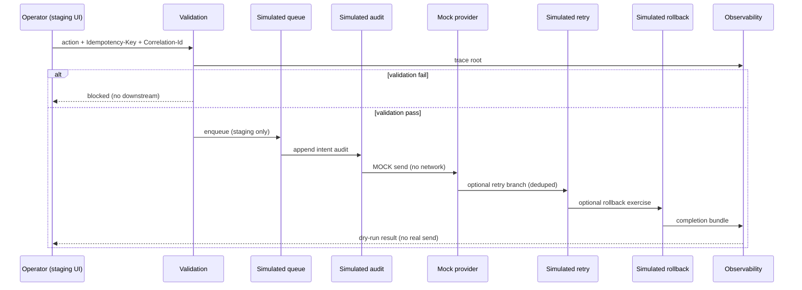

# C2C — Dry-run message flow (conceptual)

**NO REAL SEND OCCURS** — This document describes a **simulation-only** pipeline for staging design. No customer devices receive traffic. No production systems are mutated.

**NO PRODUCTION STATE MUTATION** — All stages below apply to **staging-only** synthetic data and mock adapters unless explicitly contradicted in a future signed charter.

---

## Stage-by-stage specification

Each stage lists: **expected evidence** · **observability requirement** · **replay / idempotency expectation** · **failure outcome** · **rollback expectation**

---

### 1. Operator action

| Field | Content |
|-------|---------|
| Expected evidence | UI event log: `dryrun_started`, `scenario_id`, `actor_id`, `idempotency_key`, `correlation_id` |
| Observability requirement | Trace root span `dryrun.operator_action` with attributes above |
| Replay / idempotency expectation | Duplicate click with **same** idempotency key must not create a second root action id (merge or reject) |
| Failure outcome | `validation_failed` if key missing or actor unknown |
| Rollback expectation | N/A — no side effects yet; clear UI pending state |

---

### 2. Validation

| Field | Content |
|-------|---------|
| Expected evidence | Structured log: `dryrun.validation.pass` or `.fail` with reason codes |
| Observability requirement | Counter `dryrun_validation_total{result=pass|fail}` |
| Replay / idempotency expectation | Replayed HTTP request with same key returns **cached** validation outcome within TTL |
| Failure outcome | Stop pipeline; emit `dryrun_blocked` |
| Rollback expectation | No queue enqueue; UI shows blocked reason |

---

### 3. Simulated queue

| Field | Content |
|-------|---------|
| Expected evidence | Row or message: `queue_job_id`, `enqueued_at`, `lease_owner` (future), `correlation_id` |
| Observability requirement | Histogram `dryrun_queue_wait_ms`; gauge `dryrun_queue_depth` |
| Replay / idempotency expectation | Same idempotency key → at most **one** active job; duplicates are no-ops or `duplicate_suppressed` events |
| Failure outcome | `enqueue_failed` — no downstream stages |
| Rollback expectation | Mark job `cancelled` if rollback requested before dequeue |

---

### 4. Simulated audit

| Field | Content |
|-------|---------|
| Expected evidence | Append-only record: `audit_sim_id`, `action=intent_recorded`, `correlation_id`, `payload_hash` |
| Observability requirement | Log link `audit_sim_id` ↔ trace id |
| Replay / idempotency expectation | Reprocessing same job id does **not** insert duplicate audit if hash matches (dedupe) |
| Failure outcome | `audit_blocked` — **must** block simulated “send” |
| Rollback expectation | Append `action=rollback_marked` rather than delete prior audit row |

---

### 5. Simulated provider response

| Field | Content |
|-------|---------|
| Expected evidence | Record: `simulated_provider_message_id` (UUID), `latency_ms`, `provider=MOCK` |
| Observability requirement | Span `dryrun.provider_mock` with fixed attributes; **no** external HTTP to real provider hosts |
| Replay / idempotency expectation | Same job → same simulated id (deterministic or idempotent store lookup) |
| Failure outcome | `provider_sim_failure` — exercise failure branch without network |
| Rollback expectation | State `simulated_delivered` reverted to `simulated_reverted` with reason |

---

### 6. Simulated retry

| Field | Content |
|-------|---------|
| Expected evidence | Trace shows `retry_attempt=1` with **same** `idempotency_key`; metric `dryrun_retry_total` |
| Observability requirement | Child spans under same `correlation_id`; no new logical send id |
| Replay / idempotency expectation | Retry must be **idempotent**: simulated provider call count for logical send = 1 |
| Failure outcome | After max attempts: `dryrun_failed_terminal` with DLQ pointer (staging only) |
| Rollback expectation | Terminal failure still leaves audit trail; optional `compensating_note` row |

---

### 7. Simulated rollback

| Field | Content |
|-------|---------|
| Expected evidence | Event `dryrun.rollback.completed` with `rollback_trace_id`, duration |
| Observability requirement | Counter `dryrun_rollback_total`; SLO timer metric |
| Replay / idempotency expectation | Duplicate rollback request is idempotent (`rollback_already_applied`) |
| Failure outcome | `rollback_stuck` — page on-call; pilot scenario marked failed |
| Rollback expectation | External world unchanged (mock only); internal state flag cleared |

---

### 8. Observability event

| Field | Content |
|-------|---------|
| Expected evidence | Single “bundle” event or log line aggregating stage timings |
| Observability requirement | Exportable JSON per dry-run for post-run binder |
| Replay / idempotency expectation | Re-emission on replay must not double-count business metrics (use idempotent counters) |
| Failure outcome | Sink down → fallback to structured stdout + file capture in staging |
| Rollback expectation | N/A |

---

### 9. Dry-run completion

| Field | Content |
|-------|---------|
| Expected evidence | Terminal state `dryrun_completed` or `dryrun_failed` with reason; `completed_at` |
| Observability requirement | Dashboard tile: dry-runs / pass rate / duplicate suppression count (= 0 required) |
| Replay / idempotency expectation | Re-submit completion callback → `already_completed` |
| Failure outcome | Stuck `in_progress` beyond watchdog → `timed_out` |
| Rollback expectation | Operator-initiated post-completion rollback moves to `rolled_back_after_complete` (rare test scenario only) |

---

## Mermaid sequence diagram

---

## NO REAL SEND OCCURS

- Mock provider **must not** open connections to Click2API, MSG91, Meta, or production SMS/email endpoints in this pilot profile.
- **No** “test send to my real phone” in this pilot class — use purely synthetic IDs or blocked ranges.

---

## NO PRODUCTION STATE MUTATION

- No writes to production DB, prod storage, prod auth, or prod Edge.
- Staging dry-run records must not contain production PII exports (no prod dumps in staging for this exercise).

---

## Cross-links

- `C2C_FIRST_STAGING_DRYRUN_PILOT.md`
- `C2C_DRYRUN_OBSERVABILITY_SPEC.md`
- `C2C_STAGING_ISOLATION_CHARTER.md`
