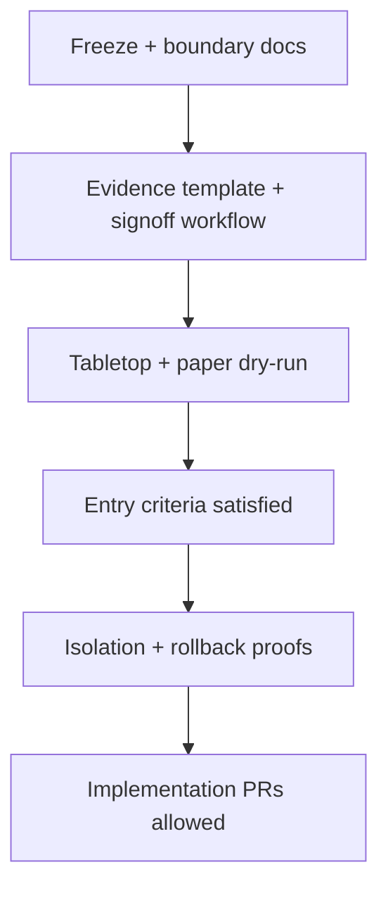

# C2C — Governance evidence master index

**NOT PRODUCTION-WRITE READY** — This index maps **documentation and non-executing scaffolds** only. Maturity of docs does **not** thaw execution freezes.

**Purpose:** Single navigation map for governance, evidence, readiness, freeze, and tabletop artifacts under `docs/C2C_*.md`, plus pointers to **type/config scaffolds** in `src/`.

---

## 1. Freeze and readiness docs

| Document | Role |
|----------|------|
| `C2C_EXECUTION_FREEZE_MANIFEST.md` | Master execution freeze (prod + staging execution) |
| `C2C_PRODUCTION_WRITE_FREEZE_CHARTER.md` | Production write freeze charter |
| `C2C_PROGRAM_STATUS_AFTER_FREEZE_PHASE.md` | Post–freeze-phase status snapshot |
| `C2C_NOT_READY_FOR_PRODUCTION_SUMMARY.md` | Blunt production readiness statement |
| `C2C_EXECUTIVE_READINESS_SCORECARD.md` | RAG scorecard |
| `C2C_REAL_WRITE_BLOCKERS_AFTER_DRYRUN.md` | Blockers after dry-run success |

---

## 2. Threat and replay docs

| Document | Role |
|----------|------|
| `C2C_WRITE_PATH_THREAT_MODEL.md` | Threat model |
| `C2C_ARCHITECTURAL_RISK_REGISTER.md` | Risk register |
| `C2C_IMPLEMENTATION_GATING_MATRIX.md` | Gating matrix |
| `C2C_EXECUTION_INDEPENDENT_TEST_STRATEGY.md` | Pre-execution test strategy |

---

## 3. Authority and escalation docs

| Document | Role |
|----------|------|
| `C2C_MASTER_AUTHORITY_AND_WRITE_SAFETY_BLUEPRINT.md` | Authority blueprint |
| `C2C_AUTHORITY_EVOLUTION_ROADMAP.md` | Stages 0–9 |
| `C2C_OPERATOR_SAFETY_PRINCIPLES.md` | Operator safety principles |
| `C2C_GOVERNANCE_APPROVAL_MODEL.md` | Who approves what |

---

## 4. Dry-run and staging docs

| Document | Role |
|----------|------|
| `C2C_FIRST_STAGING_DRYRUN_PILOT.md` | First dry-run pilot candidate |
| `C2C_DRYRUN_MESSAGE_FLOW.md` | Conceptual message flow |
| `C2C_DRYRUN_OBSERVABILITY_SPEC.md` | Observability spec |
| `C2C_STAGING_ISOLATION_CHARTER.md` | Staging isolation charter |
| `C2C_STAGING_DATA_ISOLATION_RULES.md` | Data isolation rules |
| `C2C_STAGING_PILOT_ACCEPTANCE_CRITERIA.md` | Pilot acceptance gates |
| `C2C_NON_EXECUTING_ADAPTER_STRATEGY.md` | Adapter strategy (not implemented) |

---

## 5. Evidence and signoff docs

| Document | Role |
|----------|------|
| `C2C_EVIDENCE_ARTIFACT_STANDARD.md` | Evidence bundle structure |
| `C2C_SAMPLE_EVIDENCE_BUNDLE_TEMPLATE.md` | Full bundle template (placeholder) |
| `C2C_GOVERNANCE_SIGNOFF_WORKFLOW.md` | Signoff order, veto, NO-GO rules |
| `C2C_PRE_PILOT_GO_NO_GO_CHECKLIST.md` | Pre-pilot checklist |
| `C2C_PAPER_DRYRUN_WALKTHROUGH.md` | Paper-only dry-run |
| `C2C_FAILURE_TABLETOP_EXERCISE.md` | 12 tabletop failures |
| `C2C_IMPLEMENTATION_ENTRY_CRITERIA.md` | PR entry gates |

---

## 6. Rollback and observability docs

| Document | Role |
|----------|------|
| `C2C_SAFE_IMPLEMENTATION_SEQUENCE.md` | Phased sequence + rollback per phase |
| `C2C_DRYRUN_OBSERVABILITY_SPEC.md` | (also listed above) IDs, states, alerts |
| `C2C_EXECUTION_INDEPENDENT_TEST_STRATEGY.md` | Rollback / observability test expectations |

---

## 7. Runtime constraint docs

| Document | Role |
|----------|------|
| `C2C_IMPLEMENTATION_CONSTRAINTS_FOR_ENGINEERS.md` | Hard engineering charter |
| `C2C_PRE_IMPLEMENTATION_EVIDENCE_REQUIREMENTS.md` | Evidence before implementation |
| `C2C_FUTURE_RUNTIME_ENABLEMENT_CHECKLISTS.md` | Future enablement checklists (non-active) |
| `C2C_WHAT_IS_NOT_IMPLEMENTED.md` | Explicit “not built” audit |

---

## 8. Type and config scaffolds (non-executing)

| Path | Role |
|------|------|
| `src/types/c2cAuthority.ts` | TYPE-ONLY authority / state enums |
| `src/types/c2cDryRunContracts.ts` | TYPE-ONLY dry-run contracts |
| `src/types/c2cMockStateFixtures.ts` | Readonly mock fixtures (not wired) |
| `src/config/c2cExecutionFlags.ts` | All `false` execution flags |
| `src/config/c2cGovernanceConstants.ts` | Static governance labels / targets |

*Scaffolds are **not** imported by application runtime paths for C2C execution in the freeze phase.*

---

## 9. What is still not implemented

See **`C2C_WHAT_IS_NOT_IMPLEMENTED.md`**. In one line: **no** idempotent server send path, **no** staging worker, **no** JWT-hardened pilot ingress, **no** live observability bundle for C2C pilot metrics.

---

## 10. What remains blocked

- **Staging execution** (dry-run pipeline, mock worker) without GO binder.  
- **Production writes** for C2C expansion without thaw.  
- **TOOL 5**, **finance**, **dispatch** authority in pilot track.  
- **Queues, retries, resends** as new C2C automation without evidence.

---

## 11. Current safest next step

1. Run **`C2C_FAILURE_TABLETOP_EXERCISE.md`** in a room; capture minutes as evidence-lite.  
2. Fill **`C2C_SAMPLE_EVIDENCE_BUNDLE_TEMPLATE.md`** on paper for one scenario.  
3. Obtain **named approvers** on `C2C_GOVERNANCE_SIGNOFF_WORKFLOW.md` for your org.

---

## 12. Exact prerequisites before any runtime work

Satisfy **`C2C_IMPLEMENTATION_ENTRY_CRITERIA.md`** (G1–G8) **and** scope-specific items from **`C2C_EXECUTION_AUTHORIZATION_PRECONDITIONS.md`** before opening implementation PRs that add I/O, flags wired to behavior, or Edge/DB changes.

---

## Recommended reading order

1. `C2C_CURRENT_SAFE_BOUNDARY.md` (this sprint)  
2. `C2C_EXECUTION_FREEZE_MANIFEST.md`  
3. `C2C_GOVERNANCE_SIGNOFF_WORKFLOW.md`  
4. `C2C_SAMPLE_EVIDENCE_BUNDLE_TEMPLATE.md`  
5. `C2C_WHAT_IS_NOT_IMPLEMENTED.md`  
6. `C2C_GOVERNANCE_MATURITY_SNAPSHOT.md` (this sprint)  
7. Deep dives by topic from tables above

---

## Dependency chain (conceptual)

---

## DO NOT SKIP warnings

- **Do not skip** isolation proof — shared prod/staging resource = automatic NO-GO (`C2C_GOVERNANCE_SIGNOFF_WORKFLOW.md`).  
- **Do not skip** rollback drill evidence before widening scope.  
- **Do not skip** replay/idempotency proofs before any send path.  
- **Do not skip** “not implemented” audit when scoping a PR — avoid silent authority expansion.

---

## Full doc inventory (`docs/`)

Run `ls docs/C2C_*.md` for the authoritative list on your branch; this index groups the major themes.

---

## Cross-links

- `C2C_MASTER_GOVERNANCE_INDEX.md` (legacy umbrella index)  
- `C2C_GOVERNANCE_TIMELINE_AND_PHASE_HISTORY.md`  
- `C2C_GOVERNANCE_MATURITY_SNAPSHOT.md`  
- `C2C_EXECUTION_AUTHORIZATION_PRECONDITIONS.md`  
- `C2C_CURRENT_SAFE_BOUNDARY.md`
