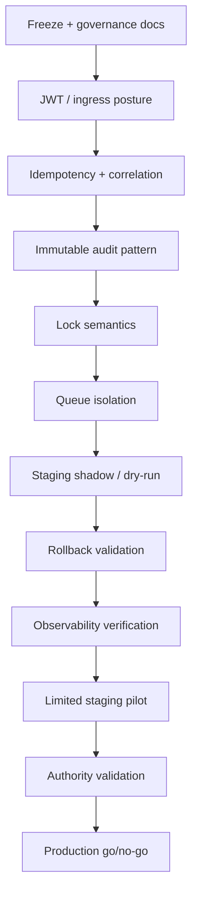

# C2C — Master governance index

**Purpose:** Single navigation hub for C2C governance, authority, replay, staging, and implementation readiness. **Documentation only** — no runtime, Edge, or schema changes.

**Inventory note:** The canonical filenames below live under `docs/`. If your clone has fewer files, merge open governance PRs or run `ls docs/C2C_*.md` for the authoritative list on your branch.

---

## 1. Current platform state

- **B2B + internal admin** platform is live with a large historical PostgREST write surface (RLS-dependent).
- **WhatsApp operator inbox** on main is **read-first** with operator reply and **suggest-only** classify/route flows; realtime refreshes and local UX persistence (filters, notes) are client-side.
- **C2C staging write pilot** is **not authorized**; **production write expansion** for C2C-hardening goals remains **frozen** at the governance/program layer until acceptance criteria and freeze charter conditions are met.
- **TOOL 5** implementation remains out of scope for this governance track (reference only in matrices).

---

## 2. What is production-safe today (relative)

- Mature **read paths** and existing **business-approved** admin/B2B mutations under current RLS and operational process (org risk acceptance applies — not a formal certification in these docs).
- **Suggest-only** operator assistance that does **not** auto-persist routing or finance decisions.

---

## 3. What is read-only safe only

- Operator **classification / routing suggestions** consumed as UI hints only.
- **Local-only** inbox affordances (saved views, filters, notes in browser storage) — must never be treated as authority for server decisions.
- **Documentation, tabletop, and scorecard** artifacts (this index and siblings).

---

## 4. What is explicitly frozen

- **C2C production write expansion** until thaw conditions in `C2C_PRODUCTION_WRITE_FREEZE_CHARTER.md` are satisfied.
- **Unauthorized staging write pilot** — no new pilot-class writes without acceptance gates in `C2C_STAGING_PILOT_ACCEPTANCE_CRITERIA.md`.
- **Schema / Edge / deploy / invoke expansion** under this program’s global rules — forbidden until explicitly out of doc-only mode.

---

## 5. Governance document map

| Document | Role |
|----------|------|
| `C2C_MASTER_GOVERNANCE_INDEX.md` | **This file** — executive navigation |
| `C2C_PRODUCTION_WRITE_FREEZE_CHARTER.md` | What may / may not change while frozen; thaw / re-freeze |
| `C2C_GOVERNANCE_GAP_SUMMARY.md` | Consolidated gap list and prerequisites (when present) |
| `C2C_EXECUTIVE_READINESS_SCORECARD.md` | RED / AMBER / GREEN status by area |
| `C2C_SAFE_IMPLEMENTATION_SEQUENCE.md` | Hard ordering of implementation phases |
| `C2C_STAGING_PILOT_ACCEPTANCE_CRITERIA.md` | Gates before pilot authorization |
| `C2C_ARCHITECTURAL_RISK_REGISTER.md` | Living risk table |
| `C2C_IMPLEMENTATION_GATING_MATRIX.md` | Cross-cutting “may proceed?” matrix |
| `C2C_SAFE_SEQUENCE_ROADMAP.md` | Sequencing narrative companion to gates |

---

## 6. Authority document map

| Document | Role |
|----------|------|
| `C2C_MASTER_AUTHORITY_AND_WRITE_SAFETY_BLUEPRINT.md` | North-star authority and write-safety model |
| `C2C_AUTHORITY_ESCALATION_REVIEW.md` | Per-action authority matrix (when present) |
| `C2C_OPERATOR_AUTHORITY_MATRIX.md` | Operator-specific matrix (when present) |
| `C2C_PRE_IMPLEMENTATION_AUTHORITY_CHECKLIST.md` | Pre-code checklists (when present) |

---

## 7. Replay / idempotency document map

| Document | Role |
|----------|------|
| `C2C_IDEMPOTENCY_AND_REPLAY_REVIEW.md` | Duplicate send, replay, queue replay classes |
| `C2C_REPO_WRITE_SURFACE_INVENTORY.md` | Invoke + DB write breadth (when present) |

---

## 8. Threat-model document map

| Document | Role |
|----------|------|
| `C2C_WRITE_PATH_THREAT_MODEL.md` | Write-path abuse and failure classes |
| `C2C_FAILURE_SCENARIO_TABLETOP.md` | Scenario symptom / blast radius / block production? (when present) |

---

## 9. Staging pilot document map

| Document | Role |
|----------|------|
| `C2C_STAGING_PILOT_ACCEPTANCE_CRITERIA.md` | **Authoritative gate list** for pilot |
| `C2C_STAGING_PILOT_DEPENDENCY_GRAPH.md` | Ordered dependencies (when present) |
| `C2C_LIVE_AUTHORITY_SURFACE_AUDIT.md` | Live Edge + inbox authority audit (when present) |
| `C2C_EDGE_CONTRACT_RECONCILIATION.md` | Invoke ↔ response contracts (when present) |

---

## 10. Rollback / recovery document map

| Document | Role |
|----------|------|
| `C2C_PRODUCTION_WRITE_FREEZE_CHARTER.md` | Emergency stop and re-freeze principles |
| `C2C_FAILURE_SCENARIO_TABLETOP.md` | Per-scenario rollback requirement column |
| `C2C_SAFE_IMPLEMENTATION_SEQUENCE.md` | Per-phase rollback expectations |

---

## 11. Auditability document map

| Document | Role |
|----------|------|
| `C2C_JWT_AND_TRUST_BOUNDARY_AUDIT.md` | Ingress trust and actor validation gaps (when present) |
| `C2C_MASTER_AUTHORITY_AND_WRITE_SAFETY_BLUEPRINT.md` | Audit expectations in design |
| `C2C_STAGING_PILOT_ACCEPTANCE_CRITERIA.md` | Immutable audit gate |

---

## 12. Safe implementation order

1. **Freeze + document** (this layer) — no skips.
2. **JWT / ingress hardening** decisions per Edge function — see scorecard + acceptance criteria.
3. **Idempotency + correlation IDs** — design then implement for pilot scope only.
4. **Immutable audit guarantees** — transactional patterns where audit and mutation must align.
5. **Lock semantics** — packet / resource locks before concurrent write features.
6. **Queue isolation** — server-side worker; remove multi-tab client processor for pilot-class traffic.
7. **Shadow / dry-run staging** — prove metrics before widening blast radius.
8. **Rollback + observability** — kill switches and SLOs proven in staging.
9. **Limited staging pilot** — time-boxed, monitored, reversible.
10. **Authority validation + production go/no-go** — explicit sign-off.

Detailed phase breakdown: `C2C_SAFE_IMPLEMENTATION_SEQUENCE.md`.

---

## 13. Explicit “DO NOT SKIP” gates

| Gate | Rationale |
|------|-----------|
| Ingress / JWT decision per write function | Without this, all deeper controls are cosmetic |
| Idempotency for customer-visible sends | Duplicate message = immediate trust loss |
| Correlation IDs for pilot scope | Without tracing, incidents are not recoverable in reasonable time |
| Rollback drill in staging | “We can deploy” ≠ “we can safely undo” |
| Outbox / queue redesign before finance-linked pilot | Browser-driven queue is not an isolation boundary |
| Failure tabletop sign-off | Humans must agree on blast radius before widening writes |

---

## 14. Conditions before ANY staging write

Satisfy **all** items in `C2C_STAGING_PILOT_ACCEPTANCE_CRITERIA.md` for the **declared pilot scope**, plus:

- Written **pilot scope** (tables, functions, max rate, max operators).
- **Kill switch** documented and tested (disable send path without deploy if possible; else fastest safe rollback).
- **Observability** dashboard or query pack ready for duplicate-send and 4xx/5xx anomalies.

Cross-reference: `C2C_PRODUCTION_WRITE_FREEZE_CHARTER.md` (what “allowed” means during freeze).

---

## 15. Conditions before ANY production write

- All staging conditions, plus sustained staging soak **per org-defined duration**.
- **Go/no-go** with security + finance + ops signatories (`C2C_EXECUTIVE_READINESS_SCORECARD.md` GREEN in blocking rows).
- **Risk register** closure or explicit acceptance of residual risks (`C2C_ARCHITECTURAL_RISK_REGISTER.md`).
- **Re-freeze playbook** exercised once in tabletop form.

---

## Dependency graph (high level)

---

## Recommended reading order

1. `C2C_PRODUCTION_WRITE_FREEZE_CHARTER.md` — **rules of engagement**
2. `C2C_EXECUTIVE_READINESS_SCORECARD.md` — **current posture at a glance**
3. `C2C_MASTER_AUTHORITY_AND_WRITE_SAFETY_BLUEPRINT.md` — **design intent**
4. `C2C_WRITE_PATH_THREAT_MODEL.md` — **what can go wrong**
5. `C2C_SAFE_IMPLEMENTATION_SEQUENCE.md` — **how to proceed without skipping**
6. `C2C_STAGING_PILOT_ACCEPTANCE_CRITERIA.md` — **pilot bar**
7. `C2C_ARCHITECTURAL_RISK_REGISTER.md` — **tracked risks**
8. Domain audits (`C2C_JWT_AND_TRUST_BOUNDARY_AUDIT.md`, `C2C_IDEMPOTENCY_AND_REPLAY_REVIEW.md`, …) as needed for implementation tickets

---

## Highest-risk unresolved areas (program view)

1. **Edge ingress with `verify_jwt = false` on write-adjacent functions** — until each function has an explicit compensating control, replay and spoofing classes remain hot.
2. **Absence of systematic idempotency keys** on operator and customer-visible sends.
3. **Client-processed notification outbox** — concurrency and identity model unsuitable as a long-term “queue.”
4. **Split trust model** — service-role Edge vs RLS-scoped PostgREST from browser; reasoning burden and mismatch risk.
5. **Finance + messaging coupling** — operational mistakes in one surface amplify the other without strict locks and correlation.

---

## Revision

Revisit this index when: merge completes for sibling governance PRs; any Edge or RLS policy changes; pilot scope changes; or thaw / re-freeze events.
