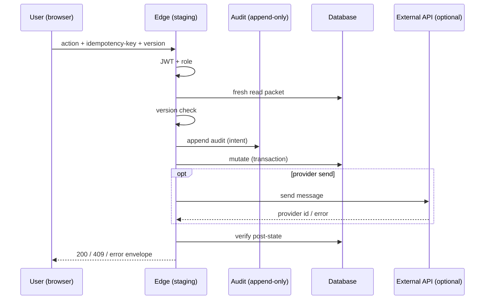

# C2C — Write lifecycle sequence

**Purpose:** Define the **ordered** lifecycle for a governed write (staging pilot → future production) without implementing it. Each step lists **required guarantees**, **failure handling**, and **observability expectations**.

> Diagram-style: read top-to-bottom as a single request pipeline. Parallel paths (e.g. async queue) are **out of pilot v1** unless explicitly added later.

---

## 1. User action

| Aspect | Required guarantees | Failure handling | Observability |
|---------|---------------------|------------------|---------------|
| Operator clicks confirm / submits form | Action is intentional; debounced; CSRF/session valid for SPA | Disable double-submit; show inline validation errors | Client breadcrumb: screen, packet id, action type (non-PII) |

---

## 2. JWT validation

| Aspect | Required guarantees | Failure handling | Observability |
|---------|---------------------|------------------|---------------|
| Edge receives `Authorization` / cookie per Supabase contract | `verify_jwt` effective; clock skew within tolerance; token not expired | **401**; no partial mutation; no audit of “success” | Log reject reason code (not raw token); metric: auth_fail_total |

---

## 3. Role validation

| Aspect | Required guarantees | Failure handling | Observability |
|---------|---------------------|------------------|---------------|
| Map JWT claims → role / tenant | Allowlist matches `docs/C2C_MASTER_AUTHORITY_AND_WRITE_SAFETY_BLUEPRINT.md` matrix | **403**; audit **denied_attempt** row optional but recommended | actor_role, packet_id, action, deny_reason |

---

## 4. Packet freshness check

| Aspect | Required guarantees | Failure handling | Observability |
|---------|---------------------|------------------|---------------|
| Server re-reads packet + contact | Row exists; status allows action; tenant matches JWT | **409** or **404** with safe message; **no mutation** | log packet_status, contact_id hash or id per privacy policy |

---

## 5. Conflict / version check

| Aspect | Required guarantees | Failure handling | Observability |
|---------|---------------------|------------------|---------------|
| Client echoes `expected_version` / `updated_at` token | Optimistic lock match | **409 CONFLICT** + latest version payload for UI refresh | metric: conflict_total; include client_sent vs server_version |

---

## 6. Immutable audit append

| Aspect | Required guarantees | Failure handling | Observability |
|---------|---------------------|------------------|---------------|
| Append row **before** or in same transaction as mutation (policy choice) | Append succeeds with full correlation; DB perms deny UPDATE/DELETE on audit | **If audit append fails → abort mutation** (preferred) | alert on audit_append_failure CRITICAL |

---

## 7. Mutation execution

| Aspect | Required guarantees | Failure handling | Observability |
|---------|---------------------|------------------|---------------|
| DB update / external API (e.g. WhatsApp send) | Idempotency key honored; transactional boundaries defined | Compensating logic or explicit failure state; **no silent partial apply** | latency histogram; external provider message id on success |

---

## 8. Post-write verification

| Aspect | Required guarantees | Failure handling | Observability |
|---------|---------------------|------------------|---------------|
| Re-read row; compare invariants | Matches expected post-state; side effects visible where applicable | Mark packet **needs_reconciliation**; alert; human runbook | verification_fail_total |

---

## 9. UI refresh

| Aspect | Required guarantees | Failure handling | Observability |
|---------|---------------------|------------------|---------------|
| Client receives authoritative response | Version monotonicity; toast on conflict | User retries from fresh state; no blind retry storm | client telemetry optional (privacy-safe) |

---

## 10. Rollback trigger path

| Aspect | Required guarantees | Failure handling | Observability |
|---------|---------------------|------------------|---------------|
| Feature flag / kill switch / incident commander decision | Stops **new** mutations quickly; does not delete audit | Drain in-flight; replay deferred; comms per `docs/C2C_ROLLBACK_AND_RECOVERY_STRATEGY.md` | kill_switch_toggle event with actor |

---

## Sequence diagram (Mermaid — documentation only)

This diagram is **normative for design reviews** only; implementation may split transactions per DB capabilities.
