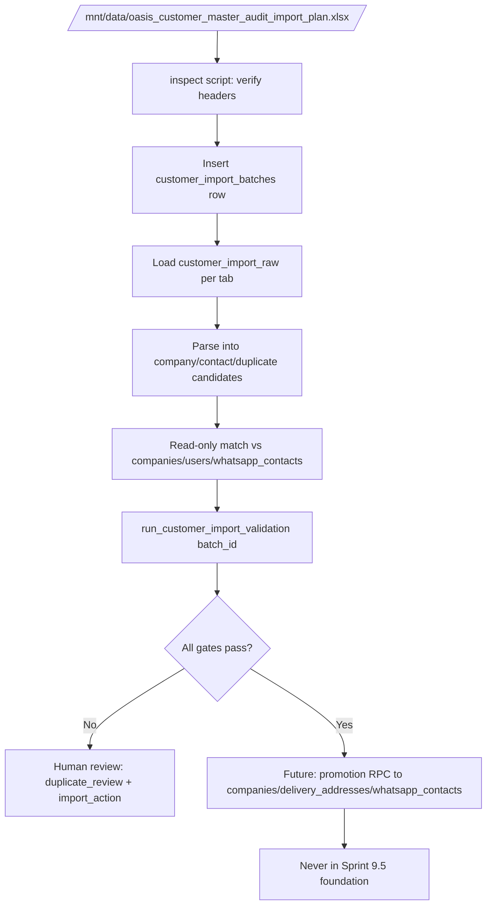

# Customer Master Import Foundation (Sprint 9.5)

**Date:** 2026-06-05  
**Scope:** Staging-only import foundation — **no data imported**, **no production writes**, **no order creation**, **no overwrite of existing customer data**  
**Primary workbook:** `/mnt/data/oasis_customer_master_audit_import_plan.xlsx`  
**Lineage workbook:** `/mnt/data/Copy of Party (1).xlsx` (original Party upload; audit workbook is authoritative for import)

---

## Executive summary

This foundation adds **isolated staging tables** for customer master data loaded from the audit Excel workbook. Rows land in `customer_import_*` tables first; validation runs read-only against existing `companies`, `users`, and `whatsapp_contacts`; **promotion to live master is a separate future phase**.

| Deliverable | Path |
|-------------|------|
| Staging table migration | `supabase/migrations/20260607190000_sprint_9_5_customer_master_import_staging.sql` |
| Validation SQL (views + function) | `scripts/sql/sprint_9_5_customer_import_validation.sql` |
| Workbook inspector (read-only) | `scripts/inspect_customer_master_workbook.py` |

**Workbook access (this agent run):** `/mnt/data` is **not mounted** in the cloud agent VM. Running `python3 scripts/inspect_customer_master_workbook.py` returned `file_not_found` for both workbooks. **Re-run the inspector where `/mnt/data` is mounted** before loading data; use the **Central Mapping** tab as the column SSOT.

**Safe to proceed to staging import?** **Not yet.** Apply migrations + validation SQL on staging, mount workbooks, run inspector to confirm headers, then load `customer_import_raw` only. Do not promote to `companies` until validation gates pass.

---

## 1. Existing schema found

There is **no `customers` or `contacts` table**. B2B client master lives in **`public.companies`**.

### 1.1 Company / party master (`companies`)

| Column | Type | Import relevance |
|--------|------|------------------|
| `id` | uuid PK | Target link (`matched_company_id`); never overwritten by import staging |
| `business_name` | text NOT NULL | Primary display / resolution name |
| `gst_number` | text | Dedup key (15-char GSTIN normalized) |
| `phone` | text | Company WhatsApp/primary phone (currently sparse on staging) |
| `registered_address` | text | Legal address (single text field) |
| `account_manager_id` | uuid → `users` | **Client Owner** |
| `payment_terms` | text NOT NULL | `'prepaid'` \| `'credit'` |
| `status` | text | Includes `'shadow'` for WA-created leads |
| `fssai_number`, `price_tier`, `credit_limit`, … | various | Commercial / compliance |

### 1.2 Contacts (fragmented — no SSOT table)

| Table | Phone fields | Links to company? |
|-------|--------------|-------------------|
| `whatsapp_contacts` | `phone_number`, `customer_name`, `company_name` | **No `company_id` FK** |
| `users` | `phone`, `mobile_number`, `secondary_phones[]` | `company_id` |
| `b2b_applications` | `contact_phone`, `mobile_number` | Onboarding → company on approval |
| `delivery_addresses` | `contact_phone`, `contact_person` | `company_id` |
| `shadow_clients` | `sender_phone` | Optional `promoted_to_company_id` |

### 1.3 Addresses

| Table | Fields |
|-------|--------|
| `delivery_addresses` | `company_id`, `label`, `street_address`, `city`, `state`, `pincode`, `contact_person`, `contact_phone`, `is_default` |
| `companies.registered_address` | Single text field |
| `b2b_applications` | `registered_address`, `city`, `state`, `pincode` |

### 1.4 WhatsApp identities

| Table | Role |
|-------|------|
| `whatsapp_contacts` | Inbox address book (`phone_number`, display names) |
| `whatsapp_message_packets` | Stitched conversations |
| `shadow_clients` | Pre-company leads |

**Gap:** No FK from `whatsapp_contacts` → `companies`.

### 1.5 Client ownership

- **SSOT:** `companies.account_manager_id` → `users.id`
- Sprint 9 drafts snapshot owner at create (`sales_order_drafts.client_owner_id/name`)
- Staging import stores **placeholders only** (`account_manager_name_raw`, `account_manager_email_raw`); resolution is read-only preview in validation views

### 1.6 Payment terms

- **SSOT:** `companies.payment_terms` (`prepaid` \| `credit`, NOT NULL)
- Staging normalizes via `customer_import_normalize_payment_terms()`

---

## 2. Workbook tabs vs staging schema

### 2.1 Expected workbook tabs (audit file)

| Excel tab | Staging destination | Purpose |
|-----------|---------------------|---------|
| **Customer Master Candidate** | `customer_import_company_candidates` + `customer_import_raw` | Cleaned party/company rows |
| **Contact WhatsApp Candidate** | `customer_import_contact_candidates` + `customer_import_raw` | WhatsApp numbers linked to customer keys |
| **Duplicate Phone Review** | `customer_import_duplicate_review` (`duplicate_type='phone'`) | Human-reviewed phone collisions |
| **Duplicate GST Review** | `customer_import_duplicate_review` (`duplicate_type='gst'`) | Human-reviewed GST collisions |
| **Central Mapping** | `customer_import_batches.central_mapping` + `customer_import_raw` | Excel column → DB target mapping SSOT |

### 2.2 Provisional column mapping (verify with inspector + Central Mapping tab)

> **Important:** Headers below are **provisional** until `inspect_customer_master_workbook.py` succeeds on `/mnt/data`. The **Central Mapping** tab overrides this table when present.

#### Customer Master Candidate → `customer_import_company_candidates`

| Expected Excel column (provisional) | Staging column | Final target (`companies` / related) |
|-------------------------------------|----------------|--------------------------------------|
| `source_customer_key` / `customer_code` / `party_code` | `source_customer_key` | Import identity (not a DB column) |
| `business_name` / `party_name` / `name` | `business_name` | `companies.business_name` |
| `trade_name` | `trade_name` | metadata / display |
| `gst_number` / `gstin` | `gst_number_raw` → `gst_number_normalized` | `companies.gst_number` |
| `registered_address` / `address` | `registered_address` | `companies.registered_address` |
| `city`, `state`, `pincode` | `city`, `state`, `pincode` | `delivery_addresses.*` (promotion phase) |
| `phone` / `mobile` / `whatsapp` | `phone_raw` → `phone_last10` | `companies.phone` |
| `payment_terms` | `payment_terms_raw` → `payment_terms_normalized` | `companies.payment_terms` |
| `fssai_number` | `fssai_number` | `companies.fssai_number` |
| `price_tier` | `price_tier` | `companies.price_tier` |
| `client_owner` / `account_manager` | `account_manager_name_raw` | → `companies.account_manager_id` (promotion) |
| `account_manager_email` | `account_manager_email_raw` | owner resolution |
| `existing_company_id` / match hint | `matched_company_id` (read-only link) | `companies.id` |

#### Contact WhatsApp Candidate → `customer_import_contact_candidates`

| Expected Excel column (provisional) | Staging column | Final target |
|-------------------------------------|----------------|--------------|
| `source_contact_key` | `source_contact_key` | Import identity |
| `source_customer_key` | `source_customer_key` | FK to company candidate |
| `contact_name` | `contact_name` | `delivery_addresses.contact_person` / WA display |
| `whatsapp_phone` / `mobile` | `whatsapp_phone_raw` → `phone_last10` | `whatsapp_contacts.phone_number` (promotion) |
| `is_primary` | `is_primary` | primary contact flag |
| `contact_role` | `contact_role` | metadata |

#### Duplicate Phone / GST Review → `customer_import_duplicate_review`

| Expected Excel column (provisional) | Staging column |
|-------------------------------------|----------------|
| `duplicate_key` / phone / gst | `duplicate_key_raw`, `duplicate_key_normalized` |
| `occurrence_count` | `occurrence_count` |
| `candidate_source_keys` (list) | `candidate_source_keys[]`, `candidate_details` jsonb |
| `recommended_action` | `recommended_action_raw` |
| `chosen_winner` | `chosen_winner_source_key` |

#### Central Mapping → `customer_import_batches.central_mapping`

JSON array of objects, e.g.:

```json
{
  "excel_tab": "Customer Master Candidate",
  "excel_column": "Party Name",
  "target_table": "customer_import_company_candidates",
  "target_column": "business_name",
  "transform": "trim"
}
```

### 2.3 Original workbook (`Copy of Party (1).xlsx`)

Used for **lineage only** (Tally/ERP Party export). The audit workbook is the **import authority**. Do not load Party file directly unless audit tabs are regenerated from it.

---

## 3. Recommended staging tables

| Table | Role |
|-------|------|
| `customer_import_batches` | One row per workbook load; stores `central_mapping`, counts, validation summary; **staging environment only** (`CHECK source_environment = 'staging'`) |
| `customer_import_raw` | Lossless JSON per Excel row (`row_json`) keyed by tab + row number |
| `customer_import_company_candidates` | Parsed company/party candidates |
| `customer_import_contact_candidates` | Parsed WhatsApp/contact rows |
| `customer_import_duplicate_review` | Duplicate phone/GST review queue |

**Helper functions (normalization only, no mutation):**

- `customer_import_normalize_gst(text)`
- `customer_import_normalize_phone_last10(text)`
- `customer_import_normalize_payment_terms(text)`

---

## 4. Import flow (designed, not executed)



### Phase boundaries

| Phase | Allowed | Blocked |
|-------|---------|---------|
| **9.5 foundation (now)** | CREATE staging tables; validation views | INSERT into `companies`, `users`, `whatsapp_contacts`, `orders` |
| **9.5 load (next)** | INSERT into `customer_import_*` only on **staging** | UPDATE existing `companies` rows |
| **9.5 promotion (future)** | INSERT new companies / link existing; INSERT delivery_addresses | Overwrite non-null existing fields without review |

---

## 5. Duplicate rules

### 5.1 Within batch (hard block until resolved)

| Rule | Detection | Action |
|------|-----------|--------|
| Duplicate GST | Same `gst_number_normalized` on 2+ company candidates | Set `validation_status = duplicate_gst_in_batch`; require Duplicate GST Review row |
| Duplicate company phone | Same `phone_last10` on 2+ company candidates | `duplicate_phone_in_batch` |
| Duplicate contact phone | Same `phone_last10` on 2+ contact candidates | `duplicate_phone_in_batch` on contacts |
| Orphan contact | `source_customer_key` not in company candidates | `orphan_customer_key` |

### 5.2 Against existing master (read-only — link, never overwrite)

| Rule | Detection | Default `import_action` |
|------|-----------|---------------------------|
| GST match existing | Normalized GST equals `companies.gst_number` | `link_existing` if same party; `review` if name mismatch |
| Phone match existing | last-10 matches `companies.phone`, `users.phone`, or `whatsapp_contacts.phone_number` | `link_existing` or `review` |
| New party | No GST/phone match | `create_new` (after review) |

### 5.3 Human review (from workbook Duplicate tabs)

- `resolution_status` must leave `pending` before promotion
- `chosen_winner_source_key` selects surviving `source_customer_key`
- Non-winners → `import_action = skip`

### 5.4 Non-negotiable constraints

- **Never UPDATE** existing `companies` fields from import staging automatically
- **Never DELETE** production master rows
- **Never INSERT** into `orders` / `order_items`
- Default `import_action = 'review'` until explicitly approved

---

## 6. Final target mapping (promotion phase — not implemented)

| Staging source | Target table | Target columns |
|----------------|--------------|----------------|
| Company candidate (new) | `companies` | `business_name`, `gst_number`, `phone`, `registered_address`, `payment_terms`, `account_manager_id`, `status` |
| Company candidate (link) | `companies` | Set `matched_company_id` only in staging; promotion adds FK refs elsewhere |
| Address fields | `delivery_addresses` | `street_address`, `city`, `state`, `pincode`, `contact_person`, `contact_phone`, `is_default` |
| Contact candidate | `whatsapp_contacts` | `phone_number`, `customer_name`, `company_name` (+ future `company_id`) |
| Owner placeholder | `companies` | `account_manager_id` after user ID resolution |

---

## 7. Exact migration file

**File:** `supabase/migrations/20260607190000_sprint_9_5_customer_master_import_staging.sql`

Creates:

- `customer_import_batches`
- `customer_import_raw`
- `customer_import_company_candidates`
- `customer_import_contact_candidates`
- `customer_import_duplicate_review`
- Normalization functions + `updated_at` triggers
- RLS: `service_role` ALL; `authenticated` internal staff SELECT only

**Not applied in this task.** Apply to staging project only when ready:

```bash
# staging only — do not apply to production
supabase db push --project-ref tcxvcatsqqertcnycuop
```

---

## 8. Exact validation SQL

**File:** `scripts/sql/sprint_9_5_customer_import_validation.sql`

Creates views:

| View | Purpose |
|------|---------|
| `v_customer_import_batch_summary` | Row counts + valid/error totals |
| `v_customer_import_company_required_gaps` | Missing/invalid required fields |
| `v_customer_import_duplicate_gst_in_batch` | Intra-batch GST dupes |
| `v_customer_import_duplicate_phone_in_batch` | Intra-batch company phone dupes |
| `v_customer_import_duplicate_contact_phone_in_batch` | Intra-batch contact phone dupes |
| `v_customer_import_gst_match_existing` | Read-only cross-match vs `companies` |
| `v_customer_import_phone_match_existing` | Cross-match vs companies/users/WA |
| `v_customer_import_orphan_contacts` | Contacts without company key |
| `v_customer_import_duplicate_review_alignment` | Workbook vs computed dupe counts |
| `v_customer_import_owner_placeholder` | Owner name/email → `users` preview |
| `v_customer_import_promotion_readiness` | Single-row gate per batch |

Function:

```sql
SELECT * FROM public.run_customer_import_validation('<batch_id>');
```

**Not executed in this task.**

---

## 9. Risks before importing

| Risk | Severity | Mitigation |
|------|----------|------------|
| `/mnt/data` workbook headers differ from provisional mapping | High | Run `scripts/inspect_customer_master_workbook.py`; trust Central Mapping tab |
| Duplicate SKU-style GST groups in Party source | High | Resolve via Duplicate GST Review before promotion |
| Shared phones across parties | High | Duplicate Phone Review + `import_action` |
| 95% existing companies missing owner on staging DB | Medium | Owner placeholders required; do not auto-assign without review |
| `whatsapp_contacts` has no `company_id` | Medium | Promotion phase must add linkage column or bridge table |
| Accidental production apply | Critical | `customer_import_batches.source_environment` CHECK = `'staging'` only; separate project refs |
| Overwriting existing customer data | Critical | Staging design uses `link_existing` / `create_new` only; no UPDATE triggers on `companies` |
| Import creates orders | Critical | Out of scope; no FK to `orders`; no promotion RPC in this foundation |

---

## 10. Whether safe to proceed to staging import

| Step | Status |
|------|--------|
| Staging tables designed | ✅ Done (migration SQL) |
| Validation SQL designed | ✅ Done |
| Workbook headers verified | ❌ Blocked — `/mnt/data` not mounted in agent VM |
| Migration applied to staging DB | ❌ Not done (by design this task) |
| Data loaded into `customer_import_*` | ❌ Not done (by design) |

**Verdict:** Safe to proceed to **staging schema apply** and **workbook inspection** on a machine where `/mnt/data` is mounted. **Not safe** to load or promote data until:

1. Inspector confirms headers match Central Mapping  
2. Migrations + validation SQL applied on staging  
3. `run_customer_import_validation` returns zero error-severity rows  
4. All duplicate review rows resolved  

---

## 11. Workbook inspection command

Run where files exist at the specified paths only:

```bash
python3 scripts/inspect_customer_master_workbook.py > docs/customer_master_workbook_inventory.json
```

Expected paths (do not use other locations):

- `/mnt/data/oasis_customer_master_audit_import_plan.xlsx`
- `/mnt/data/Copy of Party (1).xlsx`

Paste the JSON output into a follow-up commit or attach to the import runbook before first load.

---

## 12. Related documents

- `docs/SPRINT_9_5_MASTER_DATA_READINESS_AUDIT.md` — data quality baseline on staging
- `docs/WHATSAPP_WA04A_CLIENT_RESOLUTION.md` — runtime client matching
- `docs/WHATSAPP_IDENTITY_OWNERSHIP_ARCHITECTURE.md` — ownership / shadow client model

---

*End of Customer Master Import Foundation — schema and SQL only; no data mutated.*
