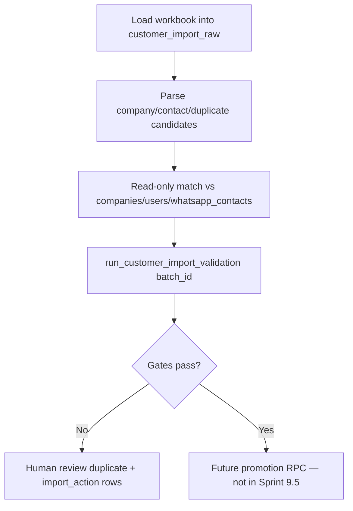

# Customer Master Import Foundation (Sprint 9.5)

**Date:** 2026-06-05  
**Scope:** Staging-only import foundation — **no data imported**, **no migration applied**, **no production writes**  
**Workbook:** `oasis_customer_master_audit_import_plan.xlsx`  
**Reference:** [Google Sheets audit workbook](https://docs.google.com/spreadsheets/d/1idaaSF2qVI8wym0a8TzUOeF31-Vfu5lN/htmlview)

---

## Executive summary

Isolated **staging tables** for customer master data from the ChatGPT audit workbook. Validation is read-only against existing `companies`, `users`, and `whatsapp_contacts`. Promotion to live master is a **future phase**.

| Deliverable | Path |
|-------------|------|
| Known workbook schema (JSON) | `scripts/customer_master_workbook_schema.json` |
| Staging table migration | `supabase/migrations/20260607190000_sprint_9_5_customer_master_import_staging.sql` |
| Validation SQL | `scripts/sql/sprint_9_5_customer_import_validation.sql` |
| Workbook inspector | `scripts/inspect_customer_master_workbook.py` |

**Column SSOT:** Known provisional headers below + `Central Mapping` tab (`source_column` → `target_table.target_field`).

---

## 1. Workbook structure (known)

### Tabs

| # | Tab | Staging destination |
|---|-----|---------------------|
| 1 | Import Summary | `customer_import_batches.row_counts` / `validation_summary` |
| 2 | Customer Master Candidate | `customer_import_company_candidates` |
| 3 | Contact WhatsApp Candidate | `customer_import_contact_candidates` |
| 4 | Duplicate Phone Review | `customer_import_duplicate_review` (`duplicate_type='phone'`) |
| 5 | Duplicate GST Review | `customer_import_duplicate_review` (`duplicate_type='gst'`) |
| 6 | Possible Name Duplicate Review | `customer_import_duplicate_review` (`duplicate_type='name'`) |
| 7 | Central Mapping | `customer_import_batches.central_mapping` |

All tabs also land in `customer_import_raw` as lossless JSON.

### Known columns

#### Customer Master Candidate

| Excel column | Staging column | Final target |
|--------------|----------------|--------------|
| `company_name` | `business_name` | `companies.business_name` |
| `gstin` | `gst_number_raw` → `gst_number_normalized` | `companies.gst_number` |
| `address` | `registered_address` | `companies.registered_address` |
| `state` | `state` | `delivery_addresses.state` (promotion) |
| `country` | `country` | metadata |
| `registration_type` | `registration_type` | metadata |
| `phone_primary` | `phone_raw` → `phone_last10` | `companies.phone` |
| `phone_secondary` | `phone_secondary_raw` → `phone_secondary_last10` | metadata / future contact |
| `source_sheet` | `source_sheet` | lineage |
| `source_row` | `source_row` | lineage |

**Derived key:** `source_customer_key = source_sheet || ':' || source_row`

#### Contact WhatsApp Candidate

| Excel column | Staging column | Final target |
|--------------|----------------|--------------|
| `company_name` | `company_name` | join to company candidate |
| `contact_name` | `contact_name` | `delivery_addresses.contact_person` / WA display |
| `phone` | `whatsapp_phone_raw` → `phone_last10` | `whatsapp_contacts.phone_number` |
| `whatsapp_candidate` | `whatsapp_candidate_raw` | operator flag from audit |
| `source_sheet` | `source_sheet` | lineage |
| `source_row` | `source_row` | lineage |

**Derived keys:** `source_contact_key = source_sheet || ':' || source_row`; link to company via `company_name` (case-insensitive trim match on `business_name`).

#### Duplicate Phone Review

| Excel column | Staging column |
|--------------|----------------|
| `phone` | `duplicate_key_raw` → `duplicate_key_normalized` (last-10) |
| `matched_company_count` | `occurrence_count` |
| `matched_companies` | `matched_companies_raw` + `candidate_details` jsonb |
| `review_status` | `review_status_raw` → `resolution_status` |

#### Duplicate GST Review

| Excel column | Staging column |
|--------------|----------------|
| `gstin` | `duplicate_key_raw` → `duplicate_key_normalized` |
| `matched_company_count` | `occurrence_count` |
| `matched_companies` | `matched_companies_raw` |
| `review_status` | `review_status_raw` |

#### Possible Name Duplicate Review

| Excel column | Staging column |
|--------------|----------------|
| `company_name` | `duplicate_key_raw` → `duplicate_key_normalized` (lower trim) |
| `matched_company_count` | `occurrence_count` |
| `matched_companies` | `matched_companies_raw` |
| `review_status` | `review_status_raw` |

#### Central Mapping

| Excel column | Stored as |
|--------------|-----------|
| `source_column` | `central_mapping[].source_column` |
| `target_table` | `central_mapping[].target_table` |
| `target_field` | `central_mapping[].target_field` |
| `import_rule` | `central_mapping[].import_rule` |

---

## 2. Existing DB schema (target, not written by this PR)

| Domain | SSOT table | Key fields |
|--------|------------|------------|
| Company / party | `companies` | `business_name`, `gst_number`, `phone`, `registered_address`, `account_manager_id`, `payment_terms` |
| Ship-to | `delivery_addresses` | `street_address`, `city`, `state`, `pincode`, `contact_person`, `contact_phone` |
| WhatsApp | `whatsapp_contacts` | `phone_number`, `customer_name`, `company_name` (no `company_id` FK yet) |
| Client owner | `companies.account_manager_id` | → `users.id` |

No `customers` or normalized `contacts` table exists.

---

## 3. Staging tables

| Table | Purpose |
|-------|---------|
| `customer_import_batches` | Batch registry; `source_environment = 'staging'` enforced by CHECK |
| `customer_import_raw` | Lossless JSON per workbook row |
| `customer_import_company_candidates` | Parsed Customer Master Candidate rows |
| `customer_import_contact_candidates` | Parsed Contact WhatsApp Candidate rows |
| `customer_import_duplicate_review` | Phone / GST / name duplicate review queue |

**Safety constraints:**

- No FK from staging → `companies` that CASCADE mutates master
- `matched_company_id` is read-only link only
- Default `import_action = 'review'`
- RLS: `service_role` ALL; internal staff SELECT only

---

## 4. Import flow (designed, not executed)



---

## 5. Duplicate rules

| Rule | Scope | Action |
|------|-------|--------|
| Duplicate GST in batch | Same normalized `gstin` among non-`skip` company rows | Block until Duplicate GST Review resolved (`resolution_status = 'pending'` cleared) and losers marked `skip` |
| Duplicate phone in batch | Same last-10 on company primary/secondary or contact rows (cross-table) | Block until Duplicate Phone Review resolved and losers marked `skip` |
| Duplicate name in batch | Same normalized `company_name` among non-`skip` rows | Block until Possible Name Duplicate Review resolved and losers marked `skip` |
| Orphan contact | No link via `company_candidate_id` (FK-only when set; skipped company does not satisfy), `source_customer_key`, or `company_name` | Block until linked or contact marked `skip` |
| GST/phone vs existing master | Read-only cross-match (primary + secondary company phones) | `link_existing` or `review`; **never auto-UPDATE** |
| `import_action = 'skip'` | Any row | Excluded from duplicate, gap, orphan, and promotion blocking |
| `import_action = 'review'` | Default on load | Blocks promotion until operator resolves |

---

## 6. Exact migration file

`supabase/migrations/20260607190000_sprint_9_5_customer_master_import_staging.sql`

**Not applied in this PR.** Staging-only when applied.

---

## 7. Exact validation SQL

`scripts/sql/sprint_9_5_customer_import_validation.sql`

Key views:

- `v_customer_import_batch_summary`
- `v_customer_import_company_phone_slots` (primary + secondary last-10)
- `v_customer_import_duplicate_gst_in_batch`
- `v_customer_import_duplicate_phone_any_in_batch` (company/contact cross-table, blocking)
- `v_customer_import_duplicate_phone_in_batch` / `v_customer_import_duplicate_contact_phone_in_batch` (diagnostic)
- `v_customer_import_duplicate_name_in_batch`
- `v_customer_import_duplicate_review_alignment` (workbook `occurrence_count` vs active non-skip row counts; phone exposes company and contact counts separately)
- `v_customer_import_orphan_contacts`
- `v_customer_import_gst_match_existing` / `v_customer_import_phone_match_existing` (read-only)
- `v_customer_import_promotion_readiness`

Runner (internal staff or `service_role` only):

```sql
SELECT * FROM public.run_customer_import_validation('<batch_id>');
-- Returns check_code, severity, row_count, is_blocking, detail
-- Fatal unknown batch: single row batch_not_found with is_blocking = true
```

---

## 8. Workbook inspector

```bash
python3 scripts/inspect_customer_master_workbook.py
```

- Uses known schema from `scripts/customer_master_workbook_schema.json`
- Validates headers when `/mnt/data/oasis_customer_master_audit_import_plan.xlsx` exists
- **Exits 0** when file is missing (does not block on VM mount)

---

## 9. Risks before importing

| Risk | Mitigation |
|------|------------|
| Applying migration to production | `source_environment` CHECK = `'staging'`; apply to staging project only |
| Overwriting existing companies | No UPDATE triggers; `import_action` review default |
| Orphan WhatsApp contacts | Join on `company_name`; validation view flags orphans |
| Name/GST/phone collisions | Three duplicate review tabs + computed batch views |
| Accidental order creation | Out of scope; no `orders` writes |

---

## 10. Safe to proceed?

| Step | Status |
|------|--------|
| Staging schema designed | ✅ |
| Known workbook headers documented | ✅ |
| Validation SQL designed | ✅ |
| Migration applied | ❌ Not in this PR |
| Data loaded | ❌ Not in this PR |

**Safe for PR review:** Yes — SQL/docs/scripts only, no runtime app changes, no data mutation.

**Safe for staging import:** After migration + validation SQL applied on staging and first batch passes `run_customer_import_validation`.

---

*End of Customer Master Import Foundation.*
