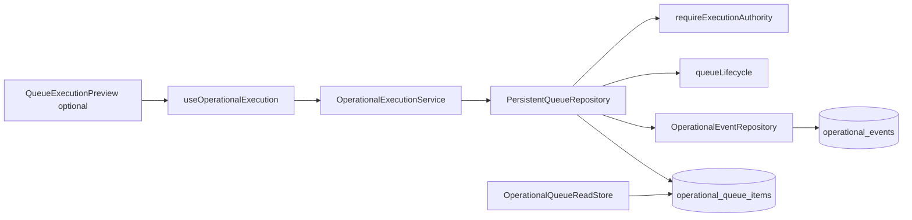

# Execution OS — Phase 3B: Operational execution actions

**Target PR:** `feat(execution): add authority-gated operational queue actions`  
**Branch:** `cursor/phase-3b-operational-queue-actions-6c20`  
**Depends on:** PR #105, PR #106 merged; Phase 3A/3D migration applied and verified in staging (`docs/EXECUTION_OS_PHASE3A3D_STAGING_VALIDATION.md`)

## Mission

First controlled execution action layer on durable `operational_queue_items` and append-only `operational_events` — typed service API, authority checks, lifecycle transitions, and operational event emission for every action.

## Architecture



| Layer | Path | Responsibility |
|-------|------|----------------|
| Execution service | `src/lib/operational-execution/operationalExecutionService.ts` | Charter actions, reason enforcement, error mapping |
| Read store | `src/lib/operational-execution/operationalQueueReadStore.ts` | `getQueueItem`, `listOpenQueueItems` (no writes) |
| Bundle | `src/lib/operational-execution/operationalExecutionBundle.ts` | Wire Supabase / in-memory stacks |
| Persistence | `src/lib/persistent-queues/` (Phase 3A/3D) | Single write path, version checks, events |
| Authority | `src/lib/execution-authority/` | Per-action `queue:*` guards |
| Preview UI | `src/pages/admin/QueueExecutionPreview.tsx` | Optional; `cmd_war_room` + SUPER_ADMIN / OPERATIONS_MANAGER writes |

## In-scope actions

| Action | Service method | Authority | Event type | Reason required |
|--------|----------------|-----------|------------|-----------------|
| Acknowledge | `acknowledgeQueueItem` | `queue:acknowledge` | `queue_acknowledged` | No |
| Assign | `assignQueueItem` | `queue:assign` | `queue_assigned` | Optional |
| Start | `startQueueItem` | `queue:start` | `queue_started` | No |
| Block | `blockQueueItem` | `queue:block` | `queue_blocked` | Yes |
| Escalate | `escalateQueueItem` | `queue:escalate` | `queue_escalated` | Yes |
| Complete | `completeQueueItem` | `queue:complete` | `queue_completed` | No |
| Fail | `failQueueItem` | `queue:fail` | `queue_failed` | Yes |
| Cancel | `cancelQueueItem` | `queue:cancel` | `queue_cancelled` | Yes |
| Note | `addOperationalNote` | `queue:note` | `operational_note_added` | Yes (note body) |

Destructive / override flows (cancel, fail, block, escalate) require non-empty reason at the service layer (repository also enforces cancel/fail).

## Lifecycle (unchanged from 3A/3D)

Uses `applyQueueLifecycleTransition` in `src/lib/persistent-queues/queueLifecycle.ts`. Illegal transitions throw `OperationalExecutionError` with code `illegal_transition`.

## Concurrency and idempotency

- Every mutating action requires `expectedVersion`; stale updates map to `stale_version`.
- Default idempotency key per action: `{action}:{queueItemId}:{expectedVersion}` unless caller supplies `idempotencyKey` on context.
- Create dedupe remains on repository via `findByIdempotencyKey` (Phase 3A/3D).

## Usage (server or Edge consumer)

```typescript
import { createSupabaseOperationalExecutionBundle } from "@/lib/operational-execution";
import { supabase } from "@/integrations/supabase/client";

const { execution, read } = createSupabaseOperationalExecutionBundle(supabase);

const open = await read.listOpenQueueItems({ queueType: "production_queue", limit: 20 });

const result = await execution.acknowledgeQueueItem(
  { queueItemId: open[0].id, expectedVersion: open[0].version },
  {
    correlationId: crypto.randomUUID(),
    actorUserId: userId,
    actorRole: role,
  },
);
```

## Out of scope (Phase 3B)

Finance approval, invoices, stock reservation/deduction, dispatch completion, payment capture, barcode persistence, customer timeline binding, notifications, AI automation, Edge/package changes.

## Forbidden writes grep

Allowed `.insert` / `.update` for this phase remain only in:

- `src/lib/persistent-queues/supabasePersistentQueueRepository.ts`
- `src/lib/operational-events/supabaseOperationalEventRepository.ts`
- `src/lib/operational-execution/operationalQueueReadStore.ts` — **select only**

UI and hooks must not call Supabase table APIs for queue/event tables.

## Tests

```bash
npm run test -- --run src/lib/operational-execution src/lib/persistent-queues src/lib/execution-authority
```

## Merge order

1. #105 → #106 → staging migration checklist  
2. Rebase `cursor/phase-3b-operational-queue-actions-6c20` onto `main`  
3. Run Phase 3B staging gates (no new migration)  
4. Merge when CI and Bugbot clean  
