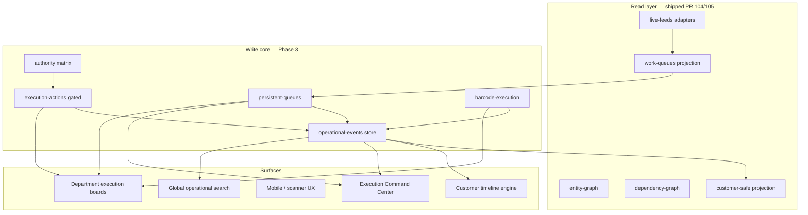
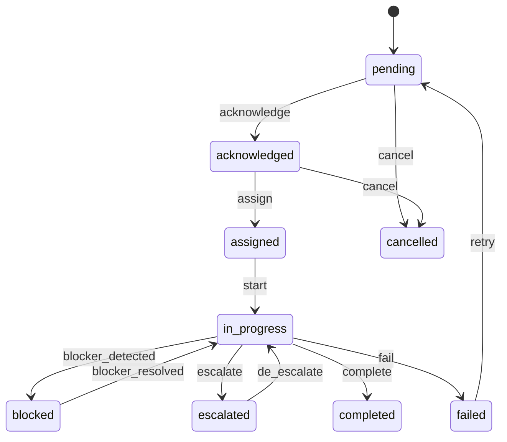

# Oasis Central — Execution Operating System (Phase 3)

**Status:** Planning + Phase 3A contracts (interfaces only).  
**Base branch:** `main` after PR #105 merge (`cursor/connect-read-only-operational-graph-queues-6c20` until merged).  
**Mission:** Transform read-only operational nervous system → controlled execution OS without losing governance, finance control, traceability, or customer-safe separation.

---

## 1. Architecture map



| Layer | Responsibility | Source of truth |
|-------|----------------|-----------------|
| **Projection** (104/105) | Live feeds, pressure, graphs, search contracts | Supabase reads + in-memory derive |
| **Persistent queues** (3A) | Durable work items, assignment, SLA | `operational_queue_items` (+ related) |
| **Operational events** (3D) | Append-only audit trail | `operational_events` |
| **Execution actions** (3B) | Controlled writes | Action handlers → events + queue transitions |
| **Authority** (3G) | Who may invoke which action | JWT role + matrix + reason codes |
| **Customer timeline** (3H) | Public-safe status | Events + approved mappings only |

**Core principle:** Every mutation = authority check + append event + queue state transition (if applicable). No silent writes.

---

## 2. PR slicing recommendation

| PR | Phase | Scope | Merge gate |
|----|-------|-------|------------|
| **#106** | 3A | `persistent-queues/` contracts + DB migration + RLS + read repository | Interfaces + migration reviewed; **no UI writes** |
| **#107** | 3D | `operational-events/` append store + event types + immutability triggers | Event tests + no UPDATE/DELETE policy |
| **#108** | 3G | Authority matrix + execution gate middleware (client + Edge) | Bypass tests fail closed |
| **#109** | 3B | Acknowledge / assign / escalate / note / photo (allowed list only) | Forbidden action grep clean |
| **#110** | 3C | `barcode-execution/` scan verify + timeline + mismatch | No stock mutation |
| **#111** | 3E | CMD Execution Command Center (persistent ownership, SLA, event stream) | Read-only fallbacks when store empty |
| **#112** | 3F | Department boards (Production → Complaints) | Scoped queue filters per role |
| **#113** | 3H | Customer timeline from events + mappings | Suppression tests |
| **#114** | 3I | Persistent search index + global lookup | Typo/alias/barcode |
| **#115** | 3J | Mobile execution UX pass | Playwright smoke on handheld breakpoints |

**Rule:** One vertical slice per PR; never mix finance mutation, stock deduction, or customer public binding into execution PRs.

---

## 3. Persistence schema proposal

### 3.1 `operational_queue_items`

| Column | Type | Notes |
|--------|------|-------|
| `id` | uuid PK | |
| `queue_id` | text | Aligns with `WorkQueueId` |
| `entity_type` | text | order, carton, ticket, … |
| `entity_id` | uuid/text | |
| `state` | text | See lifecycle §4 |
| `priority_band` | text | urgent / high / … |
| `priority_score` | numeric | Denormalized for sort |
| `owner_user_id` | uuid nullable | Assigned operator |
| `owner_role` | text | OperationalOwnerRole |
| `assigned_at` | timestamptz nullable | |
| `acknowledged_at` | timestamptz nullable | |
| `escalation_tier` | text nullable | |
| `escalated_at` | timestamptz nullable | |
| `blocked_reason_code` | text nullable | |
| `customer_impact` | boolean | |
| `sla_due_at` | timestamptz nullable | |
| `freshness_status` | text | fresh / stale / breached |
| `title` | text | Operator-facing |
| `summary` | text nullable | |
| `version` | int | Optimistic concurrency |
| `created_at` | timestamptz | |
| `updated_at` | timestamptz | |
| `completed_at` | timestamptz nullable | |
| `cancelled_at` | timestamptz nullable | |
| `created_by` | uuid | |
| `last_actor_id` | uuid | |

**Indexes:** `(queue_id, state)`, `(owner_user_id, state)`, `(entity_type, entity_id)`, `(sla_due_at)` where open states.

### 3.2 `operational_queue_assignments` (history)

Append-style rows: `from_user`, `to_user`, `reason`, `transferred_at`, `actor_id`, `queue_item_id`.

### 3.3 `operational_events` (append-only)

| Column | Type | Notes |
|--------|------|-------|
| `id` | uuid PK | |
| `event_type` | text | §5 enum |
| `occurred_at` | timestamptz | Server default |
| `actor_id` | uuid | Required |
| `actor_role` | text | |
| `entity_refs` | jsonb | `[{type,id}]` |
| `payload` | jsonb | Action-specific, no PII leak |
| `customer_safe` | boolean | If derivable to public timeline |
| `correlation_id` | uuid | Idempotency / trace |
| `queue_item_id` | uuid nullable | |

**DB rules:** REVOKE UPDATE/DELETE on `operational_events`; insert-only via service role or secured RPC.

### 3.4 `operational_scan_records` (3C)

`barcode_text`, `scan_domain`, `verification_status`, `order_id`, `carton_id`, `photo_media_id`, `duplicate_of`, `mismatch_code`, `actor_id`, `department`, `device_source`.

### 3.5 `operational_search_index` (3I)

Denormalized search doc per entity; rebuilt from events (async); not authoritative.

---

## 4. Queue lifecycle model

**States:** `pending` → `acknowledged` → `assigned` → `in_progress` → (`blocked` | `escalated`) → `completed` | `failed` | `cancelled`



**Implementation:** `src/lib/persistent-queues/queueLifecycle.ts` — pure transition validator; persistence layer rejects illegal transitions.

**Link to projection:** `work-queues` snapshots remain read models; persistent items get `projection_key` or sync job from feeds (Phase 3A.2 — separate PR).

---

## 5. Operational event model (source of truth)

| Event type | Phase | Triggers queue transition |
|------------|-------|---------------------------|
| `queue_created` | 3A | pending |
| `queue_assigned` | 3B | assigned |
| `queue_escalated` | 3B | escalated |
| `blocker_detected` | 3B | blocked |
| `blocker_resolved` | 3B | in_progress |
| `scan_verified` | 3C | — |
| `scan_failed` | 3C | — |
| `dispatch_gate_verified` | 3C | — |
| `production_marked_ready` | 3B | — |
| `complaint_opened` | 3F | pending |
| `complaint_acknowledged` | 3B | acknowledged |
| `operational_note_added` | 3B | — |
| `photo_uploaded` | 3B | — |

**Separation:** `operational-events/` (Phase 3D) supersedes derived-only `src/lib/operational-events/` feeds for **authoritative** history; derived feeds remain until cutover.

**Customer-safe:** Only events with `customer_safe=true` and approved mapping enter `customerTimelineProjection`.

---

## 6. Authority matrix (execution)

| Action | Roles allowed | Override |
|--------|---------------|----------|
| acknowledge_queue_item | queue owner role, backup, ops_manager | — |
| assign_queue_item | ops_manager, dept manager for queue | super_admin + reason |
| escalate_queue_item | owner, cmd_escalation, ops_manager | super_admin + reason |
| mark_department_prepared | production/assembly/store roles | — |
| mark_ready_for_dispatch | dispatch_manager, packing supervisor | **not** dispatch completion |
| attach_operational_note | scoped dept roles | — |
| upload_operational_photo | scoped dept roles | — |
| barcode_scan_verify | security, dispatch, store, assembly | — |
| gate_security_verify | security_control, dispatch_incharge | — |
| complaint_acknowledge | support_executive | — |
| **finance approval** | finance only | **Phase 4+** |
| **stock deduct/reserve** | — | **Forbidden Phase 3** |
| **dispatch complete** | — | **Forbidden Phase 3** |
| **payment capture** | — | **Forbidden Phase 3** |
| force_bypass | super_admin only | typed reason + event |

**Enforcement layers:** (1) `hasAdminModuleAccess` + queue scope, (2) `canExecuteAction(role, action, context)`, (3) Edge/RPC server re-check, (4) RLS.

---

## 7. Execution state machine (order-level, advisory)

Aligns with existing `execution-engine` lanes; persistent queues **do not** auto-advance order status.

| Lane | Prepared signal (3B allowed) | Blocked by |
|------|------------------------------|------------|
| Finance | — | finance hold (read-only in 3) |
| Production | `production_marked_ready` event | finance |
| Assembly | department prepared | production |
| Packing | department prepared | assembly |
| Dispatch gate | `dispatch_gate_verified` scan event | finance + scans |
| Dispatch complete | **forbidden in 3** | gate + finance |

---

## 8. Scan lifecycle

1. **Capture** — device/web → `barcode-execution` validate payload  
2. **Dedupe** — duplicate scan detection (reuse `scanLifecycle` rules)  
3. **Verify** — match order/carton/handoff context  
4. **Record** — `operational_scan_records` + `scan_verified` / `scan_failed` event  
5. **Project** — CMD + department board badges (read-only derive)

**No stock mutation** in Phase 3C.

---

## 9. Rollback philosophy

| Concept | Policy |
|---------|--------|
| **Events** | Never deleted; compensating event (`action_reversed`) if policy allows |
| **Queue state** | Reverse only via authorized transition (e.g. `failed` → `pending` retry) |
| **Assignments** | New assignment row; never overwrite history |
| **Overrides** | Super-admin only; immutable override event with reason |
| **Customer timeline** | Rebuild from events; no direct row edits |

**Visibility:** UI shows "rollback visibility" = chain of compensating events, not hidden undo.

---

## 10. Commit grouping (Phase 3A branch)

```
docs(execution-os): Phase 3 master plan and schema proposal
feat(persistent-queues): add queue lifecycle and persistence contracts
test(persistent-queues): lifecycle, SLA, and transition guards
```

---

## 11. Risk map

| Risk | Severity | Mitigation |
|------|----------|------------|
| Dual truth (projection vs persistent) | High | Sync job + `version`; CMD shows "stale" badge |
| ADMIN wildcard regression | Medium | Fixed in #105; authority tests per PR |
| Finance bypass via execution | Critical | Forbidden action list in CI grep + Edge deny |
| Event store UPDATE | Critical | DB triggers + REVOKE |
| Cross-dept queue leakage | High | RLS `queue_id` + role scope |
| Customer internal leak | Critical | Whitelist + suppression tests (existing customer-safe) |
| Scan without actor | High | NOT NULL `actor_id` |
| Idempotency double-assign | Medium | `correlation_id` unique partial index |

---

## 12. Migration plan

1. **Pre-merge:** PR #105 merged to `main`.  
2. **Migration 1:** `operational_queue_items` + assignments + RLS policies (staff read scoped, write via RPC).  
3. **Migration 2:** `operational_events` append-only + immutability.  
4. **Migration 3:** scan records + media FK.  
5. **Backfill:** Optional one-time job from open orders → queue items (ops-approved, dry-run).  
6. **Cutover:** CMD reads persistent first, projection fallback.  
7. **Deprecate:** Synthetic `cmdQueuePressure` demo items (already removed in #105).

**No Edge edits** until authority PR (#108) defines RPC contracts.

---

## 13. UI flow map

### Execution Command Center (3E)

```
War Room orders (read) ─┬─ Persistent queue strip (ownership, SLA)
                        ├─ Event stream (append-only tail)
                        ├─ Bottleneck / blocker graphs (existing + persistent)
                        ├─ Scan failure queue
                        └─ Orders at risk today (SLA breach + customer impact)
```

### Department board (3F)

```
Login → role-scoped queue filter → list tiles → item drawer
  → [Acknowledge] [Assign to me] [Start] [Note] [Photo] [Scan] [Escalate]
  → each action → confirm if override → success → event in stream
```

### Mobile scanner (3J)

```
Scan barcode → verify context → haptic result → optional photo
  → offline queue (future) → sync with correlation_id
```

---

## 14. Remaining launch blockers (post-Phase 3)

| Blocker | Until |
|---------|-------|
| Finance release write path | Phase 4 (governance-approved) |
| Stock reservation/deduction | Inventory OS + authority |
| Dispatch completion | Gate + finance + persistent queues |
| Customer public timeline binding | 3H complete + legal review |
| WhatsApp write expansion | C2C gates |
| Global search index freshness | 3I + worker |
| Supabase migration drift | Reconciliation pack |

---

## 15. Mandatory safety (per PR)

```bash
npm run typecheck
npm run build
npm run test -- --run src/lib/persistent-queues src/lib/operational-events src/lib/customer-safe src/lib/auth
```

Grep (fail CI if hit in new code):

```
forceBypass|unsafeOverride|\bany\b|TODO|mock|console\.log|hardcoded
\.insert\(|\.update\(|\.delete\(|\.upsert\(|\.rpc\(|functions\.invoke
```

Exception: migrations and approved RPC wrappers in dedicated `execution-rpc/` modules (Phase 3B+).

---

## 16. Phase 3A deliverable (this branch)

**Location:** `src/lib/persistent-queues/`

- Types + lifecycle validator  
- Assignment / ownership / escalation / ack / completion / failure / SLA models  
- `PersistenceContracts` — repository interfaces only (no Supabase wire yet)

**Next PR (#106):** Supabase tables + RLS + `SupabasePersistentQueueRepository` implementing contracts.

---

*Oasis Central Execution OS — assignable, traceable, auditable, reversible only through authority.*
