# FACT-E2E — Golden-order certification runbook (checklist only)

**Status:** Executable checklist for the FACT-E2E golden-order certification. This document
specifies the run — it does not execute anything itself. It is to be run against canonical
production only after (A) Mission Control independently confirms FACT-C1 (`20260830110000`)
and FACT-C2 (`20260830120000`) and their RPCs are deployed and present on production, and (B)
PR #423 is approved and merged. No code changes accompany this document; it is documentation
only.

**Scope boundary:** covers one continuous governed order from Finance commercial release
through active-DPL submission to Finance. Does **not** cover Finance's post-submission
verification/release-of-payment, transporter selection/loading, Gate/security clearance,
departure, or POD/delivery — those remain separate, later missions outside FACT-C3's and this
runbook's scope.

**Environment:** run first on staging (never canonical production) to validate the script
itself; the production run happens only under the gate above. No SQL, no migrations, no
eligibility bypasses, no manual DB surgery anywhere in the chain — UI/RPC paths only, per the
convention in `docs/STAGE_14B_GOLDEN_CHAIN_RUNBOOK.md`.

---

## Golden chain sequence

```mermaid
flowchart LR
  A[Finance commercial release] --> B[Factory handover / Operations intake]
  B --> C[RGS demand / reservation]
  C --> D{Shortage?}
  D -- yes --> E[Production order]
  E --> F[Production execution / completion]
  F --> G[Production to RGS receipt/custody]
  G --> H[RGS fulfilment]
  D -- no --> H
  H --> I[P&A / Assembly]
  I --> J{Component shortfall?}
  J -- yes --> K[3PGS requirement/reservation/issue]
  K --> I
  J -- no --> L[Packing completion]
  L --> M[Dispatch: consignment + carton creation]
  M --> N[Governed product scans: batch/lot/qty truth]
  N --> O[Weight evidence + photo]
  O --> P[Reconciliation]
  P --> Q[Carton lock]
  Q --> R[DPL creation]
  R --> S{Correction needed?}
  S -- yes --> T[DPL supersession / history]
  T --> R
  S -- no --> U[Submit active DPL to Finance]
```



---

## Certification verification matrix

Every property below must be demonstrated at least once across the run, cross-referenced to the
step that exercises it:

| Property | Exercised at | Assertion |
|---|---|---|
| Actor/RBAC correctness | Every step | Each governed action is attempted only as a role actually authorized for it (e.g. `DISPATCH_HEAD`/`DISPATCH_MANAGER` for carton/DPL actions, `FINANCE_HEAD`/`FINANCE_EXEC` for release/submission visibility); an unauthorized-role attempt is rejected server-side, not merely hidden in the UI |
| Custody transitions | Steps 4–5, 8–9 | Production→RGS and consignment→carton custody moves only via governed RPC, never a direct table write, and are visible in `production_rgs_transfers`/`b2b_dispatch_events` |
| No parallel mutable authority | Step 7 (Packing) | Confirm `legacyDplMutationDecommission.test.ts` still passes and no legacy screen (`AdminPackingDispatch.tsx`, `AdminAccountsRelease.tsx`) can record packed quantity, cartons, or DPL for this order |
| Idempotent retry | Steps 9, 11 | Same correlation id resubmitted after a simulated failure produces no duplicate scan/submission |
| Duplicate-scan rejection | Step 9 | A second scan of an already-fully-reconciled line/barcode is rejected or is a no-op, not double-counted |
| Wrong-order/product/carton rejection | Step 9 | A barcode not belonging to the consignment line is rejected with a reason, not accepted |
| Quantity overflow rejection | Steps 3, 9 | RGS reservation beyond available stock, and carton scan beyond the consignment line's authoritative quantity, are both rejected |
| Missing-evidence rejection | Step 9 (lock) | `lock_b2b_dispatch_carton` rejects a carton with no recorded evidence |
| Stale-version/concurrency rejection | Step 9 (lock) | Locking with a stale `p_expected_version` is rejected; UI does not advance state optimistically |
| Post-lock mutation rejection | Step 9 | No further scan/evidence RPC succeeds against an already-locked carton |
| Unlocked-carton DPL rejection | Step 10 | `create_b2b_dispatch_packing_list` rejects while any required carton is unlocked; no DPL is fabricated |
| DPL supersession/history preservation | Step 10 | A superseded version remains visible in history with its correction reason; the prior version's data is not lost |
| Unauthorized DPL submit rejection | Step 11 | Submission attempted by a role without Dispatch/Finance authority is rejected |
| Successful final `submitted_to_finance` state | Step 11 | `submitted_to_finance_at` and `finance_check_state` update on the authoritative record only after the RPC succeeds, confirmed by reload, not optimistically |

---

## Pre-conditions

- [ ] Target environment confirmed (staging for script validation; production only under the
      gate stated above).
- [ ] FACT-C1/FACT-C2 migrations and RPCs confirmed present in the target environment before
      starting.
- [ ] Test accounts available for every role touched: `FINANCE_HEAD`/`FINANCE_EXEC`,
      `OPERATIONS_MANAGER`, `RGS_ADMIN`/`STORE_READY_GOODS`, a department `PRODUCTION_MANAGER`
      and worker role, `ASSEMBLY_MANAGER`, `STORE_3RD_PARTY`, `DISPATCH_HEAD`/
      `DISPATCH_MANAGER`/`DISPATCH_INCHARGE`, plus one role deliberately lacking Dispatch/Finance
      authority for the RBAC-rejection assertions.
- [ ] One order seeded with a genuine component/stock shortfall so the shortage → Production →
      RGS loop and the 3PGS bridge are both exercised, not skipped.

---

## Step-by-step script

Each step: **governing RPC/action** → **expected pre-state** → **execution** → **expected
post-state** → **evidence/assertion** → **negative-path assertion**.

### 1. Finance commercial release

- **RPC/action:** Finance Operations Clearance (PF-6C) commercial release.
- **Pre-state:** order not yet cleared; `canReleaseOrderToDispatch` returns blockers.
- **Execution:** clear outstanding advance/balance/finance-hold; record commercial release as
  `FINANCE_HEAD`/`FINANCE_EXEC`.
- **Post-state:** order clearance recorded; `canReleaseOrderToDispatch` returns no blockers.
- **Evidence:** finance clearance state on the order; UI shows released.
- **Negative path:** attempt release while a blocker remains — confirm rejection with the
  blocker named, no clearance recorded. Attempt as a role without Finance authority — confirm
  rejection.

### 2. Factory handover / Operations intake

- **RPC/action:** order routing into the Factory pipeline (Operations Controller).
- **Pre-state:** order cleared but not yet visible to Factory execution.
- **Execution:** confirm the cleared order surfaces in Operations/Factory queues.
- **Post-state:** order visible and actionable in Factory-side boards.
- **Evidence:** order present in Operations Controller / production queue feed.
- **Negative path:** confirm an order not yet cleared does not appear as Factory-ready.

### 3. RGS demand / reservation

- **RPC/action:** `reserve_rgs_stock` or, on shortfall, `create_production_shortage_demand`.
- **Pre-state:** `inventory_stock_balances` known for the order's SKUs.
- **Execution:** attempt reservation; on insufficient stock, raise shortage demand instead.
- **Post-state:** either a reservation exists in `inventory_reservations`, or a
  `production_jobs` shortage row exists.
- **Evidence:** `inventory_reservations` row, or `production_jobs` row with correct department.
- **Negative path:** attempt to reserve more than available stock — confirm rejection, not an
  oversold/negative balance. Attempt as a role without RGS authority — confirm rejection.

### 4. Production order (shortage path)

- **RPC/action:** `accept_production_job`.
- **Pre-state:** shortage demand exists as a pending `production_jobs` row.
- **Execution:** accept the job as the correct department's production role.
- **Post-state:** job status advances to accepted.
- **Evidence:** `production_jobs.status`.
- **Negative path:** attempt acceptance as a role from the wrong department — confirm
  rejection.

### 5. Production execution / completion

- **RPC/action:** `advance_production_job_stage`, `record_production_output`,
  `declare_production_ready`.
- **Pre-state:** job accepted, at initial stage.
- **Execution:** advance through each required stage in order; record output; declare ready.
- **Post-state:** job at terminal "ready" stage with recorded output.
- **Evidence:** `production_jobs` stage history, recorded output quantity.
- **Negative path:** attempt to skip a required stage — confirm the forward-only transition
  guard rejects it.

### 6. Production → RGS receipt/custody

- **RPC/action:** `dispatch_production_to_rgs`, `record_rgs_receipt`,
  `accept_rgs_production_receipt`.
- **Pre-state:** job declared ready; no RGS transfer/receipt yet exists.
- **Execution:** dispatch to RGS; record receipt; accept receipt as RGS role.
- **Post-state:** `inventory_stock_balances` credited **only after acceptance**, not on receipt
  alone.
- **Evidence:** `production_rgs_transfers` row (custody evidence), `rgs_issue_events` if
  applicable, stock balance delta timed to acceptance.
- **Negative path:** attempt `accept_rgs_production_receipt` for a receipt that was never
  recorded — confirm rejection.

### 7. RGS fulfilment

- **RPC/action:** `pick_rgs_reservation`, `issue_rgs_stock`, `acknowledge_rgs_issue`.
- **Pre-state:** reservation from Step 3 now satisfiable (either directly or after Step 6).
- **Execution:** pick, issue, and acknowledge the reservation.
- **Post-state:** reservation fulfilled; issue acknowledged by receiving actor.
- **Evidence:** `rgs_issue_events` acknowledgement row.
- **Negative path:** attempt to issue against an unacknowledged/unpicked reservation — confirm
  rejection.

### 8. P&A / Assembly

- **RPC/action:** governed assembly job/component RPCs (create/reserve/issue/consume).
- **Pre-state:** order requires assembly; BOM-derived component set known.
- **Execution:** create the assembly job; reserve and issue components.
- **Post-state:** `b2b_assembly_jobs`/`b2b_assembly_components` reflect correct component
  custody state.
- **Evidence:** component reservation/issue/consumption rows.
- **Negative path:** attempt to complete the job with an unacknowledged component shortfall
  outstanding — confirm the job cannot close.

### 9. 3PGS requirement/reservation/issue (where required)

- **RPC/action:** `create_assembly_3pgs_requirement` and the 3PGS reserve/issue/acknowledge
  bridge.
- **Pre-state:** a component shortfall identified in Step 8.
- **Execution:** raise the governed 3PGS requirement; fulfil via 3PGS reserve/issue; acknowledge
  receipt back into assembly.
- **Post-state:** assembly resumes only after the distinct-actor acknowledgement.
- **Evidence:** `b2b_assembly_3pgs_requirements` fulfilment/acknowledgement state.
- **Negative path:** attempt to resume assembly before 3PGS acknowledgement — confirm
  rejection.

### 10. Packing completion

- **RPC/action:** none — packed-quantity truth is owned entirely by Dispatch's carton scan/
  evidence flow (Steps 12–13). This step is a **negative-path-only** step.
- **Pre-state:** order ready for packing.
- **Execution:** attempt to use the legacy `AdminPackingDispatch.tsx` screen to record packed
  quantities for this order.
- **Post-state:** submission is fail-closed; no legacy `dispatches`/`packing_lists` row is
  created; no `order_items.actual_packed_qty` mutation occurs.
- **Evidence:** `legacyDplMutationDecommission.test.ts` passing on the merged head; manual
  confirmation the legacy screen's guard fires.
- **Negative path:** this entire step *is* the negative-path assertion (no parallel mutable
  authority).

### 11. Dispatch: consignment + carton creation

- **RPC/action:** `create_b2b_dispatch_consignment`, `open_b2b_dispatch_carton`.
- **Pre-state:** order cleared, no consignment yet exists.
- **Execution:** create the consignment for the released order/order-item with correct dispatch
  mode; open one or more cartons.
- **Post-state:** `b2b_dispatch_consignment_lines` and `b2b_dispatch_cartons` rows exist in
  `open` state.
- **Evidence:** consignment/carton rows visible on `/admin/dispatch-mgmt`.
- **Negative path:** attempt consignment creation with a missing order/order-item id — confirm
  the RPC is never called and the UI blocks locally first. Attempt as a role without Dispatch
  authority — confirm rejection.

### 12. Governed product scans — batch/lot/quantity truth

- **RPC/action:** `record_b2b_dispatch_carton_item_scan`.
- **Pre-state:** carton open, no items scanned.
- **Execution:** scan each expected item with barcode, batch/lot, and quantity, using a stable
  correlation id.
- **Post-state:** `b2b_dispatch_carton_items` rows exist; packed-vs-authoritative quantity
  reconciliation reflects the scan.
- **Evidence:** `b2b_dispatch_carton_items`, `b2b_dispatch_product_scan_events`.
- **Negative path:** scan a barcode not belonging to the consignment line — confirm rejection
  with a reason (e.g. `blocked_wrong_product`), not silent acceptance. Scan a quantity exceeding
  the consignment line's authoritative remaining quantity — confirm rejection. Retry the same
  scan with the same correlation id after a simulated failure — confirm no duplicate event.

### 13. Weight evidence + photo

- **RPC/action:** `record_b2b_dispatch_carton_evidence`.
- **Pre-state:** carton scanned, no evidence recorded.
- **Execution:** record net/gross weight and required carton photo.
- **Post-state:** carton evidence fields populated; photo reference stored without deriving the
  storage path from the uploaded file's name.
- **Evidence:** carton `net_weight`/`gross_weight`/`open_photo_ref` populated.
- **Negative path:** attempt to submit with a blank weight field — confirm rejection rather than
  silently recording zero (per the fix already merged in this PR).

### 14. Reconciliation

- **RPC/action:** (derived, not a separate RPC) packed-vs-authoritative reconciliation display.
- **Pre-state:** scans recorded for the carton/consignment.
- **Execution:** review reconciliation view for the consignment.
- **Post-state:** reconciliation reflects exactly the scanned quantities against the
  authoritative consignment line quantities — no discrepancy silently absorbed.
- **Evidence:** UI reconciliation panel matches `b2b_dispatch_consignment_lines.packed_qty`
  against scanned totals.
- **Negative path:** N/A — covered by Step 12's overflow/duplicate assertions.

### 15. Carton lock

- **RPC/action:** `lock_b2b_dispatch_carton`.
- **Pre-state:** carton scanned and evidenced, not yet locked.
- **Execution:** lock with the correct `p_expected_version`.
- **Post-state:** carton status is locked; no further scan/evidence RPC succeeds against it.
- **Evidence:** carton `status = locked`, `locked_by`/`locked_at` populated.
- **Negative path:** attempt lock before evidence is recorded — confirm rejection with a
  missing-evidence reason. Attempt lock with a stale `p_expected_version` — confirm
  version-conflict rejection, no optimistic state advance. After locking, attempt a further scan
  or evidence RPC against the same carton — confirm rejection (post-lock mutation rejection).

### 16. DPL creation

- **RPC/action:** `create_b2b_dispatch_packing_list`.
- **Pre-state:** all required cartons for the consignment are locked.
- **Execution:** generate the DPL.
- **Post-state:** `b2b_dispatch_packing_list_versions` version 1 exists, derived only from
  locked carton truth.
- **Evidence:** DPL version row; contents match locked carton totals exactly.
- **Negative path:** attempt generation with an unlocked carton outstanding — confirm rejection,
  no DPL version fabricated.

### 17. DPL versioning / governed correction / supersession

- **RPC/action:** `supersede_b2b_dispatch_packing_list`.
- **Pre-state:** an active DPL version exists; a correction is needed.
- **Execution:** supersede with a required correction reason.
- **Post-state:** prior version marked superseded, new version active; superseded version and
  its reason remain visible in history.
- **Evidence:** `b2b_dispatch_packing_list_versions` history shows both versions with the
  recorded reason.
- **Negative path:** attempt supersession with a blank reason — confirm the UI blocks the call
  before the RPC is invoked.

### 18. Active DPL submission to Finance

- **RPC/action:** `submit_b2b_dispatch_packing_list_to_finance`.
- **Pre-state:** current (non-superseded) DPL version exists, not yet submitted.
- **Execution:** submit as `DISPATCH_HEAD`/`DISPATCH_MANAGER`.
- **Post-state:** `submitted_to_finance_at` and `finance_check_state` update on the
  authoritative record, confirmed only after reload (never optimistically before the RPC
  returns).
- **Evidence:** DPL version row shows submitted state; Finance-side visibility confirms receipt.
- **Negative path:** attempt submission as a role without Dispatch/Finance authority — confirm
  rejection. Simulate a transient RPC failure — confirm the UI surfaces the server's reason,
  does not mark the DPL submitted, and a retry with the same correlation id does not create a
  duplicate submission.

---

## Exact test/command sequence to run immediately after #423 merges

```bash
git fetch origin main && git checkout main && git pull
npm ci
npm run typecheck
npx eslint src/pages/admin/DispatchManagement.tsx src/pages/admin/AdminPackingDispatch.tsx src/pages/admin/AdminAccountsRelease.tsx src/lib/dispatch-finalization/legacyDispatchGuard.ts
npx vitest run
npm run build
npx playwright test tests/factory-route-source-reconciliation.spec.ts
bash scripts/check-repo-boundaries.sh
```

All must pass on the merged `main` head before beginning the staging dry run of this runbook;
the staging dry run must pass in full before requesting Mission Control's authorization for the
production run.

---

## FACT-E2E certification report checklist

- [ ] Steps 1–18 completed in sequence on staging, including one full shortage loop (Steps
      3–7) and one 3PGS bridge exercise (Step 9)
- [ ] Every negative-path assertion in Steps 1–18 confirmed to fail closed
- [ ] Every row in the Certification verification matrix confirmed
- [ ] Zero manual DB intervention used anywhere in the chain
- [ ] Regression suite (above) green immediately before and after the staging run
- [ ] Screenshots/evidence captured per stage under `docs/artifacts/fact-e2e/`
- [ ] Production run gate confirmed satisfied (FACT-C1/FACT-C2 present + RPCs verified on
      production; PR #423 merged) before any production execution

**Explicitly out of scope:** Finance's post-submission verification/release-of-payment,
transporter selection/loading, Gate/security clearance, departure, POD/delivery.

**This checklist is preparation, not execution.** Completing it on staging is evidence of
FACT-E2E readiness; it does not itself declare Factory or programme completion, and it must not
be run against canonical production until Mission Control has independently verified the
production migration state and explicitly authorized the run.
