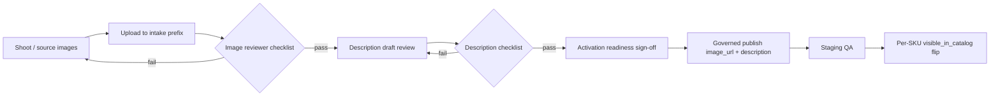

# First 5 SKU Media Intake Workflow

**Created:** 2026-06-12  
**Scope:** Controlled image + description intake for Batch 001 pilot SKUs  
**SKUs:** OAS-AS-BKL-0024, OAS-AS-BKL-0020, OAS-AS-BKL-0001, OAS-AS-BKL-0025, OAS-AS-BKL-0007

## Purpose

Provide a simple, governed path for merchandising to submit product images and approve buyer-facing descriptions **without** direct `products` writes, `visible_in_catalog` flips, or auto-approval.

This workflow sits between the [First 5 Pilot Execution Pack](./BATCH001_FIRST5_PILOT_EXECUTION_PACK.md) and catalogue activation.

---

## Executive summary

| Item | Recommendation |
|------|----------------|
| **Upload location (intake)** | Supabase Storage bucket `product-images`, prefix `batch001/intake/first5/` |
| **Local mirror (optional)** | `data/catalogue/intake/first5/` on shared merchandising drive (not committed to git) |
| **Naming convention** | `{SKU}_hero`, `{SKU}_square`, `{SKU}_detail` (`.jpg` preferred) |
| **Primary catalogue image** | `{SKU}_square` → becomes `products.image_url` after governed publish |
| **Buyer preview** | **NO-GO** until intake + review + activation checklists complete |

---

## 1. Where images should be uploaded

### Stage A — Intake (this workflow)

Upload all raw assets to the **intake prefix** only:

```
product-images/batch001/intake/first5/
```

| SKU | Example paths |
|-----|---------------|
| OAS-AS-BKL-0024 | `.../OAS-AS-BKL-0024_hero.jpg`, `.../OAS-AS-BKL-0024_square.jpg`, `.../OAS-AS-BKL-0024_detail.jpg` |
| OAS-AS-BKL-0020 | `.../OAS-AS-BKL-0020_hero.jpg`, etc. |

**How to upload (no product record changes):**

1. **Preferred:** Supabase Dashboard → Storage → `product-images` → create folder `batch001/intake/first5/` → upload files with exact names from [first5_image_naming_manifest.csv](../data/catalogue/first5_image_naming_manifest.csv).
2. **Alternative:** Shared merchandising drive folder mirroring the same path and filenames; catalogue admin uploads to Storage after review.
3. **Do not** use Admin → Products image picker during intake — that writes `image_url` immediately.

### Stage B — Publish (separate governed step, out of scope here)

After reviewer sign-off, catalogue admin copies approved square (and optional hero) to:

```
product-images/batch001/live/
```

Then links `{SKU}_square` to `products.image_url` via **Catalogue Sync / Products admin** with explicit approval. No bulk publish. No `visible_in_catalog` change in this step.

### Description drafts (no DB write in intake)

Source text: [batch001_first5_description_drafts.csv](../data/catalogue/batch001_first5_description_drafts.csv)  
Track approvals in [first5_description_approval_checklist.csv](../data/catalogue/first5_description_approval_checklist.csv).

---

## 2. File naming convention

Pattern: **`{SKU}_{role}.{ext}`**

| Role | Filename pattern | Required | Aspect | Min resolution | Use |
|------|------------------|:--------:|--------|----------------|-----|
| Hero | `{SKU}_hero.jpg` | Yes | 16:9 | 1600×900 | Product detail banner / marketing |
| Square | `{SKU}_square.jpg` | Yes | 1:1 | 1200×1200 | Buyer catalogue card (`image_url`) |
| Detail | `{SKU}_detail.jpg` | Optional | 4:3 | 1600×1200 | Close-up / cross-section |

**Rules:**

- Use the full SKU including `OAS-AS-BKL-` prefix and hyphens.
- Lowercase extension: `.jpg` (`.webp` acceptable if team standardizes).
- No spaces, no random suffixes, no timestamps in filename.
- One file per role per SKU; replace in place if reshooting.

**Examples:**

- `OAS-AS-BKL-0024_hero.jpg`
- `OAS-AS-BKL-0024_square.jpg`
- `OAS-AS-BKL-0024_detail.jpg`

Full manifest: `data/catalogue/first5_image_naming_manifest.csv`

---

## 3. Image reviewer checklist

Reviewer: **Merchandising lead** or delegated **catalogue reviewer**.  
Record pass/fail in the image manifest CSV `review_status` column (manual update).

| # | Check | Pass criteria |
|---|-------|---------------|
| 1 | **Image clarity** | In focus, well lit, no heavy blur or compression artifacts |
| 2 | **Correct product** | Matches SKU name and variant (e.g. Mor Pistachio Durum ≠ Mor Pistachio Asiyah) |
| 3 | **No wrong packaging** | Pack size and label match Central record (1 kg / 3 kg / 6 kg) |
| 4 | **No watermark** | No stock watermarks, competitor logos, or phone numbers |
| 5 | **Suitable for buyer catalogue** | Professional presentation; square crop works at card size; no distracting backgrounds |

**Per-asset notes:**

- **Hero:** Product recognizable at wide crop; packaging legible if shown.
- **Square:** Product centered; safe margin for rounded card UI; works on light and dark backgrounds.
- **Detail (optional):** Texture/layers visible; still passes checks 1–5.

**Reject path:** Return to merchandising with SKU + role + reason; re-upload to intake prefix with same filename.

---

## 4. Description approval checklist

Reviewer: **Merchandising** (draft) → **Catalogue admin** (final).  
Track in `data/catalogue/first5_description_approval_checklist.csv`.

| # | Check | Pass criteria |
|---|-------|---------------|
| 1 | **Accurate product** | Name, origin (Lebanese/Turkish), nut/variant correct |
| 2 | **Pack size stated** | Matches live pack (1 kg, 3 kg, or 6 kg) |
| 3 | **Buyer tone** | Wholesale/HORECA appropriate; no internal jargon |
| 4 | **Length** | 1–3 sentences; ≤ 220 characters preferred for card excerpt |
| 5 | **No unsubstantiated claims** | No health/medical claims; no competitor comparisons |
| 6 | **Spelling / grammar** | Proofread; consistent “baklawa” spelling |
| 7 | **Manual sign-off** | Reviewer name + date recorded in checklist CSV |

**Approval does not write to DB.** After sign-off, catalogue admin performs a separate governed save to `products.description`.

---

## 5. Final activation checklist

Activation is **per SKU**, in order: **0024 → 0020 → 0001 → 0025 → 0007**.  
Track in `data/catalogue/first5_activation_readiness_checklist.csv`.

| # | Gate | Owner | Required before next step |
|---|------|-------|---------------------------|
| 1 | Hero + square uploaded to intake prefix | Merchandising | — |
| 2 | Image reviewer checklist passed (both required assets) | Merchandising lead | Gate 1 |
| 3 | Square published to `batch001/live/` and `image_url` linked | Catalogue admin | Gate 2 |
| 4 | Description approval checklist signed | Merchandising + catalogue admin | — |
| 5 | Description saved to `products.description` (governed) | Catalogue admin | Gate 4 |
| 6 | `is_active` confirmed true | Catalogue admin | — |
| 7 | Live alias count re-verified | Language ops | — |
| 8 | Resolver PASS on primary utterance | Language ops | — |
| 9 | Staging buyer preview QA | Operations | Gates 3, 5, 6 |
| 10 | `visible_in_catalog` flip (single SKU) | Catalogue admin | All above |

**Explicitly out of scope for this workflow:** steps 3, 5, 6, 10 product writes; step 10 visibility flip.

---

## Workflow diagram



---

## Deliverables

| File | Purpose |
|------|---------|
| `data/catalogue/first5_image_naming_manifest.csv` | Filename, paths, review status per asset |
| `data/catalogue/first5_description_approval_checklist.csv` | Per-SKU description review gates |
| `data/catalogue/first5_activation_readiness_checklist.csv` | End-to-end activation gates |

---

## Constraints

- No SQL, migrations, or production writes in this workflow document
- No direct `products` updates during intake
- No `visible_in_catalog` flip
- No auto-approval of images or descriptions

---

## Current status (2026-06-12 snapshot)

| SKU | Images in intake | Image review | Description review | Activation |
|-----|:----------------:|:------------:|:------------------:|:----------:|
| OAS-AS-BKL-0024 | pending | pending | draft ready | blocked |
| OAS-AS-BKL-0020 | pending | pending | draft ready | blocked |
| OAS-AS-BKL-0001 | pending | pending | draft ready | blocked |
| OAS-AS-BKL-0025 | pending | pending | draft ready | blocked |
| OAS-AS-BKL-0007 | pending | pending | draft ready | blocked |

**GO/NO-GO for buyer catalogue preview:** **NO-GO** — zero intake uploads and zero reviewer sign-offs recorded.
