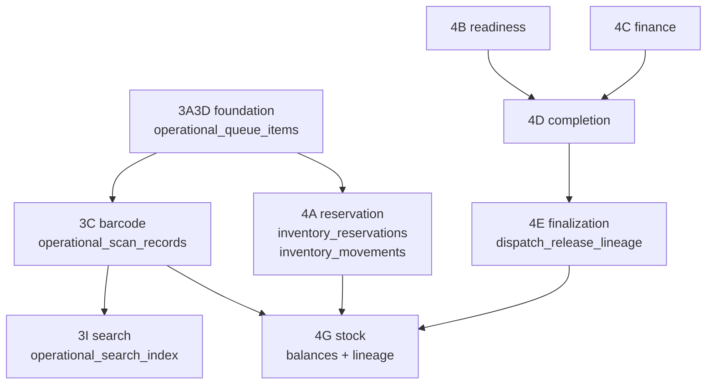

# Migration deployment plan — Execution OS (production)

**Production project:** `tcxvcatsqqertcnycuop`  
**Staging reference:** `aruyieslaxjhnamlstpx` (golden chain validated in STAGE 14G; full stack per `docs/EXECUTION_OS_STACK_STAGING_READINESS.md`)  
**Status:** Planning only — **do not execute** from this document without a controlled change window.

---

## Scope

Bring production to **governed golden-chain parity** for Phase 4 pilot tables:

| Target table | Created in migration |
|--------------|-------------------|
| `operational_scan_records` | Phase 3C |
| `inventory_reservations` | Phase 4A |
| `inventory_movements` | Phase 4A (extended in 4G) |
| `dispatch_readiness_evidence` | Phase 4B |
| `finance_review_evidence` | Phase 4C |
| `dispatch_completion_evidence` | Phase 4D |
| `dispatch_release_lineage` | Phase 4E |
| `inventory_stock_balances` | Phase 4G |
| `stock_consumption_lineage` | Phase 4G |
| `order_status_history` | **Pre-existing on production** (legacy; not created by Execution OS) |

---

## Prerequisites on production (verified read-only)

| Prerequisite | Production status |
|--------------|-------------------|
| `public.is_internal_staff(uuid)` | **Present** |
| `public.get_user_role(uuid)` | **Present** |
| `public.orders` | **Present** (app dependency) |
| Phase 4A–4G tables | **Absent** |
| Execution OS rows in `supabase_migrations.schema_migrations` | **Absent** (none `20260525*` / `20260526*`) |

---

## Migration inventory and execution order

Apply **in this exact order** (timestamp order on `main`):

| Order | Filename | Purpose | Tables / objects created or altered |
|------:|----------|---------|-------------------------------------|
| 1 | `20260525230000_execution_os_phase3a3d_foundation.sql` | Operational queue + append-only events foundation | `operational_queue_items`, `operational_queue_assignments`, `operational_events`; indexes; RLS; `prevent_operational_event_mutation()` + triggers |
| 2 | `20260526010000_execution_os_phase3c_barcode_execution.sql` | Barcode / scan evidence (4G `scanReference`) | **`operational_scan_records`**; indexes; append-only trigger `prevent_operational_scan_mutation()`; RLS |
| 3 | `20260526020000_execution_os_phase3i_operational_search_index.sql` | Internal search index (recommended with 3C on staging) | `operational_search_index` (FK to scans/queues/events); GIN indexes; RLS |
| 4 | `20260526030000_execution_os_phase4a_inventory_reservation.sql` | Governed reservations + movement ledger | **`inventory_reservations`**, `inventory_reservation_allocations`, **`inventory_movements`**; indexes; `prevent_inventory_movement_mutation()`; RLS |
| 5 | `20260526120000_execution_os_phase4b_dispatch_readiness.sql` | Dispatch readiness evidence (4B) | **`dispatch_readiness_evidence`**; immutable triggers; RLS |
| 6 | `20260526130000_execution_os_phase4c_finance_governance.sql` | Finance governance evidence (4C) | **`finance_review_evidence`**; immutable triggers; RLS |
| 7 | `20260526140000_execution_os_phase4d_dispatch_completion.sql` | Completion attestation (4D) | **`dispatch_completion_evidence`**; immutable triggers; RLS |
| 8 | `20260526150000_execution_os_phase4e_dispatch_finalization.sql` | Dispatch release lineage (4E) | **`dispatch_release_lineage`**; immutable triggers; RLS; REVOKE UPDATE/DELETE |
| 9 | `20260526160000_execution_os_phase4g_stock_finalization.sql` | Stock balances + consumption lineage (4G) | **`inventory_stock_balances`**, **`stock_consumption_lineage`**; **ALTER** `inventory_movements` CHECK to add `dispatch_consumption_confirmed` / reversal / variance types; lineage immutable triggers; RLS |

**Note:** Step 3 is not in the user’s ten-table list but is part of staging stack (`EXECUTION_OS_STACK_STAGING_READINESS.md`) and depends on steps 1–2. Include it for staging parity unless search index is explicitly out of scope.

### Full staging stack (beyond this plan)

Staging also applied Phase 3B / 3E / 3F / 3H / 3J migrations (separate files on `main`). Those are **not required** for the ten pilot tables above but are required for **full** Execution OS feature parity (department boards, CMD center, mobile/TV, etc.).

---

## Dependency graph

**Hard FK dependencies:**

- `inventory_reservations.queue_item_id` → `operational_queue_items` (nullable but table must exist)
- `operational_scan_records.queue_item_id` → `operational_queue_items`
- `stock_consumption_lineage.reservation_id` → `inventory_reservations`
- `operational_search_index` → `operational_scan_records`, `operational_queue_items`, `operational_events` (if step 3 included)

**Soft dependencies (application, not FK):**

- `is_internal_staff`, `get_user_role` — already on production
- `orders` — existing; 4E updates `orders.status` via app only (no migration trigger)

---

## Per-migration dependency detail

### Functions (created)

| Function | Migration |
|----------|-----------|
| `prevent_operational_event_mutation` | 3A3D |
| `prevent_operational_scan_mutation` | 3C |
| `prevent_inventory_movement_mutation` | 4A |
| `dispatch_readiness_evidence_immutable` | 4B |
| `finance_review_evidence_immutable` | 4C |
| `dispatch_completion_evidence_immutable` | 4D |
| `dispatch_release_lineage_immutable` | 4E |
| `prevent_stock_consumption_lineage_mutation` | 4G |

### Triggers (append-only enforcement)

| Table | Triggers |
|-------|----------|
| `operational_events` | no UPDATE / no DELETE |
| `operational_scan_records` | no UPDATE / no DELETE |
| `inventory_movements` | no UPDATE / no DELETE |
| `dispatch_readiness_evidence` | no UPDATE / no DELETE |
| `finance_review_evidence` | no UPDATE / no DELETE |
| `dispatch_completion_evidence` | no UPDATE / no DELETE |
| `dispatch_release_lineage` | no UPDATE / no DELETE |
| `stock_consumption_lineage` | no UPDATE / no DELETE |

### Views

None in these nine migrations.

### Critical constraints (post-apply)

| Check | Migration |
|-------|-----------|
| `stock_consumption_lineage.lineage_type` includes `consumption_finalized` | 4G |
| `inventory_movements.movement_type` includes `dispatch_consumption_confirmed` | 4G (extends 4A) |
| `inventory_reservations.reservation_status`, `reserved_qty`, `fulfilled_qty` | 4A |
| `dispatch_release_lineage.release_type`, `previous_status`, `next_status` | 4E |
| `finance_review_evidence.review_type`, `review_status` | 4C |
| `dispatch_completion_evidence.evidence_type`, `completion_status` | 4D |

---

## Expected row impact

| Migration | DML on existing business tables | New table initial rows |
|-----------|----------------------------------|-------------------------|
| All nine | **None** (DDL only) | **0** (empty tables) |
| 4G `ALTER` on `inventory_movements` | N/A until 4A creates table | — |

**Existing production data:** `orders`, `order_status_history` (30 rows), legacy inventory tables — **unchanged** by these migrations.

---

## Deployment procedure (controlled — not executed in Phase 15.2)

1. **Pre-flight**
   - Resolve migration history drift (`docs/SUPABASE_MIGRATION_DRIFT_REPORT.md`) so `supabase db push` or dashboard apply can record versions `20260525230000` … `20260526160000`.
   - Backup / PITR snapshot of production database.
   - Confirm no concurrent schema migration jobs.

2. **Apply**
   - Link CLI: `supabase link --project-ref tcxvcatsqqertcnycuop`
   - Dry-run / diff review: `supabase db diff` (optional)
   - Apply in order: `supabase db push` **or** run each SQL file in a single maintenance transaction per file.

3. **Post-apply verification (read-only)**
   - Re-run `PHASE_15_1` table/column probe.
   - Smoke: governance board loads (`probeStockFinalizationTables`, reservation probe).
   - Do **not** run pilot orders until sign-off.

---

## Rollback considerations

| Approach | Notes |
|----------|--------|
| **Forward-only (recommended)** | If pilot fails, disable UI routes; leave schema in place. Safest for append-only ledgers. |
| **DDL rollback** | Drop in **reverse order** (4G → 4E → … → 3A3D). Only safe if **no pilot/production data** written to new tables. |
| **4G partial rollback** | Dropping `stock_consumption_lineage` / `inventory_stock_balances` does not restore old `inventory_movements` CHECK without manual SQL. |
| **Migration history** | Removing rows from `supabase_migrations.schema_migrations` without matching down-migration is dangerous — treat as forward-only. |

**Risk:** After pilot data exists, rollback requires governed data migration, not simple `DROP TABLE`.

---

## Deployment risks

| Risk | Severity | Mitigation |
|------|----------|------------|
| Migration history drift blocks `db push` | **High** | Repair/reconcile per drift report before apply |
| Long-running DDL lock on `orders`-heavy workload | Medium | Maintenance window; apply off-peak |
| Missing `is_internal_staff` | Low | Already present on production |
| Skipping step 1 breaks 3C/4A FKs | **High** | Never skip foundation |
| Applying 4G before 4A | **Critical** | Enforce order |
| App deployed before schema | **High** | Apply schema before enabling pilot (code already at PR #132 on Vercel) |

---

## Estimated deployment duration (technical)

| Phase | Estimate |
|-------|----------|
| Pre-flight drift reconciliation | Variable (human + CLI) |
| DDL apply (9 migrations, empty DB) | **~3–15 minutes** (depends on locks, region, concurrent traffic) |
| Post-apply read-only verification | **~15–30 minutes** |

Not a calendar project estimate — wall-clock DDL on an active production instance may require a short maintenance window if lock contention appears.

---

## Staging vs production (migration state)

| Item | Staging (`aruyieslaxjhnamlstpx`) | Production (`tcxvcatsqqertcnycuop`) |
|------|-------------------------------|-------------------------------------|
| Execution OS migrations in remote history | **Applied** (per STAGE 14G UI proof) | **Not applied** |
| Ten pilot tables | **Present** (operational validation) | **Missing** (except legacy `order_status_history`) |
| MCP read access for this audit | Permission denied | **OK** |

---

## Sign-off checklist

- [ ] Migration drift reconciled
- [ ] Nine migrations applied in order
- [ ] `PHASE_15_1` re-probe PASS
- [ ] Staging smoke on production clone (optional)
- [ ] Pilot checklist `PRODUCTION_PILOT_CHECKLIST.md` enabled
