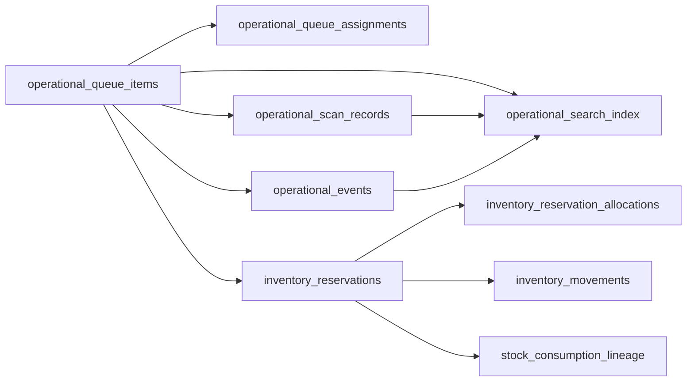

# PHASE 15.4 — Deployment readiness review (Execution OS migrations)

**Scope:** Nine Execution OS migrations required for governed pilot tables, plus awareness of **ten** additional pending migrations that `db push` will apply first.  
**Production:** `tcxvcatsqqertcnycuop`  
**Rules:** Review only — no apply, no production writes.

---

## 1. Migration chain under review

| # | File | Creates / alters |
|---|------|------------------|
| 1 | `20260525230000_execution_os_phase3a3d_foundation.sql` | `operational_queue_items`, `operational_queue_assignments`, `operational_events` |
| 2 | `20260526010000_execution_os_phase3c_barcode_execution.sql` | `operational_scan_records` |
| 3 | `20260526020000_execution_os_phase3i_operational_search_index.sql` | `operational_search_index` |
| 4 | `20260526030000_execution_os_phase4a_inventory_reservation.sql` | `inventory_reservations`, `inventory_reservation_allocations`, `inventory_movements` |
| 5 | `20260526120000_execution_os_phase4b_dispatch_readiness.sql` | `dispatch_readiness_evidence` |
| 6 | `20260526130000_execution_os_phase4c_finance_governance.sql` | `finance_review_evidence` |
| 7 | `20260526140000_execution_os_phase4d_dispatch_completion.sql` | `dispatch_completion_evidence` |
| 8 | `20260526150000_execution_os_phase4e_dispatch_finalization.sql` | `dispatch_release_lineage` |
| 9 | `20260526160000_execution_os_phase4g_stock_finalization.sql` | `inventory_stock_balances`, `stock_consumption_lineage`; **ALTER** `inventory_movements` CHECK |

---

## 2. FK chain verification

| Child | FK parent | ON DELETE | Migration |
|-------|-----------|-----------|-----------|
| `operational_queue_assignments.queue_item_id` | `operational_queue_items.id` | RESTRICT | 3A3D |
| `operational_events.queue_item_id` | `operational_queue_items.id` | RESTRICT | 3A3D |
| `operational_scan_records.queue_item_id` | `operational_queue_items.id` | RESTRICT | 3C |
| `operational_search_index.queue_item_id` | `operational_queue_items.id` | RESTRICT | 3I |
| `operational_search_index.scan_record_id` | `operational_scan_records.id` | RESTRICT | 3I |
| `operational_search_index.event_id` | `operational_events.id` | RESTRICT | 3I |
| `inventory_reservations.queue_item_id` | `operational_queue_items.id` | RESTRICT | 4A |
| `inventory_reservation_allocations.reservation_id` | `inventory_reservations.id` | RESTRICT | 4A |
| `inventory_movements.reservation_id` | `inventory_reservations.id` | RESTRICT | 4A |
| `stock_consumption_lineage.reservation_id` | `inventory_reservations.id` | RESTRICT | 4G |

**Evidence tables (4B–4E):** `order_id` uuid columns — **no FK** to `orders` (application-level integrity).

**4G → 4A:** `ALTER TABLE inventory_movements` requires table from 4A. **Cannot reorder.**

**Verdict:** FK chain is **valid** when migrations run in timestamp order. **FAIL** if 4A skipped or 4G run before 4A.

---

## 3. Trigger chain verification

| Function | Table(s) | Operation blocked |
|----------|----------|-------------------|
| `prevent_operational_event_mutation()` | `operational_events` | UPDATE, DELETE |
| `prevent_operational_scan_mutation()` | `operational_scan_records` | UPDATE, DELETE |
| `prevent_inventory_movement_mutation()` | `inventory_movements` | UPDATE, DELETE |
| `dispatch_readiness_evidence_immutable()` | `dispatch_readiness_evidence` | UPDATE, DELETE |
| `finance_review_evidence_immutable()` | `finance_review_evidence` | UPDATE, DELETE |
| `dispatch_completion_evidence_immutable()` | `dispatch_completion_evidence` | UPDATE, DELETE |
| `dispatch_release_lineage_immutable()` | `dispatch_release_lineage` | UPDATE, DELETE |
| `prevent_stock_consumption_lineage_mutation()` | `stock_consumption_lineage` | UPDATE, DELETE |

All use `BEFORE UPDATE` / `BEFORE DELETE` → `RAISE EXCEPTION`.

**REVOKE complement:** `operational_events`, `operational_scan_records`, `inventory_movements`, `dispatch_release_lineage`, `stock_consumption_lineage` also revoke UPDATE/DELETE from `authenticated` / `anon` where specified.

**3I:** No append-only triggers; `REVOKE DELETE` on `operational_search_index` only.

**Queue tables:** `operational_queue_items` allows UPDATE (lifecycle); not append-only.

**Verdict:** Trigger chain is **consistent** with governed append-only evidence model.

---

## 4. RLS chain verification

**Prerequisite functions (production — verified):**

- `public.is_internal_staff(uuid)` — present
- `public.get_user_role(uuid)` — present

### 4.1 Baseline staff gate (3A3D, 3C, 4A, 4G balances/lineage)

- **SELECT / INSERT** (and UPDATE on queues/reservations): `is_internal_staff(auth.uid())`

### 4.2 Role-scoped gates (4B–4E)

| Table | SELECT | INSERT |
|-------|--------|--------|
| `dispatch_readiness_evidence` | Staff, not `SALES_EXECUTIVE` | Same |
| `finance_review_evidence` | Staff, not `SALES_EXECUTIVE` | Finance roles + admin set |
| `dispatch_completion_evidence` | Staff, not `SALES_EXECUTIVE` | Dispatch role set |
| `dispatch_release_lineage` | Staff, not `SALES_EXECUTIVE` | Dispatch role set |

**4G stock balances:** Staff read/insert/update (governed update policy — app must enforce version discipline).

**Verdict:** RLS chain **depends** on `is_internal_staff` / `get_user_role` — satisfied on production. Pilot SUPER_ADMIN must be in staff map.

---

## 5. Critical CHECK constraints (post-apply)

| Table | Constraint | Values include (pilot-critical) |
|-------|------------|----------------------------------|
| `inventory_movements` | `inventory_movements_type_check` | `dispatch_consumption_confirmed` (added in 4G) |
| `stock_consumption_lineage` | `stock_consumption_lineage_type_check` | `consumption_finalized` |
| `inventory_reservations` | status + qty coherent | `reserved`, `fulfilled`, qty caps |
| `dispatch_release_lineage` | `release_type` | `finalize`, `override`, … |

**4G migration step:** `DROP CONSTRAINT IF EXISTS inventory_movements_type_check` then re-ADD — brief exclusive lock on `inventory_movements` **only after table exists** (empty at first deploy).

---

## 6. Rollback risk

| Scenario | Risk | Notes |
|----------|------|-------|
| Rollback before any pilot writes | Medium | Drop tables reverse order 4G→3A3D; drop functions/triggers |
| Rollback after pilot evidence written | **High** | Append-only tables hold audit data; forward-only preferred |
| Rollback 4G only | **High** | CHECK on `inventory_movements` may not restore without manual SQL |
| Remove `schema_migrations` rows without DDL | **Critical** | Desyncs CLI from reality |

**Recommendation:** Treat production apply as **forward-only**. Disable pilot UI if rollback needed; do not drop tables after data exists.

---

## 7. Lock risk

| Migration | Lock concern | Mitigation |
|-----------|--------------|------------|
| 3A3D–4E | `CREATE TABLE IF NOT EXISTS` — new tables only | Low contention on empty catalog |
| 3I | **GIN indexes** on new `operational_search_index` | Moderate CPU; empty table at deploy |
| 4G | `ALTER TABLE inventory_movements` ADD CONSTRAINT | Short lock on new empty table |
| Pending `20260508155100` (pre-OS) | **DROP/CREATE POLICY** on `orders`, `companies` | Run in maintenance window; highest lock risk in full push |

No `CREATE INDEX CONCURRENTLY` in Execution OS files. No explicit `ACCESS EXCLUSIVE` beyond normal DDL.

**Estimated DDL time (Execution OS nine only, empty DB):** ~3–15 minutes.  
**Full `db push` (19 migrations):** add time for RLS migration + payment/storage policies — plan **15–45 minutes** wall-clock including verification.

---

## 8. Row impact

| Migration | Existing table DML | New table rows |
|-----------|-------------------|----------------|
| All nine Execution OS | **None** | **0** at deploy |
| Pending pre-OS (see 15.3) | Mostly `ADD COLUMN IF NOT EXISTS`, policy changes | N/A |

`orders`, `order_status_history` (~30 rows), legacy inventory — **unchanged** by Execution OS DDL.

---

## 9. Pre-OS pending migrations (push bundle risk)

When using `supabase db push`, these run **before** Execution OS:

| Version | Risk highlight |
|---------|----------------|
| `20260508155100` | **RLS policy replacement** on core commerce tables |
| `20260515194500` | Storage + payment policies (136 lines) |
| `20260518220000` | WhatsApp audit reconcile (idempotent) |
| Others | Low — additive columns, small alters |

**Deployment review verdict for Execution OS files:** **APPROVED for apply** in defined order, assuming prerequisites met.

**Deployment review verdict for full `db push`:** **CONDITIONAL** — requires explicit sign-off on pending RLS migrations 1–10.

---

## 10. Staging parity note

Staging (`aruyieslaxjhnamlstpx`) has Execution OS schema (STAGE 14G proof). Production lacks tables and migration rows. **Code at `189177df` is ahead of production DB** — expected failure mode for governance boards until apply completes.

---

*End of Phase 15.4 deployment review.*
