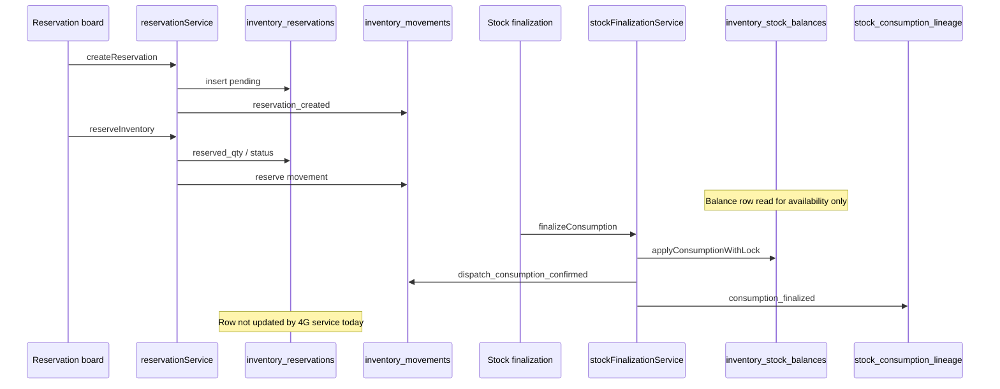

# PHASE 15 — Production pilot preparation report

**Date:** 2026-05-30  
**Production project:** `tcxvcatsqqertcnycuop` (not accessed in this phase)  
**Staging reference:** `aruyieslaxjhnamlstpx`  
**Code baseline:** `main` @ `189177dfd70407ac02b042cd11a7a5f24f846e44` (includes PR #129, #131, #132)

---

## 1. PR #132 merge status

| Item | Status |
|------|--------|
| PR #132 | **MERGED** to `main` |
| Merge commit | `189177dfd70407ac02b042cd11a7a5f24f846e44` |
| Merged at | 2026-05-30T18:24:39Z |
| URL | https://github.com/oasisbaklawa2006/Oasis-Baklawa-Central/pull/132 |

Includes: SUPER_ADMIN `overrideReason` on stock finalization, reservation-board context/loading fixes (14H.1), reserve-failure compensation.

---

## 2. Deliverables

| Document | Purpose |
|----------|---------|
| `docs/PRODUCTION_PILOT_CHECKLIST.md` | Operator + engineering pre/pilot/post checklist |
| `docs/PILOT_ORDER_TEST_MATRIX.md` | Per-order pass/fail matrix for 5–10 orders |
| `docs/PHASE_15_PRODUCTION_PILOT_REPORT.md` | This report |

---

## 3. Reservation lifecycle audit (after stock consumption)

### 3.1 Intended governed flow

### 3.2 Table-by-table behavior (post–4G)

| Table | After 4F (reserve) | After 4G (finalize) | Governed writer |
|-------|------------------|---------------------|-----------------|
| **inventory_reservations** | `reservation_status` → `reserved` (typical); `reserved_qty` set; `fulfilled_qty` usually **0** | **No service update** — status/qty often unchanged | `reservationRepository` (4F only) |
| **inventory_movements** | `reservation_created` + reserve-type movement | Adds **`dispatch_consumption_confirmed`** (qty = consume) | Reservation repo + `supabaseStockFinalizationStore` |
| **stock_consumption_lineage** | None | **`consumption_finalized`** with `consumed_qty`, `correlation_id`, scan/gate/lineage refs | `stockFinalizationService` only |
| **inventory_stock_balances** | May exist via staging seed; **`reserved_qty` often not increased on reserve** (movements-only hold model) | `available_qty` ↓; `version` ↑; `releaseReservedQty` capped by on-hand `reserved_qty` | Seed: staging UI; mutate: **4G only** |
| **orders.status** | Unchanged (`dispatched` required for board) | **Unchanged** (by design) | **4E only** for `→ dispatched` |

### 3.3 Reconciliation / UI after consumption

- Read model loads `alreadyFinalizedReservationIds` from `stock_consumption_lineage` (`consumption_finalized`).
- Stock board then shows **`consumption_blocked`** / `already_finalized` — prevents double finalize.
- **Operational gap:** Reservation board may still display `reserved` / `fulfilled_qty: 0` after 4G. Operators should trust **lineage + consumption movement**, not reservation row alone, until a future sync job or service patch updates `fulfilled_qty` / status.

### 3.4 Staging evidence (SO-2026-000002)

From STAGE 14G/14H on staging (read-only):

- Lineage: 1× `consumption_finalized`
- Movement: `dispatch_consumption_confirmed`
- Order: `dispatched`
- Reservation row: still `reserved`, `fulfilled_qty: 0`
- Balance: `available_qty` 50→49, `version` 1→2

---

## 4. `orders.status` mutation paths

### 4.1 Governed path (pilot-safe for `→ dispatched`)

| Path | Module | Notes |
|------|--------|-------|
| **Finalize dispatch** | `dispatchFinalizationService` → `updateOrderDispatchStatus` | Only transition to `dispatched` from allowed source statuses; optimistic guard |
| UI | `/admin/dispatch-finalization` | Documented golden-chain step 4E |

### 4.2 Other status mutations (outside 4E — operational risk)

These **can** change `orders.status` without dispatch finalization lineage. **Exclude pilot orders from these surfaces** or accept dual-path risk:

| Surface | File | Example transitions |
|---------|------|---------------------|
| Order pipeline | `OrderManagement.tsx` | Generic `effectiveNext` status |
| Admin orders | `AdminOrders.tsx` | Manual status changes |
| Finance release | `FinanceReleaseBoard.tsx` | `in_production`, payment fields |
| Accounts release | `AdminAccountsRelease.tsx` | `manufacturing`, `cleared_for_dispatch`, payment |
| Packing / dispatch legacy | `AdminPackingDispatch.tsx` | `cleared_for_dispatch` |
| Dispatch management | `DispatchManagement.tsx` | `awaiting_final_payment` |
| Ready goods | `ReadyGoodsStore.tsx` | `packed_ready` |
| RGS stock check | `StockCheckEngine.tsx` | `manufacturing`, `packed_ready` |
| Admin finance | `AdminFinance.tsx` | Payment / document fields + status |
| Checkout / cart | `useCart.ts` | Draft / starter pack flags |

**Tests:** `legacyDispatchDecommission.test.ts` asserts key legacy files do **not** set `dispatched` directly; other statuses remain ungoverned.

**Pilot mitigation:** Restrict operators to governance boards for pilot orders; use order roster in matrix; verify `dispatch_release_lineage` exists before 4F/4G.

---

## 5. `inventory_stock_balances` mutation paths

| Path | Writer | Governed? | Pilot use |
|------|--------|-----------|-----------|
| **Stock finalization** | `supabaseStockFinalizationStore.applyConsumptionWithLock` / reversal | Yes — version lock | **4G** |
| **Initial balance seed** | `seedInitialStockBalance` → `upsertBalanceInitial` | Explicit staging button on reservation board | Only when no row exists |
| **Reads** | Reservation board, governance read models | Read-only | Safe |

**No other application code** in `src/` updates `inventory_stock_balances` (grep audit on `main` @ 189177d).

**Risk:** Reservation **movements** record hold logic, but balance `reserved_qty` may stay **0** until 4G deducts `available_qty` only — operators must not interpret `reserved_qty` on balance as reservation truth.

---

## 6. Remaining operational risks (ranked)

| Risk | Severity | Mitigation |
|------|----------|------------|
| Reservation row not updated after 4G | **Medium** | Verify `stock_consumption_lineage`; document in operator training |
| Balance `reserved_qty` out of sync with reservation row | **Medium** | PR #132 caps release at balance; seed balance before 4F if needed |
| Legacy `orders.status` changes on non-governance pages | **High** | Pilot order lock + role routing |
| SUPER_ADMIN override without audit trail text | **Low** | Require typed override; store in movement `reason_code` / lineage |
| Double 4G click / race | **Low** | Lineage idempotency via `already_finalized` blocker |
| Failed reserve orphan reservation | **Low** | 14H.1 compensation + cancel |
| Production migrations not applied | **High** | Pre-pilot table probe (checklist A1) |
| Using staging credentials on production | **Critical** | Separate env vars; network host check |

---

## 7. Pilot readiness verdict

| Criterion | Status |
|-----------|--------|
| Code on `main` (129 + 131 + 132) | ✅ |
| Staging golden chain proven (4B–4G) | ✅ (reference order) |
| Operator checklists | ✅ (this phase) |
| Production data touched in prep | ✅ None |
| Migrations run in prep | ✅ None |
| Reservation lifecycle fully aligned in DB | ⚠️ **Partial** — lineage/movements/balance OK; reservation row lag |
| All order status paths governed | ❌ **No** — legacy surfaces remain |

### Recommendation

| | |
|--|--|
| **Controlled production pilot (5–10 orders)** | **CONDITIONALLY READY** |
| Conditions | (1) Production 4A–4G tables confirmed. (2) Pilot orders only on governance boards for dispatch→stock. (3) Operators trained on override reason, lineage proof, and reservation/balance display gaps. (4) Matrix + checklist completed per order. |

---

## 8. Suggested post-pilot engineering (out of scope for Phase 15)

Not implementing now — track as follow-ups:

1. Update `inventory_reservations` on `consumption_finalized` (`fulfilled_qty` / terminal status).
2. Optionally sync balance `reserved_qty` on `reserveInventory` if physical hold model requires it.
3. Expand legacy decommission tests for non-dispatched status mutations on pilot routes.

---

## 9. References

- `docs/STAGE_14B_GOLDEN_CHAIN_RUNBOOK.md`
- `docs/STAGE_14G_REPORT.md`, `docs/STAGE_14H_REPORT.md`, `docs/STAGE_14H_1_BUGBOT_FIX_REPORT.md`
- `src/lib/dispatch-finalization/dispatchStatusMutation.ts`
- `src/lib/stock-finalization/stockFinalizationService.ts`
- `src/lib/inventory-reservations/createGovernedReservation.ts`
