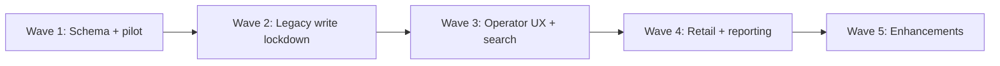

# PHASE 16 — Oasis Central rollout roadmap

**Derived from:** `docs/PHASE_16_SYSTEM_AUDIT.md`  
**Target:** Replace current manual operations with governed Oasis Central  
**Date:** 2026-05-30

---

## How to read priority

| Priority | Meaning |
|----------|---------|
| **P0** | Must complete before company-wide rollout |
| **P1** | Needed for operational excellence after initial rollout |
| **P2** | Enhancements and scale |

---

## P0 — Must finish before company rollout

### Platform & schema

| # | Task | Owner | Dependency |
|---|------|-------|--------------|
| P0-1 | Apply production migrations (19 pending incl. Execution OS) per `PRODUCTION_DEPLOYMENT_RUNBOOK.md` | DBA/Ops | Backup, change window |
| P0-2 | Phase 15.5 reprobe + Phase 15.1 re-probe PASS on production | Engineering | P0-1 |
| P0-3 | Production pilot 5–10 orders via `PILOT_ORDER_TEST_MATRIX.md` | Ops + Engineering | P0-2 |
| P0-4 | Sign `PRODUCTION_PILOT_CHECKLIST.md` with rollback owner | Leadership | P0-3 |

### Governance enforcement

| # | Task | Detail |
|---|------|--------|
| P0-5 | **Decommission writes** on `FinanceReleaseBoard` — read-only or redirect to `/admin/finance-governance` | Removes critical finance bypass |
| P0-6 | **Decommission / gate** `AdminFinance` direct `orders.status` and payment mutations | Route through 4C evidence |
| P0-7 | Audit `AdminAccountsRelease` — ensure no path to `dispatched`; route commercial release through finance governance | Align with 4C |
| P0-8 | Extend `LegacyDispatchGovernanceBanner` to all legacy dispatch/finance routes | Operator clarity |
| P0-9 | Grep CI guard: fail build on new `orders.update({ status: 'dispatched' })` outside `dispatch-finalization` | Prevent regression |
| P0-10 | Policy: **no new features** on `factory_inventory` writes — freeze or wrap | Stops dual-stock drift |

### Inventory & golden chain data integrity

| # | Task | Detail |
|---|------|--------|
| P0-11 | Fix or document **reservation row sync after 4G** (`fulfilled_qty` / status vs lineage) | Operator trust |
| P0-12 | Align **reserve → balance `reserved_qty`** model (movements-only vs balance update) | Availability accuracy |
| P0-13 | Run golden chain on production pilot orders only — no bulk backfill until signed | Risk control |

### Legacy operations containment

| # | Task | Detail |
|---|------|--------|
| P0-14 | `OrderManagement` — block or banner all statuses that skip 4C/4B evidence | Pipeline discipline |
| P0-15 | `CMDWarRoom` / war room cards — remove or guard status mutations | High-risk shadow writes |
| P0-16 | WhatsApp webhook — document allowed status transitions; block `dispatched` | Edge bypass |
| P0-17 | Training runbook: **sole path to dispatched** = `/admin/dispatch-finalization` | Change management |

### Rollout gates

| # | Task | Detail |
|---|------|--------|
| P0-18 | Role map verification: all pilot operators in `is_internal_staff` + correct roles for 4B–4E inserts | RLS |
| P0-19 | Hide or role-gate legacy routes from default nav (finance-board, central-pool) | UX |
| P0-20 | Production monitoring: alert on `dispatch_release_lineage` insert without prior 4B/4C/4D evidence (SQL check) | Compliance |

---

## P1 — Operational excellence

### Operator UX

| # | Task |
|---|------|
| P1-1 | Golden chain **order wizard** — deep link SO → 4B → 4C → 4D → 4E → 4F → 4G with step status |
| P1-2 | Unified **order search** on all governance boards (SO / human order # / UUID) |
| P1-3 | Sidebar cleanup — add missing governance links; remove dead aliases |
| P1-4 | Mobile QA pass on 4B–4G boards (iPhone SE + 14 Pro) |
| P1-5 | Remove IOS design-reference panel from operator default view on reservation board |

### Inventory platform

| # | Task |
|---|------|
| P1-6 | Shelf / outlet inventory read model (migration + RLS) |
| P1-7 | Migrate or reconcile `factory_inventory` reads to governed balances where possible |
| P1-8 | Populate `operational_search_index` indexing job post-3I migration |
| P1-9 | Wire work queue **claim/assign** UI to `operational_queue_items` |
| P1-10 | Scan event authoritative feed → scan timeline + CMD pressure |

### Finance & dispatch

| # | Task |
|---|------|
| P1-11 | Retire `AdminFinance` legacy flows after parity in finance governance |
| P1-12 | Pack/Dispatch surfaces: read-only mode default; partial legs only |
| P1-13 | Finance hold / release **executive dashboard** from `finance_review_evidence` |

### Retail & floor

| # | Task |
|---|------|
| P1-14 | Store coordination — backend for governed reservation drafts |
| P1-15 | Ready goods — route status changes through governed gates (packed-ready service) |
| P1-16 | Operations controller — remove `factory_inventory` direct writes or lineage wrap |

### Management & reporting

| # | Task |
|---|------|
| P1-17 | **Governance compliance** report: orders with status changes lacking lineage |
| P1-18 | **Dual inventory reconciliation** report (factory vs balances) |
| P1-19 | CMD — label bounded window + live counts when stores exist |
| P1-20 | KPI dashboard: dispatch cycle time, reservation SLA, finalize latency |

### Customer & comms

| # | Task |
|---|------|
| P1-21 | Customer timeline bind to order milestones (customer-safe projection) |
| P1-22 | Unified notification outbox for dispatch/finance events |
| P1-23 | WhatsApp template alignment with governed status names |

---

## P2 — Enhancements

| # | Task |
|---|------|
| P2-1 | Label print adapter (vendor driver + audit queue) |
| P2-2 | AI order intake with human-in-the-loop guardrails |
| P2-3 | Media vault storage policy + compliance retention |
| P2-4 | Full entity graph persistence (cross-module) |
| P2-5 | Autonomous queue routing (explicitly gated — post-approval only) |
| P2-6 | Public landing page / marketing route wiring |
| P2-7 | Dedicated `CMDHeartbeat` route vs dashboard alias |
| P2-8 | Advanced execution intelligence (ML bottleneck hints) |
| P2-9 | Multi-warehouse / location expansion on stock balances |
| P2-10 | Buyer app native shell / PWA offline catalogue |

---

## Top 25 remaining tasks (ordered)

| Rank | ID | Task | Priority |
|------|-----|------|----------|
| 1 | P0-1 | Production DB migration apply (19 migrations) | P0 |
| 2 | P0-2 | Post-migrate reprobe PASS | P0 |
| 3 | P0-3 | Production pilot 5–10 orders | P0 |
| 4 | P0-5 | Decommission FinanceReleaseBoard writes | P0 |
| 5 | P0-6 | Gate AdminFinance legacy mutations | P0 |
| 6 | P0-11 | Reservation row sync after 4G consumption | P0 |
| 7 | P0-12 | Reserve vs balance `reserved_qty` alignment | P0 |
| 8 | P0-9 | CI grep guard on `dispatched` writes | P0 |
| 9 | P0-15 | CMD / war room status mutation guard | P0 |
| 10 | P0-16 | WhatsApp webhook status policy | P0 |
| 11 | P0-17 | Operator training — golden chain only | P0 |
| 12 | P0-10 | Freeze `factory_inventory` new writes | P0 |
| 13 | P0-14 | OrderManagement governance banners/blocks | P0 |
| 14 | P1-1 | Golden chain order wizard UX | P1 |
| 15 | P1-6 | Shelf-level inventory read model | P1 |
| 16 | P1-7 | Dual inventory reconciliation | P1 |
| 17 | P1-8 | Operational search index population | P1 |
| 18 | P1-9 | Work queue claim/assign UI | P1 |
| 19 | P1-10 | Authoritative scan feed | P1 |
| 20 | P1-11 | Retire AdminFinance after 4C parity | P1 |
| 21 | P1-17 | Governance compliance dashboard | P1 |
| 22 | P1-4 | Mobile QA governance boards | P1 |
| 23 | P1-14 | Store coordination reservation backend | P1 |
| 24 | P1-21 | Customer timeline public bind | P1 |
| 25 | P2-1 | Label print adapter | P2 |

---

## Suggested rollout waves

| Wave | Scope | Exit criteria |
|------|-------|---------------|
| **1** | P0-1 – P0-4 | Production schema + pilot PASS |
| **2** | P0-5 – P0-20 | No ungoverned dispatched/finance writes in pilot cohort |
| **3** | P1-1 – P1-10 | Operators use wizard; search + queues live |
| **4** | P1-11 – P1-23 | Retail + exec dashboards |
| **5** | P2-* | Optional competitive features |

---

## Estimated completion

| Milestone | % of “replace operations” |
|-----------|---------------------------|
| Today (code + staging) | **~62%** |
| After Wave 1 (prod schema + pilot) | **~72%** |
| After Wave 2 (legacy lockdown) | **~82%** |
| After Wave 3 (UX + infra) | **~88%** |
| After Wave 4 (retail + reporting) | **~93%** |
| After Wave 5 | **~97%** |

---

*End of Phase 16 roadmap.*
