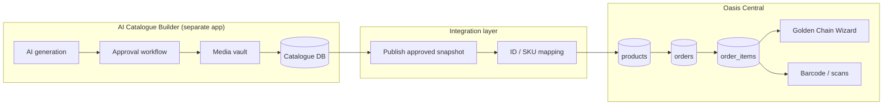

# Phase 25A — AI Catalogue Builder × Oasis Central Integration Boundary

**Date:** 2026-06-01  
**Status:** Architecture / contract only (no implementation)  
**Predecessor:** Phase 24 closed — Golden Chain operator pilot ready on `/admin/golden-chain-operator`

---

## 1. Executive summary

The **AI Catalogue Builder** is a **separate application** with its own backend, database, media workflows, and deployment. **Oasis Central** must not host catalogue generation, AI content, or approval workflows.

Central’s role is a **thin integration slice**:

- Consume **approved** catalogue products from the builder (sync or API).
- Map external catalogue records to Central `products` / `order_items`.
- Support **buyer catalogue browse**, **cart/checkout**, and **Golden Chain–ready order creation** using existing Central tables.
- Expose **read-only** product/catalogue preview in admin where needed.

Golden Chain, barcode execution, dispatch, finance, and stock logic **remain unchanged** — they operate on Central `orders` + `order_items` + `products.sku` after an order exists.

---

## 2. System boundary

| System | Owns |
|--------|------|
| **AI Catalogue Builder** | Catalogue authoring, AI copy/images, approvals, versioning, public builder UI, catalogue DB |
| **Integration layer** | Contract schema, sync jobs, mapping table(s), idempotency, audit of publishes |
| **Oasis Central** | Operational `products`, B2B storefront catalogue view, cart/orders, Golden Chain, inventory reservations, barcode/gate scans |

---

## 3. Data ownership

| Data | Owner | Central may |
|------|--------|-------------|
| Draft / rejected catalogue drafts | AI Catalogue Builder | — |
| Approved catalogue product snapshot | AI Catalogue Builder (source of truth until mapped) | Read + map |
| `products` row (operational SKU) | Oasis Central | CRUD via admin; **sync-in** from approved publish |
| `order_items` | Oasis Central | Create from cart or admin seed |
| `orders` (status, payment, dispatch) | Oasis Central | Full lifecycle |
| Governance evidence / lineage / reservations | Oasis Central | Golden Chain only |
| Product images in builder vault | AI Catalogue Builder | Store **URLs** on Central `products.image_url` after publish |
| Buyer-visible catalogue sort/merchandising | Split: builder proposes; Central `visible_in_catalog` + merchandising admin | Central enforces visibility |

---

## 4. Current Central touchpoints (as-is)

### 4.1 Products & catalogue browse

| Location | Role |
|----------|------|
| `src/pages/Catalogue.tsx` | Buyer B2B catalogue (`/catalogue`) — categories, search, sort |
| `src/hooks/useProducts.ts` | Loads `products` + `factory_inventory` for display stock hint |
| `src/components/catalogue/*` | Cards, quick order table, carton builder |
| `src/pages/ProductDetail.tsx` | Single product detail |
| `src/components/SearchOverlay.tsx` | Global product search by name/SKU/category |
| `src/pages/admin/AdminProducts.tsx` | Admin product CRUD (master data) |
| `src/pages/admin/AdminMerchandising.tsx` | Merchandising / visibility |
| `src/pages/admin/AdminPricing.tsx` | Price tiers on products |

**DB:** `products` (wide schema: `sku`, `name`, `category`, `sub_category`, `image_url`, `mrp`, `price_*`, `gst_*`, `hsn_code`, `pack_size`, `barcode_sku`, `visible_in_catalog`, `is_active`, weights, MOQ, etc.)

### 4.2 Cart & checkout

| Location | Role |
|----------|------|
| `src/hooks/useCart.ts` | Draft `orders` (`status = draft`) + `order_items` with `product_id`, `quantity`, `pack_size`, `carton_type` |
| `src/pages/Cart.tsx` | Pricing (`utils/pricing.ts`), GST/HSN, submit → `status: submitted` |
| `src/utils/pricing.ts` | Category pathways (Kg / Pc / premium), MOQ, carton rules |

**DB:** `orders`, `order_items`  
**Join:** `order_items.product_id` → `products.id`; line display uses `products(*)` embed.

### 4.3 Order creation (non-buyer)

| Location | Role |
|----------|------|
| `src/pages/admin/CentralOrderPool.tsx` | Promote suggested order → `orders` + `order_items` (match by product **name**) |
| `src/pages/admin/AdminOrders.tsx` | Admin order management |
| Various ops boards | Read/update `order_items` for production/packing |

### 4.4 Golden Chain & barcode (downstream only)

| Location | Role |
|----------|------|
| `src/pages/admin/GoldenChainOperatorWizard.tsx` | Wizard on existing orders |
| `src/lib/golden-chain-operator/goldenChainOrderQueries.ts` | Loads order + lines via `loadOrderLinesForReservation` |
| `src/lib/inventory-reservations/reservationBoardQueries.ts` | `order_items` → `product_id`, `products.sku`, `quantity` |
| Barcode / scan paths | `products.sku`, `barcode_sku`; operational scans on orders |

**Golden Chain does not create catalogue data** — it requires an order already in pipeline status (e.g. `cleared_for_dispatch`) with valid lines.

### 4.5 Media / images

- `products.image_url` — single primary image URL used across catalogue cards, cart, TV boards.
- No separate Central “media vault” for catalogue generation (merchandising may reference product fields only).

---

## 5. What Central currently expects (product → order line)

For **buyer cart** and **operational** flows, Central effectively needs:

| Field | Source (today) | Used for |
|-------|----------------|----------|
| `products.id` | UUID PK | `order_items.product_id` FK |
| `products.sku` | Required string | Search, reservations, stock, Golden Chain lines, barcode |
| `products.name` | Required | Display, name-match in CentralOrderPool |
| `products.category` / `sub_category` | Required category | Browse filters, pricing category |
| `products.image_url` | Optional | Catalogue/cart UI |
| `products.is_active` / `visible_in_catalog` | Flags | Whether buyers see SKU |
| Price fields | `price_per_kg`, `mrp`, `wholesale_price`, `base_price`, tier fields | Cart totals, SO value |
| `gst_percentage` / `gst_rate`, `hsn_code` | Tax | Cart invoice / proforma |
| `pack_size`, `carton_type`, `uom`, weights, MOQ | Packaging | Cart qty rules, packing |
| `barcode_sku` | Optional | Barcode/gate alignment |
| Stock hint | `factory_inventory` (display); `inventory_stock_balances` (4G) | Availability UX vs governed stock |

**Order line (`order_items`):** `order_id`, `product_id`, `quantity`, optional `pack_size`, `carton_type`, `notes`, later `actual_packed_qty`, `production_status`.

**Golden Chain entry (pilot seed, not catalogue-specific):** `orders.status = cleared_for_dispatch`, finance-cleared payment fields, **no** pre-seeded governance rows — see Phase 24K.

---

## 6. Integration contract — AI Catalogue Builder publishes

### 6.1 Approved product snapshot (canonical payload)

Each published record SHOULD include:

| Field | Type | Notes |
|-------|------|--------|
| `external_catalogue_product_id` | string (UUID) | Stable ID in builder DB |
| `central_product_id` | string \| null | Set after first successful map to `products.id` |
| `sku` | string | **Must match** operational SKU (e.g. `OAS-PUR-1`) |
| `product_name` | string | Maps to `products.name` |
| `product_description` | string | Maps to `products.description` |
| `approved_image_urls` | string[] | Builder CDN URLs; Central stores primary on `image_url` |
| `mrp` | number | Maps to `products.mrp` |
| `base_price` | number \| null | Optional wholesale/base |
| `pack_size` | string | e.g. pack descriptor |
| `net_weight_grams` / `avg_weight_per_pack` | number | Packaging |
| `category` | string | Required in Central |
| `sub_category` | string \| null | Browse |
| `hsn_code` | string | Required in Central schema |
| `gst_rate` | number | Maps to `gst_percentage` |
| `uom` | string | `Kg` / `Pc` — drives `pricing.ts` |
| `barcode_sku` | string \| null | Gate/carton barcode alignment |
| `status` | `active` \| `inactive` | Maps to `is_active` + publish gate |
| `version` | integer | Monotonic per `external_catalogue_product_id` |
| `updated_at` | ISO-8601 | Conflict detection |

Optional builder-only fields (not required in Central): SEO copy, AI prompt metadata, rejection history, draft assets.

### 6.2 Central ingestion rules

1. **Only `status = active` and approval-signed publishes** sync into Central.
2. **Upsert key:** prefer `central_product_id` if present; else match `products.sku`; else create new `products` row.
3. **Never** delete operational `products` from builder events — use `is_active = false` / `visible_in_catalog = false`.
4. Store `external_catalogue_product_id` in a **mapping table** (future) or `products` metadata column when schema allows — until then, document mapping in integration service.
5. Images: copy **approved URLs** to `image_url` (and optional gallery JSON later); Central does not run image generation.

### 6.3 API / sync options (recommended order)

| Option | Pros | Cons |
|--------|------|------|
| **A. Webhook push** (builder → Central edge function) | Near real-time on approve | Auth, retries, idempotency required |
| **B. Scheduled pull** (Central job reads builder REST `GET /v1/catalogue/approved?since=`) | Simple ops | Lag; Central needs builder credentials |
| **C. Shared object snapshot** (S3/JSON export) | Batch-friendly | Manual or cron; version files |
| **D. Manual CSV import** (admin) | Pilot only | Not scalable |

**Recommendation:** Phase 25B — **B + idempotent upsert** for pilot; add **A** when approval volume grows.

---

## 7. Central responsibilities (in scope)

| Responsibility | Detail |
|----------------|--------|
| Read approved catalogue | Integration service only; no AI in Central |
| Map to `products` | SKU-centric; maintain `external_catalogue_product_id` ↔ `products.id` |
| Buyer catalogue | Existing `/catalogue` reads `products` where `visible_in_catalog` && `is_active` |
| Order creation | Existing cart → draft `orders` / `order_items` |
| Golden Chain–ready orders | Admin or scripted seed: correct `product_id` + qty + `cleared_for_dispatch` + payment fields |
| Read-only preview | Admin product row + optional “Catalogue source: builder v{n}” badge |
| Barcode flow | Unchanged — uses `products.sku` / `barcode_sku` on existing orders |

---

## 8. Out of scope for Oasis Central (builder app only)

- AI catalogue / copy / image **generation**
- Content editing UI and collaboration
- Catalogue **approval workflow** and reviewer roles
- Media vault upload, transform, CDN management (beyond storing published URLs)
- Builder’s **catalogue database** and migrations
- Public **catalogue builder** SPA
- Multi-tenant catalogue versioning UI
- Replacing `AdminProducts` as full PIM (Central remains operational product master **after** sync)

---

## 9. Tables / entities involved (Central DB)

| Table | Integration role |
|-------|------------------|
| `products` | Target of approved publish; master for orders |
| `order_items` | Lines reference `product_id` |
| `orders` | Cart draft → submitted → pipeline statuses |
| `companies` | Buyer `company_id` on orders |
| `factory_inventory` | Display stock hint in catalogue (optional) |
| `inventory_stock_balances` | Golden Chain stock / reserve (SKU-level) |
| `inventory_reservations` | Post-finalize; keyed by `product_id` + `sku` |

**Not catalogue-owned:** governance evidence tables, `dispatch_*` lineage, `operational_scan_records`, finance release evidence.

**Future (Phase 25B+):** `catalogue_product_mappings` (`external_catalogue_product_id`, `central_product_id`, `sku`, `last_synced_version`, `updated_at`) — **not in schema yet**; do not add without migration phase.

---

## 10. Smallest Central requirement for Golden Chain UAT

From Phase 24K pilot pattern (**OAS-PUR-1 × 2**):

1. **Product exists** in `products` with `sku = 'OAS-PUR-1'`, `is_active = true` (whether synced from builder or legacy admin).
2. **Create order** (`orders`): `company_id`, `status = cleared_for_dispatch`, `payment_status = verified_advance`, `payment_cleared = true`, `advance_paid >= advance_required`, `tracking_token`.
3. **Create line** (`order_items`): `product_id` = that product’s UUID, `quantity = 2`.
4. **Do not seed:** dispatch readiness/finance/completion evidence, lineage, reservations, stock consumption.
5. **Run wizard** at `/admin/golden-chain-operator` — search SO, execute stages.

**Catalogue integration minimum for UAT:** ability to **select approved `OAS-PUR-1` from synced catalogue** into a test order (admin “create from catalogue SKU” or buyer cart → ops advance status). Full buyer UX is not required for Golden Chain proof.

---

## 11. Barcode / Golden Chain alignment

| Concern | Owner |
|---------|--------|
| SKU on order line | Central `products.sku` (from builder publish) |
| Gate/carton scans | Central barcode execution (unchanged) |
| Golden Chain stages | Central wizard (unchanged) |
| Label metadata from builder | Publish as `barcode_sku` + optional JSON in mapping table later |

Builder publishes barcode/label **metadata**; Central **executes** scans against operational orders.

---

## 12. Risks

| ID | Risk | Mitigation |
|----|------|------------|
| R1 | SKU mismatch between builder and Central | SKU is contract key; reject publish if SKU collision with different `external_id` |
| R2 | Duplicate `products` rows | Upsert by SKU; mapping table with unique constraints |
| R3 | Stale images/price on Central | `version` + `updated_at`; reject older versions |
| R4 | AI builder treated as in-app module | This document + separate repo/deploy |
| R5 | Golden Chain broken by catalogue work | No changes to `golden-chain-operator` services; integration stops at `products`/`order_items` |
| R6 | Cart pricing diverges from builder MRP | Central `pricing.ts` remains authoritative at checkout; publish updates price fields explicitly |
| R7 | Inactive builder product still orderable | Sync sets `is_active` / `visible_in_catalog`; cart validates |

---

## 13. Recommended next phases

| Phase | Focus | Central | Builder |
|-------|--------|---------|---------|
| **25B** | Mapping table + pull sync + admin “sync status” | Edge function or cron, upsert `products` | REST export approved products |
| **25C** | Buyer catalogue reads synced fields only | Verify `/catalogue` filters | Publish webhook |
| **25D** | “Create GC test order from SKU” admin tool | Seed script/UI using integration map | — |
| **25E** | Barcode metadata handoff | Consume `barcode_sku` from publish | Label spec API |

---

## 14. What NOT to build in Central (checklist)

- [ ] AI text/image generation endpoints  
- [ ] Catalogue approval UI  
- [ ] Separate catalogue database in Central Supabase  
- [ ] Full PIM replacing AdminProducts  
- [ ] Changes to Golden Chain derivation/services  
- [ ] WhatsApp / invoice / payment gateway / customer notification features for catalogue  

---

*End of Phase 25A boundary document.*
