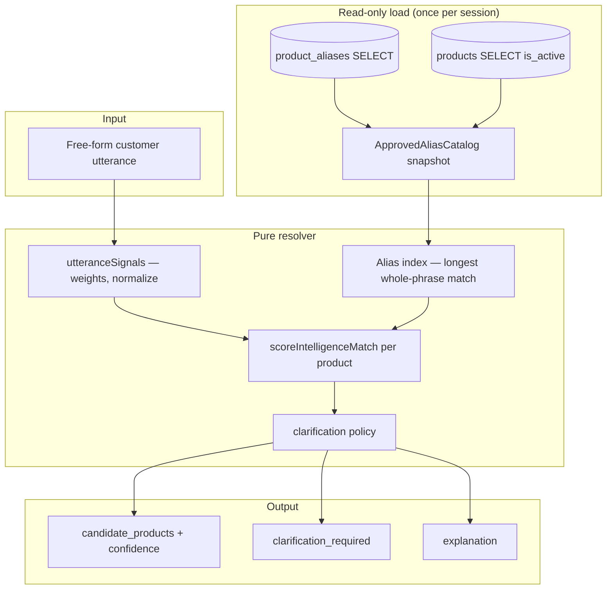

# Product Intelligence Consumption Audit

**Date:** 2026-06-09  
**Status:** Read-only prototype — Central consuming approved language from `product_aliases`  
**Route:** `/admin/product-intelligence-prototype`  
**Code:** `src/lib/product-intelligence/`

---

## 1. Goal

Demonstrate Oasis Central resolving free-form customer text against **approved alias intelligence** already stored in Central (`product_aliases` + `products.aliases[]`), without enabling AI Studio sync, WhatsApp sends, orders, or production writes.

---

## 2. Consumption readiness score

| Dimension | Score (0–5) | Notes |
|-----------|-------------|-------|
| **Approved alias source available** | 4 | `product_aliases` table + `products.aliases[]` in prod schema; AI Studio → Central promotion path exists via catalogue approval (C1a) but bulk authority import not yet landed |
| **Read-only loader** | 5 | `loadApprovedAliasCatalog()` — SELECT only |
| **Pure resolver** | 4 | `resolveProductIntelligence()` — testable without DB; scoring is prototype-grade |
| **Clarification policy** | 4 | Generic family + ambiguity rules; aligned with WA-05A ceilings conceptually |
| **Operator UI** | 3 | Staff prototype page; not wired to WhatsApp inbox |
| **WA integration readiness** | 2 | Parallel to `fetchProductResolution` — merge strategy TBD |

**Overall consumption readiness: 3.7 / 5** — suitable for **internal prototype and utterance lab**; not ready for live operator auto-highlight without catalog completeness audit and WA-05A alignment.

---

## 3. Resolver architecture



### Components

| Module | Role |
|--------|------|
| `loadApprovedAliasCatalog.ts` | SELECT `product_aliases` + active `products`; merge aliases |
| `resolveProductIntelligence.ts` | Score candidates; set clarification flag |
| `utteranceSignals.ts` | Normalize text; extract kg/gm weights |
| `genericTerms.ts` | Family-level terms too broad to auto-resolve |
| `productIntelligenceService.ts` | Cache snapshot; `loadCatalog()` + `resolve()` |
| `ProductIntelligencePrototype.tsx` | Staff UI — reload + sample utterances |

**No writes** anywhere in this path.

---

## 4. Confidence scoring

Scores are **0–98%** (integer), derived from weighted evidence on each product:

| Signal | Weight (raw score) | Example |
|--------|-------------------|---------|
| Whole product name in utterance | up to 0.88 | "Pistachio Pyramid Tin" |
| Approved alias whole-phrase match | 0.55 + length/40 (cap 0.92) | "Mor Cashew Asiyah" |
| Name token overlap (tokens > 3 chars) | up to +0.35 | "Coconut" + "Durum" |
| SKU substring | +0.25 | rare in customer text |
| Weight alignment (pack_size / net_weight_grams) | +0.10 | "500gm" on Mixed Nut Tart |

**Auto-resolve threshold:** ≥ 85% and `clarification_required = false`  
**Clarification threshold:** < 70% best match, generic-only utterance, or top-two within 8 points both ≥ 70%

### Prototype test utterances (fixture catalogue)

| Utterance | Expected | Prototype result |
|-----------|----------|------------------|
| Need 2 kg Kitta | Specific | `p-kitta`, no clarification |
| Send Mor Cashew Asiyah | Specific | `p-mor-asiyah`, no clarification |
| Need Pistachio Pyramid | Specific | `p-pist-pyr`, no clarification |
| Mix Nut Tart 500gm | Specific | `p-mix-tart`, no clarification |
| Coconut Durum 1 kg | Specific | `p-coc-durum`, no clarification |
| Need Asiyah | Clarification | Multiple Asiyah products |
| Need Baklava | Clarification | Generic family term |

---

## 5. Clarification strategy

Clarification is required when **any** of:

1. **Generic family only** — utterance reduces to terms in `GENERIC_FAMILY_TERMS` (e.g. baklava, sweets) without a distinguishing alias.
2. **Low confidence** — best candidate &lt; 70%.
3. **Ambiguous leaders** — top two candidates within 8 points and both ≥ 70%.
4. **Single-token ambiguity** — one-word product nickname maps to multiple products ≥ 70% (e.g. "Asiyah").
5. **Below auto-resolve bar** — best &lt; 85% even if nominally specific.

**Operator-facing copy** is returned in `explanation` — no automated WhatsApp reply, no order line creation.

---

## 6. Relationship to WA-05A

| | WA-05A (`fetchProductResolution`) | Product intelligence prototype |
|--|--------------------------------|------------------------------|
| Data source | `products` + `product_aliases` | Same |
| Writes | None | None |
| Scoring | `productResolutionScoring.ts` (mature) | Simpler alias-first prototype |
| UI | Operator inbox panel | Standalone admin lab |
| Integration | Live inbox path | **Not connected** |

**Recommendation before WA merge:** diff scores on production alias set; adopt shared alias index; keep WA ceilings (`METADATA_ONLY_CONFIDENCE_CEILING = 69%`).

---

## 7. Gaps before WhatsApp integration

| Gap | Risk | Mitigation |
|-----|------|------------|
| Alias catalogue completeness vs authority packs | Wrong silent match | Complete C1 alias staging import; audit alias coverage |
| Duplicate WA vs prototype resolvers | Drift | Extract shared `ApprovedAliasCatalog` builder; call from WA-05A |
| No AI Studio live feed | Stale aliases | Keep read-only; no sync enablement until approval workflow signed off |
| No quantity / client context | Under-resolution | WA-06A quantity + WA-04A client remain separate |
| No operator confirm UX in inbox | Auto-trust risk | Prototype stays staff-only until inbox adopts clarification banner |
| RLS on `product_aliases` | Load fails for some roles | Prototype uses internal staff session; verify RLS for operator roles |

---

## 8. What was not done (by design)

- No SQL migrations
- No `INSERT` / `UPDATE` / `DELETE` on any table
- No order or `sales_order_drafts` creation
- No WhatsApp edge invokes or sends
- No catalogue connector / AI Studio sync enablement
- No changes to WA inbox workflow or `fetchProductResolution` call path

---

## 9. Validation

```bash
npm run typecheck
npm run build
npm run test -- src/lib/product-intelligence
```

---

*Prototype complete. Read-only consumption only.*
