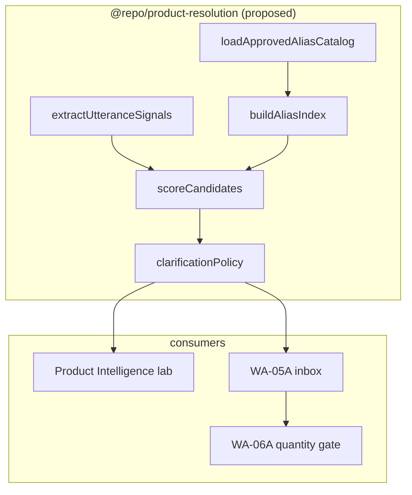

# Product Resolution Alignment Audit

**Date:** 2026-06-09  
**Scope:** Product Intelligence prototype vs WA-05A vs legacy search paths  
**Production changes:** None (audit + proposal only)

---

## 1. Resolver inventory

| Path | Entry | Data model | UI |
|------|-------|------------|-----|
| **Product Intelligence** | `resolveProductIntelligence()` | Full-catalog in-memory scan | `/admin/product-intelligence-prototype` |
| **WA-05A** | `fetchProductResolution()` | ILIKE fan-out + score | Operator inbox panel |
| **banyan-parser** | `resolveProduct()` | Exact alias + shorthand map | AI suggested orders |
| **Shadow warroom** | `resolveProductId()` | Limit 2000, exact/contains | CMD War Room |
| **SearchOverlay** | ILIKE name/sku/category | Browse search | Global search |

---

## 2. Gap matrix

| Dimension | Product Intelligence | WA-05A | Gap severity |
|-----------|---------------------|--------|--------------|
| Auto-resolve threshold | ≥ 85% | ≥ 95% (`auto_highlight`) | **High** |
| Generic family policy | Cap at 55%, force clarify | Identity keyword +0.18 | **High** |
| Retrieval | Full catalog (paged) | ILIKE bounded queries | **Medium** |
| `product_id=null` aliases | `canonical_name → product.name` | ILIKE canonical lookup | Low (aligned conceptually) |
| Ambiguity rule | Top-2 within 8 pts | Band + identity ceiling | **Medium** |
| Substring name match | `containsWholePhrase` | `productNameMatchesTerm` | **High** (Batch 001 failures) |
| Catalog completeness flag | `catalog_complete` | None | Low |
| Output | `clarification_required` | `band` enum | Medium |

---

## 3. Duplicated logic

| Concern | PI location | WA location |
|---------|-------------|-------------|
| Whole-word matching | `utteranceSignals.containsWholePhrase` | `productResolutionAliasPolicy` |
| Weight extraction | `utteranceSignals` | `productResolutionSignals` |
| Alias index | `collectAliasHits` | `fetchProductResolution` alias map |
| Family terms | `GENERIC_FAMILY_TERMS` | `IDENTITY_ALIAS_TERMS` |

**No shared module today** — zero cross-imports between `product-intelligence` and `wa-governance`.

---

## 4. Recommended shared resolver architecture

### Layer responsibilities

| Layer | Owner | Notes |
|-------|-------|-------|
| Catalog load | Shared `loadApprovedAliasCatalog` | Already production-shaped |
| Signal extraction | Shared | Unify weight regex + polite prefix strip |
| Scoring | Shared base + adapter | WA keeps identity ceilings as adapter |
| Clarification policy | Shared rules | Map `clarification_required` ↔ WA `band` |
| ILIKE discovery | WA-only optional | Fallback when catalog incomplete |

### Phased rollout

1. **Phase 1 (low risk):** Extract `containsWholePhrase`, weight signals, alias index — no inbox wiring
2. **Phase 2:** Golden utterance parity tests (Batch 001 + prototype fixture)
3. **Phase 3:** WA-05A calls shared scorer; retain ILIKE retrieval as pre-filter
4. **Phase 4:** Harmonize auto-resolve threshold (recommend **85% clarify / 95% auto-highlight** split preserved with explicit mapping)

---

## 5. Low-risk code-only actions (completed in PI PR #184)

- Generation guard for overlapping catalog reloads
- Legacy `product_id=null` alias support
- Strong approved alias override for generic-family multi-word terms

---

## 6. References

- `docs/PRODUCT_INTELLIGENCE_CONSUMPTION_AUDIT.md`
- `docs/WHATSAPP_WA05A_PRODUCT_RESOLUTION.md`
- `docs/BATCH001_RESOLVER_COVERAGE_REPORT.md`
