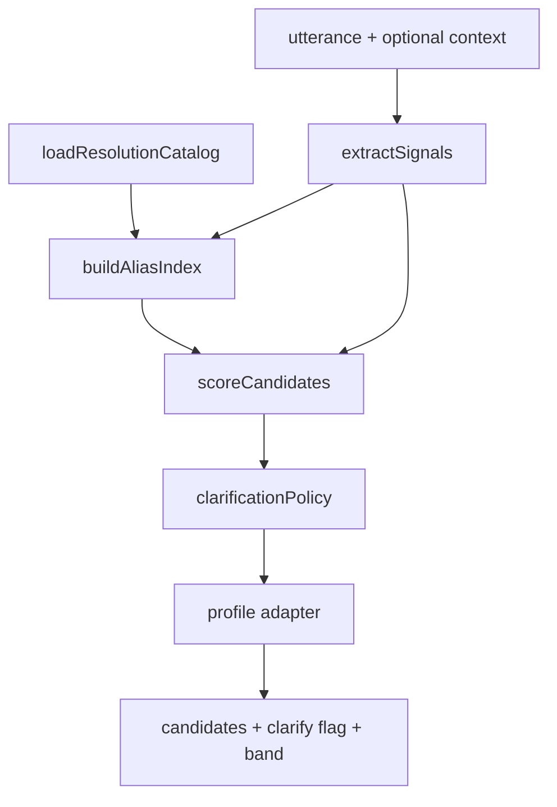

# Shared Resolver Architecture

**Date:** 2026-06-09  
**Program:** Resolver Unification Wave — Workstream C  
**Status:** Design proposal — no production wiring in this wave

---

## 1. Objective

One authoritative, read-only product resolution engine consumed by:

- Product Intelligence lab (`/admin/product-intelligence-prototype`)
- WA-05A operator inbox panel
- Future WA-06A quantity gating (identity evidence input)
- Golden utterance parity tests

---

## 2. Package boundary

```
src/lib/product-resolution/          ← proposed shared package
├── index.ts                         ← public API
├── types.ts                         ← input/output contracts
├── loadResolutionCatalog.ts         ← wraps loadApprovedAliasCatalog
├── extractSignals.ts                ← unified signal extraction
├── buildAliasIndex.ts               ← alias hits map
├── scoreCandidates.ts               ← weighted scoring
├── clarificationPolicy.ts           ← resolve vs clarify rules
├── adapters/
│   ├── waBandAdapter.ts             ← map to WA confidence bands
│   └── piOutputAdapter.ts           ← map to PI resolution shape
└── __tests__/
    ├── goldenParity.test.ts         ← 111-case matrix
    └── clarificationPolicy.test.ts
```

**Migration:** Extract from `product-intelligence` + `wa-governance`; deprecate duplicate logic incrementally.

---

## 3. Public API

### Input

```typescript
export interface ProductResolutionInput {
  /** Free-form customer or operator text */
  utterance: string;
  /** Optional stitched thread context (WA packets) */
  contextText?: string;
  /** Pre-loaded catalog; if omitted, loader fetches read-only */
  catalog?: ResolutionCatalog;
  /** Adapter profile */
  profile?: "operator" | "lab";
}
```

### Output

```typescript
export interface ProductResolutionOutput {
  utterance: string;
  candidate_products: ResolutionCandidate[];
  best_match: ResolutionCandidate | null;
  clarification_required: boolean;
  /** Human-readable explanation for operator UI */
  explanation: string;
  /** WA adapter: auto_highlight | suggested | needs_clarification */
  confidence_band: ConfidenceBand;
  /** Scoring audit trail */
  reasons: string[];
}
```

### Core function

```typescript
export function resolveProductUtterance(
  input: ProductResolutionInput,
): ProductResolutionOutput;
```

---

## 4. Pipeline



### Stage responsibilities

| Stage | Responsibility |
|-------|----------------|
| **loadResolutionCatalog** | Paged SELECT `product_aliases` + `products`; merge `aliases[]`; set `catalog_complete` |
| **extractSignals** | Normalize, strip polite prefixes, weights, piece counts, phrase candidates |
| **buildAliasIndex** | Whole-phrase alias hits; `product_id=null` via canonical name; merge product aliases |
| **scoreCandidates** | Score all catalog products (not ILIKE-limited); unified weights |
| **clarificationPolicy** | Generic-only, ambiguity margin, strong-alias override, auto-resolve bar |
| **adapter** | Map to WA bands or PI shapes without changing core policy |

---

## 5. Unified scoring model (proposal)

| Signal | Weight | Notes |
|--------|--------|-------|
| Longest whole-phrase alias match | 0.72–0.94 | Length-scaled; prefer over substring name |
| Exact product name (whole phrase) | 0.88 | Penalize if match is substring-only of utterance |
| Name token overlap | +0.12/token (cap 0.35) | Tokens > 3 chars only |
| SKU whole match | +0.25 | Rare in chat |
| Weight alignment | +0.10–0.35 | Profile-dependent |
| Piece / pack format | +0.25–0.30 | WA-05A signals retained |

### Identity ceilings (from WA-05A — retain)

| Strength | Ceiling |
|----------|---------|
| None (metadata only) | 69% |
| Weak (partial name) | 94% |
| Strong (name/alias/family) | 98% |

### Thresholds (unified)

| Outcome | Rule |
|---------|------|
| `clarification_required` | Any policy trigger OR confidence < 85% |
| `auto_highlight` band | ≥ 95% + strong identity + no clarify |
| `suggested` band | 70–94% |
| `needs_clarification` band | < 70% OR clarify flag |

**Key decision:** Single clarify policy at **85%**; WA `auto_highlight` remains **95%** via band adapter — not a policy split.

---

## 6. Clarification policy (authoritative)

Inherited from hardened PI resolver + WA identity ceilings:

1. **Generic-only** — all tokens in `GENERIC_FAMILY_TERMS` after prefix strip → cap 55% unless strong multi-word approved alias
2. **Low confidence** — best < 70%
3. **Ambiguity margin** — top-2 within 8 points, both ≥ 70%, no distinctive long-alias escape (≥ 6 char lead)
4. **Single-token multi-hit** — one word maps to 2+ products ≥ 70%
5. **Auto-resolve bar** — best < 85% always clarifies
6. **Substring name guard (new)** — if product B's name is substring of product A's name and both score ≥ 70%, clarify

---

## 7. Retrieval strategy

**Primary:** Full-catalog scan via `buildAliasIndex` (PI model)  
**Optional WA hybrid:** ILIKE pre-filter when `catalog_complete=false` only

```typescript
if (!catalog.catalog_complete) {
  // Fallback: bounded ILIKE discovery then score discovered IDs only
}
```

---

## 8. Consumer integration

| Consumer | Integration | Risk |
|----------|-------------|------|
| PI lab | Replace `resolveProductIntelligence` import | Low |
| WA-05A | Replace `scoreProductResolutionCandidates` + keep ILIKE optional | Medium |
| WA inbox UI | No change — consumes same output shape via adapter | Low |
| banyan-parser | Out of scope — deprecate separately | — |

**Constraint honored:** No inbox behavior changes in this wave.

---

## 9. Test strategy

| Layer | Tests |
|-------|-------|
| Policy unit | `clarificationPolicy.test.ts` |
| Golden matrix | 111 cases × PI + WA parity |
| Batch 001 regression | 25 SKU coverage |
| Collision cases | 12 ambiguous_family cases |

---

## 10. References

- `docs/RESOLVER_DIFF_AUDIT.md`
- `docs/RESOLVER_GOLDEN_MATRIX.md`
- `src/lib/resolver-golden/goldenUtteranceMatrix.ts`
