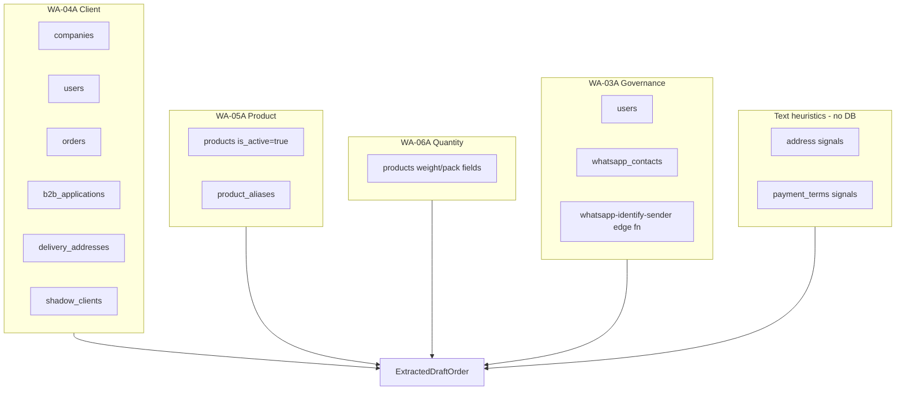

# Sprint 9.5 — Master Data Readiness Foundation Audit

**Date:** 2026-06-02  
**Scope:** Read-only audit — no production data modified, no live Sales Orders, no inventory/production/dispatch/finance/invoice changes  
**Environment audited:** Staging Supabase project `tcxvcatsqqertcnycuop`  
**Purpose:** Prepare the system so future Sprint 10 live SO promotion does not create bad orders

---

## Executive summary

Sprint 9 draft workflow is **technically ready** (persisted drafts, server-side readiness gates, extraction version integrity). **Master data is not ready** for trustworthy live SO promotion.

| Area | Readiness | Blocker severity |
|------|-----------|------------------|
| Client / customer master | **Poor** | Critical |
| WhatsApp → client linkage | **Poor** | Critical |
| Client ownership | **Poor** | High |
| Addresses | **Poor** | High |
| Payment terms (master) | **Weak** | Medium |
| Product catalog / SKU | **Mixed** | High |
| Product aliases (WA matching) | **Broken** | Critical |
| UOM / conversion fields | **Good** | Low |
| Sprint 9 draft staging | **Ready (empty)** | N/A |

**Recommendation:** **Keep Sprint 10 live SO promotion blocked.** Complete Sprint 9.5 cleanup and linkage work before any promotion RPC writes to `orders` / `order_items`.

---

## 1. Current data model

### 1.1 Customers / clients

There is **no `customers` or `contacts` table**. B2B client accounts live in **`public.companies`**.

| Table | Role | Key columns |
|-------|------|-------------|
| `companies` | Authoritative B2B client/customer | `id`, `business_name`, `phone`, `gst_number`, `registered_address`, `account_manager_id` (Client Owner), `payment_terms`, `status` |
| `users` | Buyer portal users + staff | `company_id`, `phone`, `mobile_number`, `is_sales_executive` |
| `profiles` | Auth profile mirror | `company_id`, `mobile_number` |
| `b2b_applications` | Onboarding / pre-company | `contact_phone`, `mobile_number`, `business_name`, `registered_address`, `city`, `state`, `pincode` |
| `delivery_addresses` | Structured ship-to (many per company) | `company_id`, `street_address`, `city`, `state`, `pincode`, `contact_person`, `contact_phone` |
| `shadow_clients` | Pre-KYC WhatsApp leads | `sender_phone`, `extracted_business_name`, `promoted_to_company_id` |
| `client_interactions`, `crm_tasks` | CRM (not used by WA resolution v1) | `company_id`, `executive_id` / `sales_exec_id` |

**Client Owner SSOT:** `companies.account_manager_id` → `users.id`

### 1.2 Contacts / WhatsApp numbers

Phone numbers are **fragmented** across six stores with **no normalized contact SSOT**:

| Store | Phone field | FK to `companies`? |
|-------|-------------|-------------------|
| `whatsapp_contacts` | `phone_number` | **No** — no `company_id` column |
| `companies` | `phone` | Self |
| `users` | `phone`, `mobile_number`, `secondary_phones[]` | Via `company_id` |
| `b2b_applications` | `contact_phone`, `mobile_number` | Indirect (approval flow) |
| `delivery_addresses` | `contact_phone` | Via `company_id` |
| `shadow_clients` | `sender_phone` | Optional `promoted_to_company_id` |

**`whatsapp_contacts` schema (staging):** `id`, `phone_number`, `customer_name`, `company_name`, `wa_contact_id`, timestamps — **display cache only**, not linked to CRM.

### 1.3 Products / catalog / SKUs

| Table | Role | Key columns |
|-------|------|-------------|
| `products` | Product master | `id`, `name`, `sku`, `barcode_sku`, `aliases[]`, `uom`, `settlement_unit`, weight/pack/carton fields, `is_active` |
| `product_aliases` | WhatsApp alias → product | `alias_text`, `canonical_name`, `product_id` |
| `product_variants` | Optional variant SKUs | `product_id`, `sku` (WA-05A does not query) |
| `categories` | Taxonomy | `name`, `parent_id` |
| `catalogue_product_mappings` | AI Catalogue Builder sync | `external_catalogue_product_id`, `central_product_id`, `sku`, `sync_status` |
| `catalogue_alias_drafts` | Alias approval staging | payload → `product_aliases` |

**UOM / conversion:** No lookup or conversion matrix tables. Conversions are **column-driven on `products`** + application code (`unit-conversion.ts`, `quantityResolutionNormalize.ts`).

### 1.4 Client ownership

| Layer | Field | Behavior |
|-------|-------|----------|
| CRM SSOT | `companies.account_manager_id` | Single owner per company |
| WA-04A resolution | Maps owner from company row | Read-only projection |
| Sprint 9 draft | `sales_order_drafts.client_owner_id/name` | Immutable snapshot at create |

### 1.5 Addresses

| Store | Type |
|-------|------|
| `companies.registered_address` | Single text field (legal) |
| `delivery_addresses` | Structured ship-to |
| Draft `address` readiness dimension | **Message text heuristics only** — not FK to `delivery_addresses` |

### 1.6 Payment terms

| Store | Details |
|-------|---------|
| `companies.payment_terms` | SSOT: `'prepaid'` \| `'credit'` |
| Draft `payment_terms` readiness | **Extracted from WhatsApp text** — not read from `companies.payment_terms` |

---

## 2. Data quality report (staging counts)

**Audit run:** read-only SQL against `tcxvcatsqqertcnycuop`, 2026-06-02.

### 2.1 Customers / clients

| Metric | Count | Notes |
|--------|------:|-------|
| Total companies | **85** | Includes shadow accounts |
| Active (non-shadow) companies | **52** | `status != 'shadow'` |
| Shadow companies | **33** | Auto-created from WhatsApp |
| Companies with phone populated | **2** | 2.4% of total |
| Companies missing Client Owner | **81** | 95.3% |
| Companies with assigned owner | **4** | Only 2 staff users hold assignments |
| Companies missing payment_terms | **0** | Column populated (all prepaid) |
| Prepaid companies | **85** | 100% |
| Credit companies | **0** | No credit-term customers in master |
| Companies missing registered_address | **85** | 100% |
| Companies missing GST | **30** | 35.3% |
| Companies with portal users | **32** | Buyers linked via `users.company_id` |
| Delivery addresses (total) | **11** | |
| Companies with ≥1 delivery address | **3** | 3.5% |
| Companies without delivery address | **82** | 96.5% |

**Owner assignment detail:**

| Owner | Companies owned |
|-------|---------------|
| Sharvan Kumar | 3 |
| Dinesh Mutreja | 1 |

### 2.2 Contacts / WhatsApp

| Metric | Count | Notes |
|--------|------:|-------|
| WhatsApp contacts | **9** | |
| With `company_name` populated | **0** | |
| Duplicate WhatsApp phone numbers | **0** | |
| Linked to company phone (last-10 match) | **1** | 11% |
| Linked to user phone (last-10 match) | **1** | 11% |
| Unlinked WhatsApp contacts | **8** | **89%** |
| Shadow clients | **19** | |
| Shadow clients promoted to company | **0** | |
| Duplicate shadow phones | **0** | |
| B2B applications (total) | **47** | |
| B2B approved | **43** | |
| B2B with contact phone | **47** | 100% |
| Users total | **69** | |
| Users with company | **34** | |
| Users with phone | **9** | 13% |
| Sales executives | **7** | |

### 2.3 Products / catalog

| Metric | Count | Notes |
|--------|------:|-------|
| Products total | **296** | |
| Active | **190** | |
| Inactive | **106** | |
| Missing SKU | **0** | |
| Missing UOM | **0** | |
| Missing settlement_unit | **0** | |
| Active missing conversion weight fields (strict check) | **10** | See UOM buckets below |
| Product aliases (total) | **19** | |
| Aliases with `product_id` set | **0** | **100% orphaned** |
| Aliases orphan (no product link) | **19** | Critical WA matching gap |
| Active products without any alias | **169** | 89% of active catalog |
| Active products with `aliases[]` array | **21** | 11% |
| Duplicate SKU groups | **55** | Same SKU on multiple product rows |
| Duplicate alias text (case-insensitive) | **0** | |
| Catalogue product mappings | **0** | Connector not populated |

**Top duplicate SKU examples:**

| SKU | Row count | Active rows |
|-----|----------:|------------:|
| OAS-PIS-1000 | 10 | 1 |
| OAS-CHO-1000 | 7 | 1 |
| OAS-COC-1000 | 7 | 0 |
| OAS-OSH-6000 | 7 | 1 |
| OAS-BAK-145 | 5 | 1 |

**Active products by UOM (weight field completeness):**

| UOM bucket | Active products | Missing all weight fields |
|------------|----------------:|--------------------------:|
| kg | 168 | 0 |
| pcs | 18 | 0 |
| piece | 3 | 0 |
| pack | 1 | 0 |

**Sample `product_aliases` rows:** All 19 use `canonical_name` text only (`product_id` NULL). Examples: `bulbul` → "Osh El Bulbul Cashew", `finger` → "Asabi Finger Baklawa". WA-05A queries `product_aliases.product_id` join path — **currently ineffective**.

### 2.4 Sprint 9 draft staging (staging DB)

| Metric | Count |
|--------|------:|
| Sales order drafts | **0** |
| Draft lines | **0** |
| Drafts with `promoted_order_id` | **0** |

No production draft traffic on staging yet; quality assessment is master-data-only.

---

## 3. What Sprint 9 draft workflow depends on

### 3.1 Upstream resolution (read-only master data reads)

| Concern | Master tables / services | Persisted on draft |
|---------|--------------------------|-------------------|
| Client | `companies`, `users`, `orders`, `b2b_applications`, `delivery_addresses`, `shadow_clients` | `company_id`, `company_name`, `client_owner_id/name` |
| Product | `products`, `product_aliases` | `sales_order_draft_lines.product_id`, `product_name`, `sku` |
| Quantity | `products` (subset of weight/pack columns) | `raw_*`, `normalized_*`, `conversion_explanation` |
| Address readiness | **None** (message text) | `readiness_dimensions[].address` |
| Payment terms readiness | **None** (message text) | `readiness_dimensions[].payment_terms` |
| Governance | `users`, `whatsapp_contacts`, edge fn | `order_creator_*`, `order_handler_*`, `client_owner_*` |
| Extraction version | Packet content fingerprint | `extraction_request_key` |

### 3.2 Draft persistence (writes only to staging tables)

| RPC | Server validation |
|-----|-------------------|
| `create_sales_order_draft_atomic` | One active draft per packet |
| `update_sales_order_draft_operator_final` | Extraction version match |
| `submit_sales_order_draft_for_review_atomic` | Extraction version match |
| `approve_sales_order_draft_for_so_atomic` | Extraction version + persisted `readiness_dimensions` (all 5 dims ≥40) |
| `reject_sales_order_draft_atomic` | Status + rejection reason |

**Explicitly not written by Sprint 9:** `orders`, `order_items`, inventory, production, dispatch, finance, invoice. `promoted_order_id` column exists but is **not populated**.

### 3.3 Readiness dimensions (approval gate)

All five required: `client`, `product`, `quantity`, `address`, `payment_terms` — validated client-side (informational) and **server-side on approve** from persisted JSON only.

---

## 4. Gaps before Sprint 10 promotion

### 4.1 Critical gaps

| Gap | Impact on live SO |
|-----|-------------------|
| **No WhatsApp contact → company FK** | 89% of WA senders unlinked; client resolution relies on fuzzy name/phone heuristics |
| **`product_aliases.product_id` all NULL** | Alias table does not resolve to catalog IDs; WA matching falls back to name ILIKE only |
| **95% companies missing Client Owner** | Governance slots empty; commission / accountability broken on promotion |
| **55 duplicate SKU groups** | Promotion may attach lines to wrong product row |
| **Dual shadow model** | `shadow_clients` (19, 0 promoted) vs 33 `companies.status='shadow'` — unclear promotion path |

### 4.2 High gaps

| Gap | Impact |
|-----|--------|
| **96% companies lack delivery address** | Live orders need ship-to; draft address readiness is text-only |
| **100% missing registered_address** | Legal/compliance fields empty |
| **Only 2 companies have phone** | Phone-based client match nearly impossible |
| **169/190 active products without aliases** | WhatsApp informal names won't match |
| **Address/payment readiness not from master** | Approval can pass on message keywords while company master is empty |

### 4.3 Medium gaps

| Gap | Impact |
|-----|--------|
| **All customers prepaid; 0 credit** | Credit governance untested for WA-originated orders |
| **Catalogue connector empty** | No synced external catalogue mappings |
| **`whatsapp_contacts` absent from generated types** | Type drift; inbox uses casts |
| **10 active products strict conversion gap** | Edge-case qty normalization risk |
| **No WA match audit table** | Hard to diagnose bad matches post-promotion |

### 4.4 Architectural risks (documented, not data)

| Risk | Reference |
|------|-----------|
| Webhook may auto-update `account_manager_id` | `docs/WHATSAPP_IDENTITY_OWNERSHIP_ARCHITECTURE.md` |
| `sales_order_draft_lines.product_id` has no FK | Staging migration — orphan refs possible |
| `delivery_addresses` RLS not in repo migrations | Audit gap for buyer writes |

---

## 5. Duplicate and integrity risks

| Risk | Staging evidence | Mitigation needed |
|------|------------------|-------------------|
| Duplicate WhatsApp phones | 0 in `whatsapp_contacts`, 0 in `shadow_clients` | Maintain uniqueness constraints; add cross-table dedup policy |
| Duplicate SKUs | **55 groups** (e.g. OAS-PIS-1000 × 10 rows) | SKU uniqueness enforcement; deactivate/archive duplicates |
| Duplicate alias text | 0 in `product_aliases` | Keep; fix product_id linkage first |
| Shadow vs company duplication | 33 shadow companies + 19 shadow_clients, 0 links | Single promotion workflow |
| Phone fragmentation | Same buyer phone in B2B app but not on `companies.phone` | Backfill + normalization job |
| Owner concentration | 4 companies owned by 2 admins | Sales exec roster assignment |

---

## 6. Required cleanup (Sprint 9.5 — report only, not executed)

### Phase A — Linkage foundation (block promotion without this)

1. **WhatsApp contact ↔ company linkage**
   - Add `company_id` (nullable FK) to `whatsapp_contacts` OR create `company_contact_phones` SSOT
   - Backfill from last-10 phone match against `companies.phone`, `users.phone`, approved `b2b_applications`
   - Manual review queue for 8 unlinked staging contacts

2. **Product alias repair**
   - Link all 19 `product_aliases` rows to `products.id` via `canonical_name` / SKU match
   - Expand aliases for top 50 WA-ordered active products
   - Deprecate duplicate `products.aliases[]` vs `product_aliases` — pick one SSOT

3. **SKU deduplication**
   - Audit 55 duplicate SKU groups; retain one active row per SKU
   - Document barcode_sku vs sku vs variant sku roles

### Phase B — Client master completeness

4. **Client Owner assignment**
   - Assign `account_manager_id` for all non-shadow active companies (target: 52)
   - Map sales executive roster (`users.is_sales_executive = 7`)

5. **Address backfill**
   - Import ship-to from approved B2B applications into `delivery_addresses`
   - Populate `registered_address` where GST exists

6. **Phone backfill**
   - Copy B2B `contact_phone` → `companies.phone` on approval path
   - Normalize to E.164 / last-10 storage convention

### Phase C — Promotion readiness hardening (before Sprint 10 RPC)

7. **Master-backed readiness** (future)
   - Optionally score `address` from `delivery_addresses` when company resolved
   - Optionally score `payment_terms` from `companies.payment_terms`

8. **Shadow promotion pipeline**
   - Unify `shadow_clients` → `companies` promotion; track in single table

9. **Observability**
   - WA resolution match log (client/product/qty) for operator review

---

## 7. Recommended build order

| Step | Work item | Unblocks |
|------|-----------|----------|
| **9.5.1** | Product alias `product_id` linkage + top-product alias seed | WA-05A accuracy |
| **9.5.2** | SKU deduplication / canonical active row per SKU | Correct `order_items.product_id` |
| **9.5.3** | WhatsApp phone → company linkage table + backfill | WA-04A deterministic client match |
| **9.5.4** | Client Owner assignment for active companies | Governance on promotion |
| **9.5.5** | Delivery address backfill from B2B | Ship-to on live orders |
| **9.5.6** | Company phone backfill | Phone resolution |
| **9.5.7** | Shadow client promotion unify | Lead → client hygiene |
| **9.5.8** | Readiness report dashboard (repeat this audit as CI/metrics) | Ongoing gate |
| **10.0** | Promotion RPC (`promoted_order_id`, `orders` insert) | **Only after 9.5.1–9.5.6 green** |

---

## 8. Sprint 10 block recommendation

### Verdict: **REMAIN BLOCKED**

Sprint 9 provides a **safe draft shell** (staging tables, atomic RPCs, server-side approve gates). Sprint 10 promotion would copy draft snapshots into live `orders` using master data that is:

- **89% WhatsApp senders unlinked** to companies
- **95% companies without Client Owner**
- **89% active products without WhatsApp aliases**
- **100% product_aliases rows orphaned** from catalog IDs
- **55 duplicate SKU groups** risking wrong product attachment
- **96% companies without ship-to addresses**

Promoting today would create orders with **wrong client, wrong product, missing owner, and no delivery address** — even when draft readiness scores pass (because address/payment readiness is text-heuristic, not master-backed).

### Minimum exit criteria for unblocking Sprint 10

| Criterion | Target |
|-----------|--------|
| WhatsApp contacts linked to company | ≥90% of active inbox contacts |
| Active companies with Client Owner | ≥90% |
| Active products with ≥1 alias linked to `product_id` | ≥80% of top-volume SKUs |
| Duplicate SKU groups | 0 unresolved for active products |
| Active companies with ≥1 delivery address | ≥70% |
| Sprint 9 draft UAT | ≥10 drafts through APPROVED_FOR_SO on staging |

---

## 9. Audit methodology

- **Schema:** Repo migrations, `src/integrations/supabase/types.ts`, WA governance modules
- **Counts:** Read-only SQL on staging (`tcxvcatsqqertcnycuop`)
- **No writes:** No production data modified; no DDL applied in this audit
- **Related docs:** `WHATSAPP_SPRINT9_SALES_ORDER_DRAFT_ARCHITECTURE.md`, `WHATSAPP_WA04A_CLIENT_RESOLUTION.md`, `WHATSAPP_WA05A_PRODUCT_RESOLUTION.md`, `WHATSAPP_IDENTITY_OWNERSHIP_ARCHITECTURE.md`

---

## 10. Appendix — tables inventoried

| Category | Tables |
|----------|--------|
| Client/customer | `companies`, `users`, `profiles`, `b2b_applications`, `shadow_clients`, `delivery_addresses`, `client_interactions`, `crm_tasks` |
| WhatsApp | `whatsapp_contacts`, `whatsapp_message_packets`, `whatsapp_messages`, `whatsapp_buffer`, `suggested_orders` |
| Product/catalog | `products`, `product_aliases`, `product_variants`, `categories`, `product_tags`, `product_tag_mapping`, `product_bom`, `catalogue_product_mappings`, `catalogue_alias_drafts` |
| Sprint 9 staging | `sales_order_drafts`, `sales_order_draft_lines`, `sales_order_draft_audit_log` |

---

*End of Sprint 9.5 Master Data Readiness Audit — report only.*
