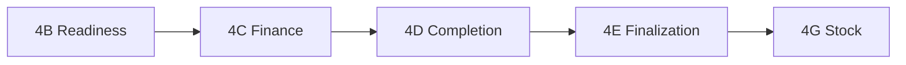

# STAGE 14B — Golden chain UI-only runbook (staging)

**Project:** `aruyieslaxjhnamlstpx` (staging only — never `tcxvcatsqqertcnycuop` production)  
**Goal:** Execute the full governed dispatch → stock chain using admin UI only. No SQL, no migrations, no eligibility bypasses.

## Environment

| Variable | Value |
|----------|--------|
| `VITE_SUPABASE_URL` | Staging project URL |
| `VITE_SUPABASE_PUBLISHABLE_KEY` | Staging anon key |
| `VITE_EXECUTION_PREVIEW_FALLBACK` | `false` (live rows only) |
| `VITE_STOCK_FINALIZATION_DEMO` | `false` |

Local dev: `npm run dev` → `http://127.0.0.1:8080` (or deployed staging URL for mobile operators).

Sign in as a role with dispatch + finance authority (`DISPATCH_HEAD`, `FINANCE_HEAD`, or `SUPER_ADMIN` with override where required).

---

## Golden chain sequence (operator)



| Step | Route | Primary UI actions | Service / bundle | Tables written (append-only unless noted) |
|------|-------|-------------------|------------------|-------------------------------------------|
| 1 | `/admin/dispatch-readiness` | Add **packing_photo**, **document_placeholder**, **gate_scan** evidence; optional link to `/security-gate`; **Record readiness review** | `createDispatchReadinessBundle` → `dispatchReadinessService.addEvidence`, `reviewReadiness` | `dispatch_readiness_evidence` |
| 2 | `/admin/finance-governance` | **Step 1 — Start finance review**; **Step 2 — Record commercial release** (only when projection `commercially_released`) | `createFinanceGovernanceBundle` → `startReview`, `commercialRelease` | `finance_review_evidence` (`credit_review` / pending, then `commercial_release` / released) |
| 3 | `/admin/dispatch-completion` | **Step 1 — Review completion**; **Step 2 — Attest completion** when checklist green | `createDispatchCompletionBundle` → completion review + attestation | `dispatch_completion_evidence` |
| 4 | `/admin/dispatch-finalization` | Confirm **gateReference**, **completionReference**, **transporterReference**; **Finalize dispatch (governed)** | `createDispatchFinalizationBundle` → `finalizeDispatch` | `dispatch_release_lineage` (`release_type=finalize`); `orders.status` → `dispatched`; `order_status_history` |
| 5 | `/admin/stock-finalization` | Confirm **dispatchLineageId**, reservations, scan ref; **Finalize consumption** | `createStockFinalizationBundle` → `finalizeConsumption` | `inventory_stock_balances`, `inventory_movements` (via service), `stock_consumption_lineage` |

---

## Step 1 — Dispatch readiness (4B)

**Board:** `DispatchReadinessBoard` + `DispatchReadinessEvidencePanel`

1. Open order card; read **Missing requirements** and **Missing live signals**.
2. **Packing photo** — enter ref (e.g. `PACK-…`), click *Record packing photo*.
3. **Document placeholder** — enter ref, click *Record document placeholder*.
4. **Gate scan** — enter gate ref or use verified scan hint from `operational_scan_records`; click *Record gate scan*. For physical gate, use **Security gate** (`/security-gate`) so scans exist in `operational_scan_records`.
5. Click **Record readiness review (evidence)** — creates `manual_readiness_review` row; status `verified` only when dimensions pass (`gate_eligible` / `ready_for_review`).

**Gate eligibility for finance:** verified `manual_readiness_review` **or** verified `gate_scan` in `dispatch_readiness_evidence` (operational scans alone do not set gate eligible).

**Screenshot (staging):** `docs/artifacts/stage-14b/01-dispatch-readiness.png`

---

## Step 2 — Finance governance (4C)

**Board:** `FinanceGovernanceBoard`

1. Confirm badge **Gate eligible: yes** (from 4B).
2. **Step 1 — Start finance review** — persists `finance_review_evidence` with `review_type=credit_review`, `review_status=pending`.
3. When projection shows **commercially_released**, **Step 2 — Record commercial release** — appends `commercial_release` / `released`.

UI explicitly separates review start vs commercial release; neither step dispatches or captures payment.

**Screenshot:** `docs/artifacts/stage-14b/02-finance-governance.png`

---

## Step 3 — Dispatch completion (4D)

**Board:** `DispatchCompletionBoard`

1. Use **Prerequisite checklist** (readiness gate, finance release, reservation, security gate, manifest, not yet dispatched).
2. **Step 1 — Review completion** → evidence row.
3. **Step 2 — Attest completion** when status `completion_eligible`.

**Screenshot:** `docs/artifacts/stage-14b/03-dispatch-completion.png`

---

## Step 4 — Dispatch finalization (4E)

**Board:** `DispatchFinalizationBoard` + `GovernanceHandoffReferences`

1. Review **Governed handoff references**: `gateReference`, `completionReference`, `transporterReference`, live order status.
2. Read **Finalize blockers** and **Missing live signals** — explains disabled **Finalize dispatch**.
3. When `release_status` = `dispatch_release_ready`, click **Finalize dispatch (governed)**.

This is the **only** UI path to `orders.status = dispatched`.

**Screenshot:** `docs/artifacts/stage-14b/04-dispatch-finalization.png`

---

## Step 5 — Stock finalization (4G)

**Board:** `StockFinalizationBoard`

1. Order must be `dispatched` (live row from read model).
2. **Missing prerequisites** lists exact blockers (lineage id, scan, reservations, projection blockers).
3. **Dispatch lineage & handoff** shows `dispatchLineageId`, `gateReference`, `scanReference`.
4. **Reservation linkage** lists `inventory_reservations` rows.
5. **Finalize consumption** when enabled.

**Screenshot:** `docs/artifacts/stage-14b/05-stock-finalization.png`

---

## Shared UI components (14B)

| Component | Purpose |
|-----------|---------|
| `GovernancePrerequisiteList` | Blockers / missing signals lists |
| `GovernanceHandoffReferences` | 4E gate / completion / transporter refs |
| `DispatchReadinessEvidencePanel` | packing_photo, document_placeholder, gate_scan |

---

## Verification queries (read-only, optional)

After UI run on order `order_id`:

- `dispatch_readiness_evidence` — packing_photo, document_placeholder, gate_scan, manual_readiness_review
- `finance_review_evidence` — credit_review pending + commercial_release released
- `dispatch_completion_evidence` — attestation
- `dispatch_release_lineage` — finalize row, `next_status=dispatched`
- `orders.status` = `dispatched`
- `stock_consumption_lineage` — after 4G

---

## Regression / CI

```bash
npm run typecheck
npm run test -- src/lib/finance-governance/__tests__/financeGovernanceService.test.ts
npm run build
```

---

## STAGE 14B implementation report checklist

- [ ] All five boards show explicit missing prerequisites
- [ ] Finance Step 1 persists evidence before Step 2
- [ ] Finalize disabled reasons visible on 4E
- [ ] Stock board shows lineage + reservations
- [ ] Golden chain completed on staging without SQL
- [ ] Screenshots captured under `docs/artifacts/stage-14b/`

**Related docs:** `EXECUTION_OS_PHASE4B_STAGING_VALIDATION.md` through `EXECUTION_OS_PHASE4G_STAGING_VALIDATION.md`
