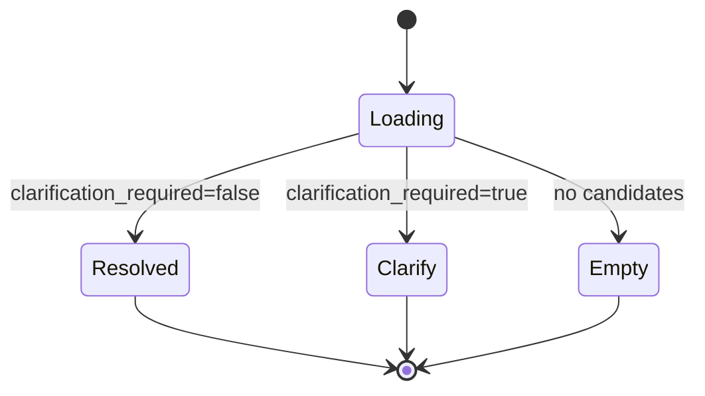

# WhatsApp Clarification UX Design

**Date:** 2026-06-09  
**Program:** Resolver Unification Wave — Workstream E  
**Status:** Design only — **no inbox behavior changes in this wave**

---

## 1. Objective

When the unified resolver sets `clarification_required = true`, the operator inbox must present a **read-only, actionable** clarification panel — not a silent best guess or empty state.

---

## 2. Design principles

1. **Never auto-create order lines** from ambiguous resolution
2. **Show why** — surface `explanation` + top candidate reasons
3. **Offer choices** — up to 3 rival SKUs as tappable chips
4. **Preserve read-only** — resolution panel does not write until operator confirms (future PR)
5. **Match WA-05A visual language** — extend existing `OperatorInboxProductResolutionPanel`

---

## 3. Panel states



| State | Badge | Primary content |
|-------|-------|-----------------|
| **Resolved** | Green — `Specific match` | Product name, SKU, confidence %, matched alias |
| **Clarify** | Amber — `Clarification needed` | Explanation + rival chips |
| **Empty** | Gray — `No match` | Suggestion to ask customer for shape/nut/weight |

---

## 4. Example — `Need Asiyah`

### Trigger

- Utterance normalizes to generic family token `asiyah`
- 6+ Batch 001 SKUs score ≥ 70%

### Panel layout

```
┌─────────────────────────────────────────────┐
│ Product match          Clarification needed   │
├─────────────────────────────────────────────┤
│ "Need Asiyah" uses a family term only.      │
│ Pick the nut + style:                       │
│                                             │
│ ┌─────────────────────┐ ┌─────────────────┐ │
│ │ Mor Cashew Asiyah   │ │ Chocolate Cashew│ │
│ │ OAS-AS-BKL-0014     │ │ OAS-AS-BKL-0013 │ │
│ │ 94% · mor asiyah    │ │ 91% · chocolate │ │
│ └─────────────────────┘ └─────────────────┘ │
│ ┌─────────────────────┐ ┌─────────────────┐ │
│ │ Pistachio Asiyah    │ │ Cashew Asiyah   │ │
│ │ OAS-AS-BKL-0016     │ │ OAS-AS-BKL-0017 │ │
│ └─────────────────────┘ └─────────────────┘ │
│                                             │
│ Or ask customer: "Cashew or pistachio       │
│ asiyah? Mor (beetroot) or plain?"           │
├─────────────────────────────────────────────┤
│ Read-only · not persisted                   │
└─────────────────────────────────────────────┘
```

### Copy template

> Multiple Asiyah variants match. Ask customer to specify **nut** (cashew / pistachio) and **style** (Mor, Chocolate, or plain).

---

## 5. Example — `Need Baklava`

### Trigger

- Generic-only utterance (`baklava` ∈ `GENERIC_FAMILY_TERMS`)
- Generic policy caps confidence at 55%

### Panel layout

```
┌─────────────────────────────────────────────┐
│ Product match          Clarification needed   │
├─────────────────────────────────────────────┤
│ "Need Baklava" is too broad to auto-match. │
│                                             │
│ Top possibilities (all low confidence):     │
│  · Assorted Baklawa tin packs               │
│  · Pistachio Baklawa tray                   │
│  · Lebanese baklawa shapes (Kitta, Ring…)  │
│                                             │
│ Suggested reply to customer:                │
│ "Which baklawa — shape or nut? e.g. Kitta,  │
│  Pyramid, Cashew Ring, Assorted tin?"       │
├─────────────────────────────────────────────┤
│ Read-only · not persisted                   │
└─────────────────────────────────────────────┘
```

### Copy template

> Baklava is a family name. Ask for **shape** (Kitta, Ring, Pyramid, Finger) or **pack type** (tin, tray, bulk kg).

---

## 6. Example — `Need Pyramid`

### Trigger

- Generic-only token `pyramid`
- Rivals: Cashew Pyramid (0006), Pistachio Pyramid (0019), Pistachio Pyramid Topping (0011)

### Panel layout

```
┌─────────────────────────────────────────────┐
│ Product match          Clarification needed   │
├─────────────────────────────────────────────┤
│ "Need Pyramid" — which nut?                 │
│                                             │
│ ┌──────────────────┐ ┌──────────────────┐   │
│ │ Cashew Pyramid   │ │ Pistachio Pyramid│   │
│ │ OAS-AS-BKL-0006  │ │ OAS-AS-BKL-0019  │   │
│ │ 6kg bulk         │ │ 6kg bulk         │   │
│ └──────────────────┘ └──────────────────┘   │
│ ┌──────────────────────────────┐           │
│ │ Pistachio Pyramid (Topping)  │           │
│ │ OAS-AS-BKL-0011 · 6kg        │           │
│ └──────────────────────────────┘           │
│                                             │
│ Ask: "Cashew or pistachio pyramid?"         │
├─────────────────────────────────────────────┤
│ Read-only · not persisted                   │
└─────────────────────────────────────────────┘
```

---

## 7. Component mapping (future implementation)

| UI element | Source field | Component |
|------------|--------------|-----------|
| State badge | `clarification_required` | `OperatorInboxProductResolutionPanel` |
| Explanation | `explanation` | Existing panel body |
| Candidate list | `candidate_products[0..2]` | New `ClarificationCandidateChips` |
| Confidence | `candidate.confidence` | Badge per chip |
| Matched alias | `candidate.matched_aliases[0]` | Subtext |
| Suggested operator script | Template by family detection | New `clarificationScripts.ts` |

**Files (existing):**

- `src/components/whatsapp/OperatorInboxProductResolutionPanel.tsx`
- `src/components/whatsapp/useOperatorInboxProductResolution.ts`
- `src/lib/wa-governance/productResolutionDisplay.ts`

---

## 8. Accessibility

| Requirement | Implementation |
|-------------|----------------|
| Screen reader | `aria-live="polite"` on clarification region |
| Keyboard | Chips focusable; Enter copies SKU to clipboard (future) |
| Color | Amber clarify badge meets contrast — not color-only |
| Language | Family names in plain English + colloquial alias subtext |

---

## 9. Clarification readiness checklist

| Item | Ready? |
|------|--------|
| Resolver emits `explanation` | Yes (PI) / Partial (WA) |
| Resolver emits ≥ 2 rivals on clarify | Yes (PI top 5) |
| Panel shows clarify badge | Yes (WA — `needs_clarification` band) |
| Rival SKU chips | **Not built** |
| Suggested customer script | **Not built** |
| Operator confirm → draft line | **Out of scope** (Sprint 9 drafts separate) |

**Clarification UX readiness: 45%** (policy yes, interactive UX no)

---

## 10. References

- `docs/RESOLVER_GOLDEN_MATRIX.md` — ambiguous_family cases
- `docs/WHATSAPP_WA05A_PRODUCT_RESOLUTION.md`
- `src/lib/product-intelligence/resolveProductIntelligence.ts` — `buildExplanation()`
