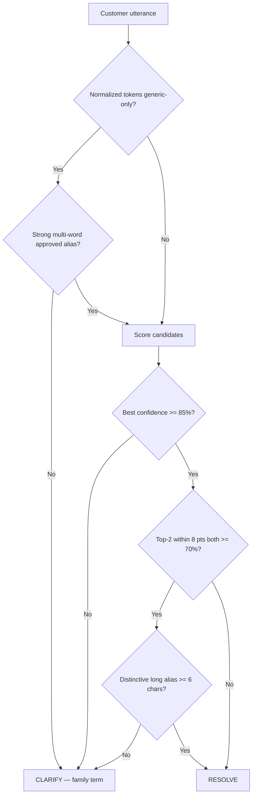

# WhatsApp Product Resolution Readiness Report

**Date:** 2026-06-09  
**Status:** Preparation only — **no WhatsApp sends, no inbox wiring, no order creation**

---

## WhatsApp readiness score: **58%**

| Dimension | Weight | Score | Notes |
|-----------|--------|-------|-------|
| Approved alias catalogue | 25% | 68% | 17/25 live; 25/25 post Wave 2C |
| Resolver policy clarity | 20% | 70% | PI prototype hardened; WA-05A parallel |
| Clarification UX | 15% | 30% | No inbox clarification banner |
| Confidence alignment | 15% | 45% | 85% vs 95% threshold split |
| Collision safety | 15% | 50% | 3 live collisions + 3 substring cases |
| Quantity/client context | 10% | 80% | WA-06A / WA-04A exist separately |

---

## 1. Utterance normalization

| Step | PI prototype | WA-05A | Aligned? |
|------|--------------|--------|----------|
| Lowercase + whitespace collapse | Yes | Yes | Yes |
| Polite prefix strip (`need`, `send`, …) | Repeated loop | Partial | **Gap** |
| Weight / piece extraction | Yes | Yes | Different tolerance constants |
| Product name candidates | N/A (full scan) | Top 6 phrases | Different |

**Recommendation:** Share `stripLeadingPolitePrefixes()` from `genericTerms.ts`.

---

## 2. Product resolution flow

```
Inbound text → normalize → alias index lookup → score candidates → clarification policy → read-only panel
```

- **Today (WA-05A):** ILIKE retrieval limits candidates before scoring
- **Target:** Shared `loadApprovedAliasCatalog()` + in-memory score (hybrid)

---

## 3. Clarification triggers

| Trigger | PI | WA-05A |
|---------|----|----|
| Generic-only utterance | Yes (cap 55%) | No equivalent |
| Best confidence < 70% | Yes | `needs_clarification` band |
| Top-2 within 8 points | Yes | No |
| Single-token multi-product | Yes | Partial via identity ceiling |
| Below auto-resolve bar | < 85% (PI) | < 95% auto-highlight |

---

## 4. Clarification decision tree



---

## 5. Confidence matrix

| Band | PI confidence | WA band | Operator action |
|------|---------------|---------|-----------------|
| Auto-resolve | ≥ 85%, no clarify flag | `auto_highlight` ≥ 95% | Show match (no auto-order) |
| Suggested | 70–84% or clarify on PI | `suggested` 70–94% | Confirm before draft line |
| Clarify | < 70% or policy trigger | `needs_clarification` | Ask customer to specify |
| Metadata-only | N/A | ceiling 69% | Never auto-highlight |

---

## 6. Ambiguity handling

| Pattern | Example | Handling |
|---------|---------|----------|
| Asiyah family | `Need Asiyah` | Clarify — list Mor/Chocolate/Pistachio/Cashew |
| Baklava family | `Need Baklava` | Clarify — cap confidence |
| Strong multi-word | `Assorted Baklava` | Resolve if approved alias unique |
| Cross-SKU collision | `cashew assiyah` | Clarify — live data defect |
| Substring name | `Special Square Baklawa` | Clarify/wrong SKU — resolver gap |

---

## 7. Fallback handling

| Level | Behavior |
|-------|----------|
| L1 | Approved alias match |
| L2 | Product name token overlap |
| L3 | SKU token (rare in chat) |
| L4 | Category/keyword ILIKE (WA only) |
| L5 | Clarification prompt — no silent null |
| L6 | Operator manual SKU entry (existing) |

**No silent order line creation** at any level.

---

## 8. Batch 001 validation

Tested against Batch 001 language data via `runResolverCoverage()`:

- 22/25 primary-alias utterances auto-resolve
- 3 known ambiguity cases documented
- Wave 2C adds 8 SKUs to alias catalogue

---

## 9. References

- `docs/WHATSAPP_WA05A_PRODUCT_RESOLUTION.md`
- `docs/PRODUCT_RESOLUTION_ALIGNMENT_AUDIT.md`
- `docs/BATCH001_RESOLVER_COVERAGE_REPORT.md`
