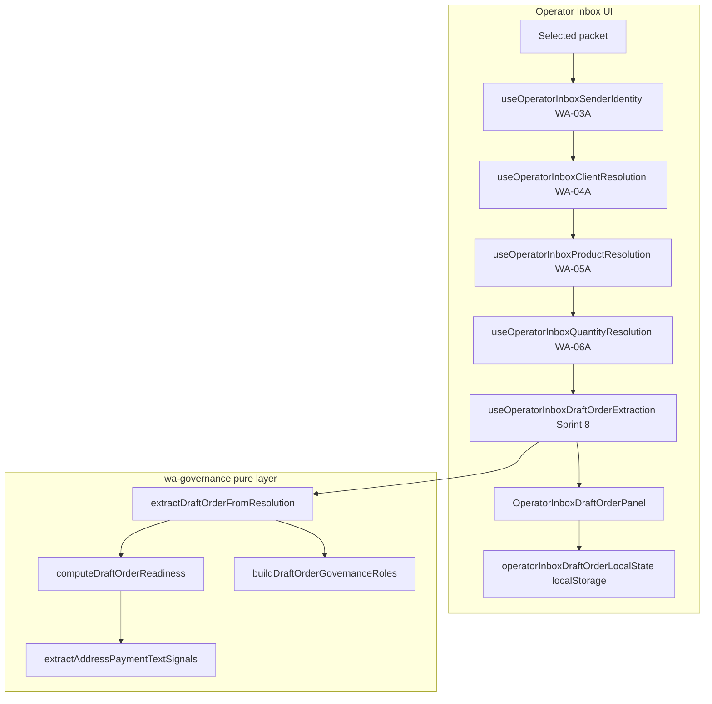

# Sprint 8 — WhatsApp to Draft Order Integration (Architecture)

**Sprint:** WA Sprint 8  
**Date:** 2026-06-04  
**Status:** Draft order extraction + read-only inbox panel (no live Sales Orders)  
**Production:** Not in scope

---

## Objective

Convert resolved WhatsApp packets into **structured draft order projections** by composing WA-04A (client), WA-05A (product), and WA-06A (quantity) resolution outputs. Stop at draft generation — **no** `orders` / `order_items` inserts, inventory, dispatch, finance, or approval automation.

---

## Architecture overview

---

## Layer 1 — Order extraction engine (pure, no I/O)

| Module | Path | Responsibility |
|--------|------|----------------|
| Types | `src/lib/wa-governance/draftOrderExtractionTypes.ts` | `ExtractedDraftOrder`, line items, readiness, governance slots |
| Extraction | `src/lib/wa-governance/draftOrderExtraction.ts` | `extractDraftOrderFromResolution()` — merges upstream results |
| Request key | `src/lib/wa-governance/draftOrderExtractionRequestKey.ts` | Stable cache key from resolution chain |
| Readiness | `src/lib/wa-governance/draftOrderReadinessScoring.ts` | 5-dimension scoring (0–100) |
| Text signals | `src/lib/wa-governance/draftOrderTextSignals.ts` | Address / payment terms heuristics from message text |
| Governance | `src/lib/wa-governance/draftOrderGovernance.ts` | Preserve client owner, creator, handler, approver slots |
| Display | `src/lib/wa-governance/draftOrderDisplay.ts` | UI labels and summaries |

### Extraction inputs

- **Client (WA-04A):** `companyId`, `companyName`, owner, confidence, reasons  
- **Product (WA-05A):** best match + candidate list for product-hint pairing  
- **Quantity (WA-06A):** one line item per quantity entry; catalogue conversion explanation  
- **Sender (WA-03A):** employee profile → order creator slot  

### Extraction outputs

- Structured **draft line items** (product, qty, units, confidence, conversion text)  
- **Order readiness score** (overall + client/product/quantity/address/payment_terms)  
- **Governance role projection** (read-only slots, not persisted)  
- **Conversion summary** (human-readable audit trail)  

---

## Layer 2 — React integration

| Module | Path | Responsibility |
|--------|------|----------------|
| Hook | `src/components/whatsapp/useOperatorInboxDraftOrderExtraction.ts` | Waits for upstream resolution; pure projection via `useMemo` |
| Panel | `src/components/whatsapp/OperatorInboxDraftOrderPanel.tsx` | Read-only draft UI in insights aside |
| Local workflow | `src/components/whatsapp/operatorInboxDraftOrderLocalState.ts` | Approve/Reject/Edit in **localStorage only** |

Wired in `src/components/WhatsAppInbox.tsx` after quantity resolution hook, rendered below `OperatorInboxLocalDraftPreview`.

---

## Layer 3 — UI behaviour

### Read-only draft generation

Panel shows when a packet is selected and upstream resolution has started. Displays:

- Original message excerpt  
- Client + product lines + quantities  
- Per-dimension readiness scores  
- Conversion explanation bullets  
- Governance preservation notes  

Copy: **“read-only · not persisted to orders”**

### Approve / Reject / Edit (local only)

| Action | Behaviour | Persists to DB? |
|--------|-----------|-----------------|
| **Edit** | Adjust line quantities in session | No — `localStorage` only |
| **Approve** | Marks local decision `approved` | No |
| **Reject** | Marks local decision `rejected` | No |
| **Reset local** | Clears local edits/decision | No |

Banner: *“does not create Sales Orders, deduct inventory, or post finance entries.”*

Governance bar **“Approve Draft”** remains disabled (Sprint C2/C2B) — distinct from panel local approve.

---

## Order readiness scoring

| Dimension | Source | Scoring logic |
|-----------|--------|---------------|
| Client | WA-04A best match confidence | 0–100 from match % + band |
| Product | WA-05A best match confidence | 0–100 from match % + band |
| Quantity | WA-06A primary entry | 0–100 from entry confidence + band |
| Address | Message text heuristics | Pincode, address keywords, city tokens |
| Payment terms | Message text heuristics | credit/advance/net terms keywords |

Overall score = arithmetic mean of five dimensions.

---

## Governance preservation

| Slot | Source | Sprint 8 behaviour |
|------|--------|---------------------|
| Client owner | WA-04A `ownerId` / `ownerName` | Copied to draft projection |
| Order creator | WA-03A employee sender | Set when sender is employee |
| Order handler | Same as client owner | Preserved, not reassigned |
| Approver | — | Reserved null; human-only |

No automatic owner reassignment. No approver assignment.

---

## Forbidden paths (enforced)

| Forbidden | Enforcement |
|-----------|-------------|
| Sales Order creation | No `from("orders")` in new modules; AST guard tests |
| Inventory deduction | Not referenced |
| Production / dispatch | Not referenced |
| Financial posting | Not referenced |
| Approval automation | Local approve is non-persistent; no Edge invoke |

Tests: `draftOrderExtraction.test.ts`, extended `operatorInboxStage1Guard.test.ts`.

---

## Stage-1 guard compatibility

New code lives under existing scan roots:

- `src/lib/wa-governance/**` — SELECT-only engines (extraction is pure)  
- `src/components/whatsapp/**` — no PostgREST writes, no new Edge invokes  

---

## Future work (out of Sprint 8 scope)

1. Persist approved drafts to a staging `draft_orders` table (migration + RLS)  
2. Enable governance bar **Approve Draft** with audit log writes  
3. Hard route + Edge JWT before any live order promotion  
4. Staging UI screenshots (`docs/evidence/sprint8/`) — capture on `support.stage1@` session  

---

## Related docs

- `docs/evidence/sprint8/WA_SPRINT8_DRAFT_ORDER_WORKFLOW.md`  
- `docs/WHATSAPP_WA04A` … `WA06A` resolution specs  
- `docs/WHATSAPP_STAGE1_GO_NO_GO_EVIDENCE_PACK.md`
