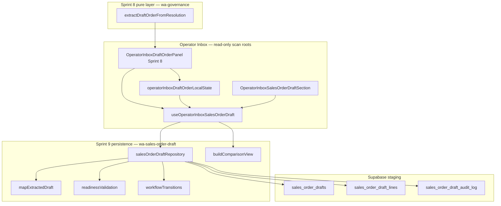

# Sprint 9 — Draft Order to Controlled Sales Order Handoff (Architecture)

**Sprint:** WA Sprint 9  
**Date:** 2026-06-05  
**Status:** Persisted sales order drafts with governed workflow (no live Sales Orders)  
**Production:** Not in scope — staging migration only

---

## Objective

Convert Sprint 8 **ExtractedDraftOrder** projections into **reviewable, persisted Sales Order Drafts** with strict governance, readiness validation, three-way comparison, and an append-only audit trail. Sales Orders in the live `orders` table may only be created after **explicit human approval** in a future promotion step — not in Sprint 9.

---

## Architecture overview

---

## Schema

| Table | Purpose |
|-------|---------|
| `sales_order_drafts` | Header: status, governance slots, readiness, three snapshots |
| `sales_order_draft_lines` | Normalized line items with AI + operator quantities |
| `sales_order_draft_audit_log` | Append-only workflow audit |

### Workflow statuses

| Status | Meaning |
|--------|---------|
| `AI_DRAFT` | Created from WA extraction; operator may sync local edits |
| `UNDER_REVIEW` | Submitted for human review |
| `APPROVED_FOR_SO` | Approved for future SO promotion — **does not create live order** |
| `REJECTED` | Rejected with reason |

Unique partial index: one active draft per packet (`AI_DRAFT`, `UNDER_REVIEW`, `APPROVED_FOR_SO`).

### Governance preservation

| Slot | Source | Persisted on |
|------|--------|--------------|
| Client Owner | WA-04A | `client_owner_id` / `client_owner_name` |
| Order Creator | WA-03A employee sender | `order_creator_id` / `order_creator_name` |
| Order Handler | Client owner slot | `order_handler_id` / `order_handler_name` |
| Approver | Human on approve | `approver_id` / `approver_name` |

### Three-way comparison snapshots

| Column | Content |
|--------|---------|
| `original_whatsapp_text` | Raw message text |
| `ai_draft_snapshot` | Full `ExtractedDraftOrder` JSON at creation |
| `operator_final_snapshot` | Operator-adjusted quantities + governance |

---

## Readiness validation

Five dimensions (Sprint 8 parity): **client**, **product**, **quantity**, **address**, **payment_terms**.

Approval to `APPROVED_FOR_SO` requires each dimension `status !== "missing"` and `score >= 40`. Validation runs in `readinessValidation.ts` before the approve transition.

---

## Module map

| Module | Path |
|--------|------|
| Types | `src/lib/wa-sales-order-draft/types.ts` |
| Mapping | `src/lib/wa-sales-order-draft/mapExtractedDraft.ts` |
| Readiness | `src/lib/wa-sales-order-draft/readinessValidation.ts` |
| Workflow | `src/lib/wa-sales-order-draft/workflowTransitions.ts` |
| Repository | `src/lib/wa-sales-order-draft/salesOrderDraftRepository.ts` |
| Comparison | `src/lib/wa-sales-order-draft/buildComparisonView.ts` |
| UI section | `src/components/whatsapp/OperatorInboxSalesOrderDraftSection.tsx` |
| UI hook | `src/components/whatsapp/useOperatorInboxSalesOrderDraft.ts` |
| Migration | `supabase/migrations/20260605120000_wa_sprint9_sales_order_drafts_staging.sql` |

PostgREST writes live **only** in `wa-sales-order-draft/` — outside Stage-1 inbox scan roots.

---

## UI actions

| Action | Transition | Creates live SO? |
|--------|------------|------------------|
| Create Sales Order Draft | → `AI_DRAFT` | No |
| Sync operator edits | Updates operator snapshot | No |
| Submit for review | → `UNDER_REVIEW` | No |
| Approve for SO | → `APPROVED_FOR_SO` | **No** |
| Reject draft | → `REJECTED` | No |

Comparison view shows **Original WhatsApp · AI Draft · Operator Final** with line-level deltas. Audit trail lists all transitions.

---

## Forbidden (Sprint 9)

| Forbidden | Enforcement |
|-----------|-------------|
| Auto Sales Order creation | No `from("orders")` in repository; `promoted_order_id` stays null |
| Auto production allocation | Not referenced |
| Auto dispatch | Not referenced |
| Auto finance release | Not referenced |
| Auto invoice generation | Not referenced |
| PostgREST writes in inbox scan roots | AST guard tests |

---

## RLS

Inbox readers (`is_whatsapp_inbox_reader`) may SELECT/INSERT/UPDATE drafts and lines; audit log is INSERT + SELECT only. Service role has full access for Edge/cron if needed later.

---

## Future promotion (out of scope)

`APPROVED_FOR_SO` drafts carry `promoted_order_id` (nullable) for a **separate** human-triggered promotion flow (e.g. War Room / governed Edge Function). Sprint 9 stops at approval gate.
